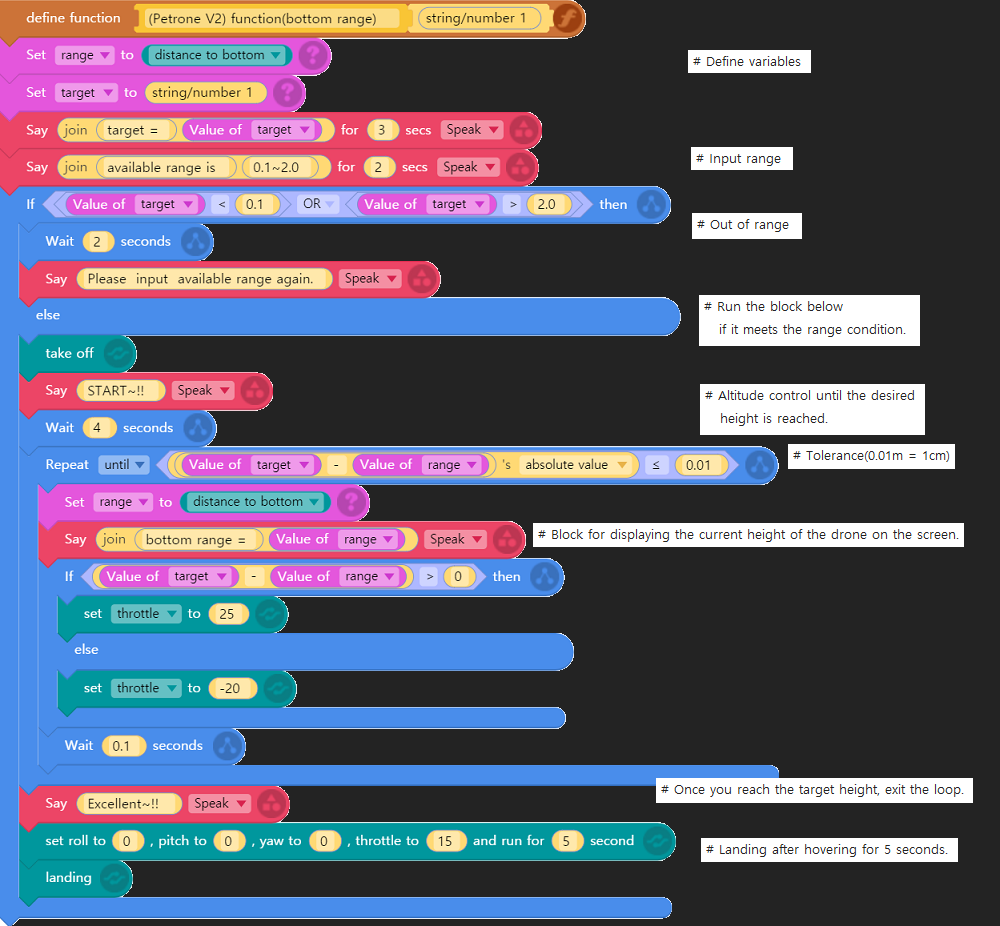

**[*petrone_v2* for entry](../index.md)** / **Examples** / **Bottom range(English)**

Modified : 2017.10.27

---

 

## <a name="Bottom range(English)">Bottom range(English)</a>

This is an example of using the **Range sensor** of Petrone V2 to control the drone by the desired **height**.

We used the function because we need to input the desired height value.

 

    

 

---

<h3><i>petrone_v2</i> for entry</H3>

 1. [Examples - Bottom range(Korean)](../examples_01_bottom_range_korean/)
 2. **Examples - Bottom range(English)**
 3. [Examples - Yaw rotation(Korean)](../examples_02_yaw_rotation_korean/)
 4. [Examples - Yaw rotation(English)](../examples_02_yaw_rotation_english/)
 
 

[Index](../index.md)
