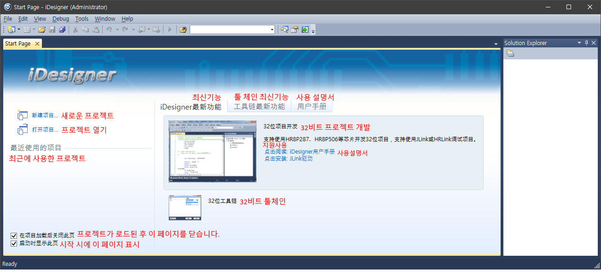
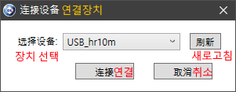
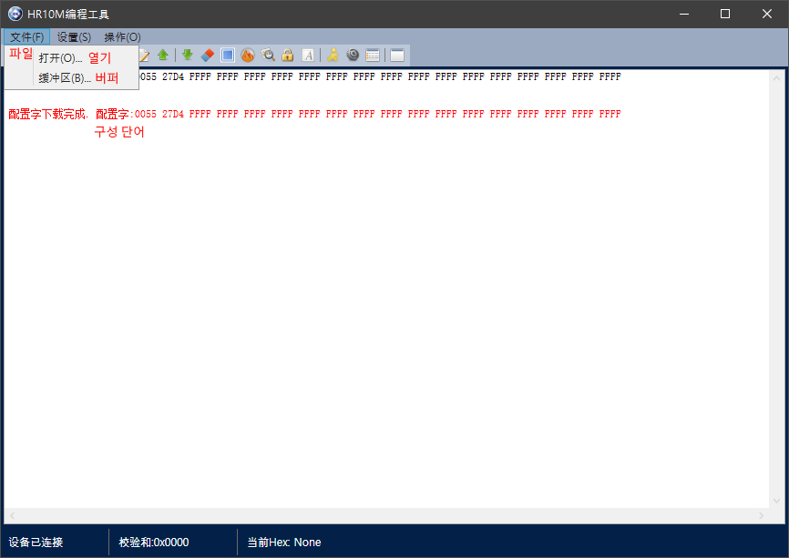
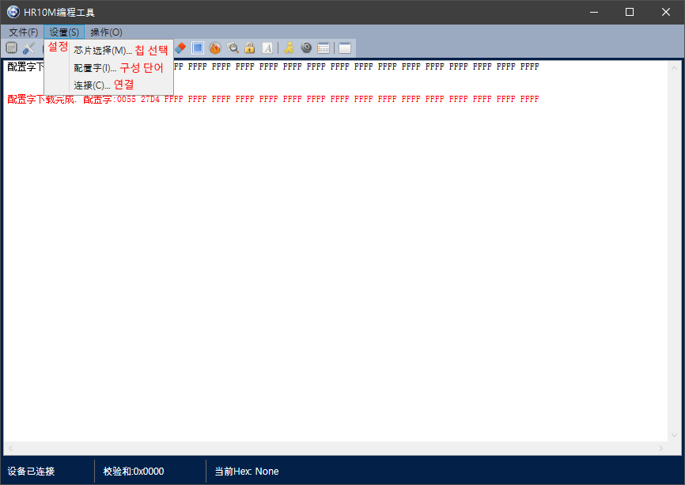
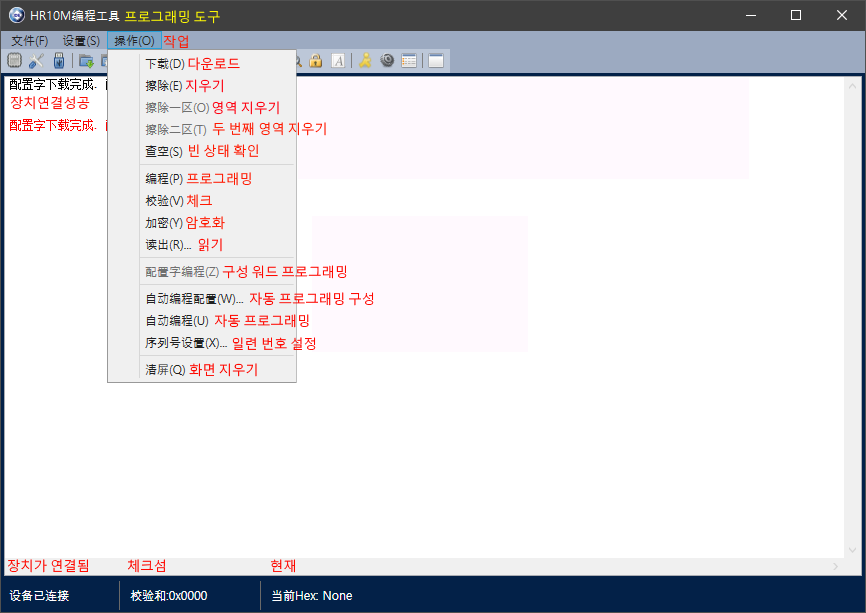
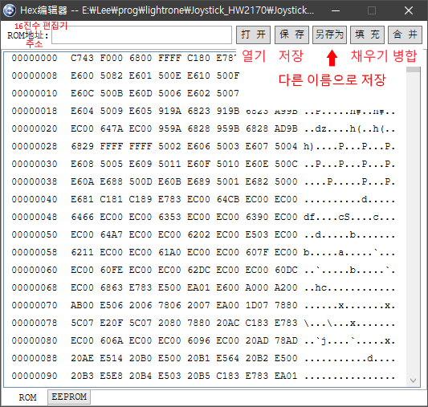
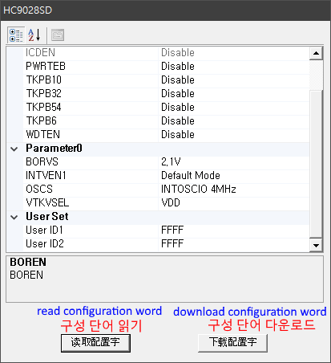
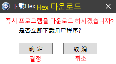
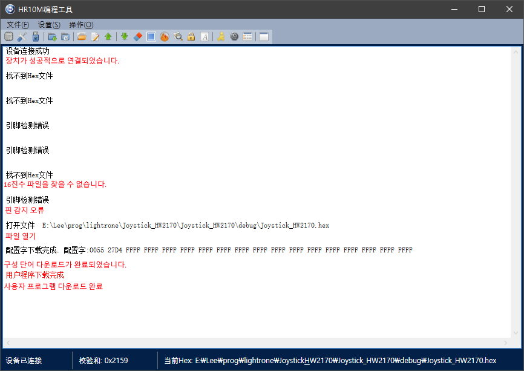

**EASTSOFT**

Modified : 2018.12.10

---

<h3>EASTSOFT IDE에 대한 설명 자료</h3>

---

* Kramdown table of contents
{:toc .toc}

 

 

# 1. iDesigner

시작 화면

    

 

# 2. HR10M 프로그래머

## 2.1. 시작 화면 및 메뉴 설명

### 2.1.1. 처음 실행 시 장치 선택 화면

    

 
 

### 2.1.2. 파일 메뉴

    

 
 

### 2.1.3. 설정 메뉴

    

 
 

### 2.1.4. 작업 메뉴

    

 
 

## 2.2. HEX 파일 다운로드

HEX 파일을 다운로드 하려면 **파일** -> **열기**를 선택해야 합니다.

### 2.2.1. 16진수 편집기

    

 
 

### 2.2.2. 읽기, 다운로드 선택 화면

    

 
 

### 2.2.3. 다운로드 선택 화면

    

 
 

### 2.2.4. 다운로드 완료 후 화면

    

 
 

 
