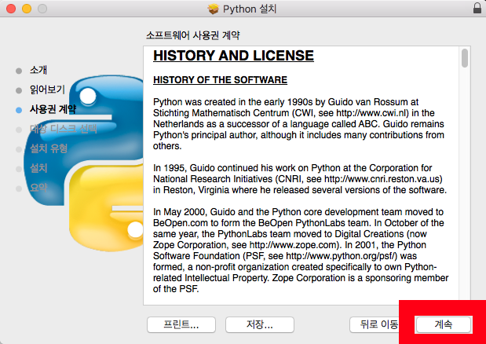

**Install Python 3 on macOS**

Modified : 2018.3.5

---

* Kramdown table of contents
{:toc .toc}

<br>

---

<h3>macOS에 <b>Python 3</b>와 <b>Visual Studio Code</b>를 설치하는 과정을 설명해드립니다.</h3>

---


<br>

# 1. 파이썬 설치

https://www.python.org 사이트를 방문합니다.

<div align="center">
    
</div>

화면의 **Downloads**라는 글자를 클릭하세요.
<br>
<br>


<div align="center">
    
</div>

두 종류의 파이썬이 노란색 버튼으로 나타납니다. 여기에서 <b>Download Python 3.6.3</b>를 클릭하세요.
<br>
<br>


<div align="center">
    
</div>

잠시 후 다운로드 폴더에 <b>python-3.6.3-macosx10.6.pkg</b> 파일을 받은 것을 확인하실 수 있습니다. 이 파일을 실행하면 설치를 시작합니다.
<br>
<br>


<div align="center">
    
</div>

<b>계속</b> 버튼을 누르면 다음으로 넘어갑니다
<br>
<br>


<div align="center">
    
</div>

<b>계속</b> 버튼을 누르면 다음으로 넘어갑니다.
<br>
<br>


<div align="center">
    
</div>

<b>계속</b> 버튼을 누르면 다음으로 넘어갑니다.
<br>
<br>


<div align="center">
    
</div>

<b>동의</b> 버튼을 누르면 다음으로 넘어갑니다.
<br>
<br>


<div align="center">
    
</div>

설치할 디스크를 묻는 화면입니다.
<br>
<br>


<div align="center">
    
</div>

설치할 디스크를 지정하면 다음 단계로 넘어갈 수 있습니다. <b>계속</b> 버튼을 누르면 다음으로 넘어갑니다.
<br>
<br>


<div align="center">
    
</div>

설치 용량을 알려주는 화면입니다. <b>설치</b> 버튼을 누르면 다음으로 넘어갑니다.
<br>
<br>


<div align="center">
    
</div>

설치 중인 화면입니다.
<br>
<br>


<div align="center">
    
</div>

설치가 완료된 화면입니다. <b>닫기</b> 버튼을 누르면 다음으로 넘어갑니다.
<br>
<br>


<div align="center">
    
</div>

설치에 사용한 파일을 휴지통에 버릴 것인지를 묻는 화면입니다. <b>휴지통으로 이동</b>을 선택하시면 파이썬 설치가 완료됩니다.
<br>
<br>


<br>


# 2. Visual Studio Code 설치

https://code.visualstudio.com 사이트를 방문합니다.

<div align="center">
    
</div>

<b>Download for Mac</b> 버튼을 누르시면 Visual Studio Code를 다운받으실 수 있습니다.
<br>
<br>


<div align="center">
    
</div>

다운로드가 시작되면 위와 같은 화면으로 바뀝니다. 화면이 전환되고도 다운로드를 시작하지 않는다면, 화면 중앙의 <b>direct download link</b> 버튼을 누르시기 바랍니다.
<br>
<br>


<div align="center">
    
</div>

처음 프로그램을 실행하면 위와 같은 창이 나타납니다. 여기에서 <b>열기</b>를 누르시면 프로그램이 실행됩니다.
<br>
<br>


<div align="center">
    
</div>

<b>Visual Studio Code</b>가 실행된 화면입니다.
<br>
<br>


<br>


# 3. Visual Studio 설정 변경

**Python 3** 기반으로 작성한 프로그램을 실행하려면 python3를 사용해야 합니다.

<div align="center">
    
</div>

화면 상단의 메뉴에서 <b>Code</b> -> <b>기본 설정</b> -> <b>설정</b>을 선택합니다.
<br>
<br>


<div align="center">
    
</div>

위의 그림과 같이 화면 우측에 다음의 설정을 추가합니다.

```python
"python.pythonPath": "python3"
```

<br>

<div align="center">
    
</div>

파일을 닫으면 설정 파일을 저장할 것인지를 묻습니다. 여기에서 <b>저장</b> 버튼을 누르시면 됩니다.
<br>
<br>


<div align="center">
    
</div>

파일 저장 위치를 묻는 화면입니다. 바로 <b>저장</b> 버튼을 누르시면 변경된 설정이 저장됩니다.
<br>
<br>


<br>


# 4. Visual Studio 확장 프로그램 설치

Visual Studio Code에서 파이썬 프로그램 작성을 도와주는 몇 가지 확장 프로그램을 설치합니다.

<div align="center">
    
</div>

화면 좌측에서 다섯번째 아이콘을 클릭하시면 확장프로그램 창이 열립니다. 여기에서는 <b>indent-rainbow</b>, <b>MagicPython</b>, <b>Python</b>, <b>Python for VSCode</b>를 설치하였습니다. 상단의 <b>마켓플레이스에서 확장 검색</b>에 각각의 이름을 넣고 검색해서 설치하시면 됩니다.


<br>


# 5. pylint 설치

파이썬 정적 코드 분석기입니다. 아래의 명령을 실행하여 설치합니다.

```
> python3 -m pip install pylint
```

아래는 Visul Studio Code 의 터미널에서 설치한 화면입니다.

<div align="center">
    
</div>


<br>


여기까지 Python 3와 Visual Studio Code 설치를 진행하였습니다.


<br>
