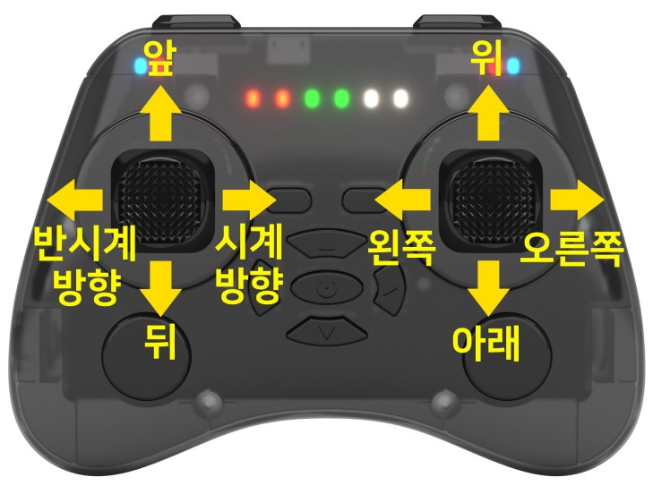
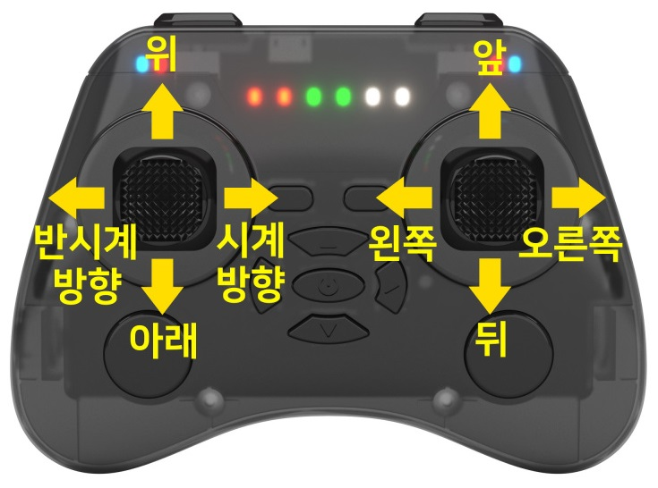

**[BATTLE DRONE](/documents/kr/products/e_drone/) User Manual**

Modified : 2020.4.7

---

<h3>BATTLE DRONE 사용자 설명서</h3>

---

* Kramdown table of contents
{:toc .toc}

 

# 1. 드론

 

## 1.1. 사양

 

    <table>
        <tr>
            <td class="spec">
<b>항목</b>
</td>
            <td class="spec">
<b>BATTLE DRONE</b>
</td>
        </tr>
        <tr>
            <td class="spec">
모터 축간 대각선 길이
</td>
            <td class="white">
95 mm
</td>
        </tr>
        <tr>
            <td class="spec">
무게
</td>
            <td class="spec">
34.5g (배터리 포함)
</td>
        </tr>
        <tr>
            <td class="spec">
배터리
</td>
            <td class="white">
3.7V, 300mAh, 15C LiPo battery (Lithium polymer) 
</td>
        </tr>
        <tr>
            <td class="spec">
비행시간
</td>
            <td class="spec">
8분(Max)
</td>
        </tr>
        <tr>
            <td class="spec">
최대조종거리
</td>
            <td class="white">
50m
</td>
        </tr>
        <tr>
            <td class="spec">
통신방식
</td>
            <td class="spec">
2.4Ghz RF
</td>
        </tr>
        <tr>
            <td class="spec">
조종 모드
</td>
            <td class="white">
Mode 1, 2
</td>
        </tr>
        <tr>
            <td rowspan="3" class="spec">
센서
</td>
            <td class="spec">
6-Axis MEMS MotionTracking
</td>
        </tr>
        <tr>
            <td class="white">
Barometer
</td>
        </tr>
        <tr>
            <td class="spec">
IR Transmitter, Receiver
</td>
        </tr>
        <tr>
            <td rowspan="2" class="spec">
주요기능
</td>
            <td class="white">
드론 배틀 게임
</td>
        </tr>
        <tr>
            <td class="spec">
앱, 파이썬 코딩
</td>
        </tr>
    </table>

 

## 1.2. 좌표계

BATTLE DRONE은 오른손 좌표계를 사용하고 있습니다.

    <table>
        <tr>
            <td class="coord">
<b>좌표축</b>
</td>
            <td class="coord">
<b>+</b>
</td>
            <td class="coord">
<b>-</b>
</td>
        </tr>
        <tr>
            <td class="coord">
X
</td>
            <td class="white">
앞
</td>
            <td class="white">
뒤
</td>
        </tr>
        <tr>
            <td class="coord">
Y
</td>
            <td class="coord">
왼쪽
</td>
            <td class="coord">
오른쪽
</td>
        </tr>
        <tr>
            <td class="coord">
Z
</td>
            <td class="white">
위
</td>
            <td class="white">
아래
</td>
        </tr>
        <tr>
            <td class="coord">
Z 회전
</td>
            <td class="coord">
반시계
</td>
            <td class="coord">
시계
</td>
        </tr>
    </table>

아래 문서의 Figure 6 이미지를 참고하시기 바랍니다.

[http://www.physics.brocku.ca/PPLATO/h-flap/math2_5.html#section_3](http://www.physics.brocku.ca/PPLATO/h-flap/math2_5.html#section_3)

 

 

# 2. 조종기

## 2.1. 버튼 구성 및 기능

    
    
배틀 드론 조종기

 

    <table>
        <tr>
            <td class="coord">
<b>번호</b>
</td>
            <td class="coord">
<b>짧게 눌렀을 때</b>
</td>
            <td class="coord">
<b>길게 눌렀을 때</b>
</td>
        </tr>
        <tr>
            <td class="coord">
1
</td>
            <td class="white">
속도 변경 ( 1 / 2 / 3 )
</td>
            <td class="white">
이륙 (대기 상태) 착륙 (비행 상태) 강제 정지 (Throttle 아래 방향)
</td>
        </tr>
        <tr>
            <td class="coord">
2
</td>
            <td class="coord">
미사일 발사 (Red, Blue) LED 색상 변경 (Magenta)
</td>
            <td class="coord">
Flip 준비 (비행 상태) Flip (Flip 준비가 완료된 상태에서 Roll 또는 Pitch 조작 시)
</td>
        </tr>
        <tr>
            <td class="coord">
3
</td>
            <td class="white">
Heading Reset
</td>
            <td class="white">
Headless 모드 ON / OFF
</td>
        </tr>
        <tr>
            <td class="coord">
4
</td>
            <td class="coord">
팀 변경
</td>
            <td class="coord">
Red, Blue(배틀 모드) Magenta(조종 모드)
</td>
        </tr>
        <tr>
            <td class="coord">
5
</td>
            <td class="white">
Trim Pitch 증가
</td>
            <td class="white">
-
</td>
        </tr>
        <tr>
            <td class="coord">
6
</td>
            <td class="coord">
Trim Roll 감소
</td>
            <td class="coord">
Mode 1
</td>
        </tr>
        <tr>
            <td class="coord">
7
</td>
            <td class="white">
조종 모드 / Link 모드 전환 (USB로 데이터를 수신받은 적이 있는 경우에만)
</td>
            <td class="white">
전원 ON / OFF
</td>
        </tr>
        <tr>
            <td class="coord">
8
</td>
            <td class="coord">
Trim Roll 증가
</td>
            <td class="coord">
Mode 2
</td>
        </tr>
        <tr>
            <td class="coord">
9
</td>
            <td class="white">
Trim Pitch 감소
</td>
            <td class="white">
-
</td>
        </tr>
        <tr>
            <td class="coord">
10
</td>
            <td class="coord">
-
</td>
            <td class="coord">
드론 Motion 센서 리셋(드론과 연결된 경우) 조이스틱 캘리브레이션 리셋(드론과 연결이 끊어진 경우)
</td>
        </tr>
        <tr>
            <td class="coord">
11
</td>
            <td class="white">
-
</td>
            <td class="white">
페어링(드론이 연결되어 있고, 비행중인 경우엔 무시함)
</td>
        </tr>
    </table>

 

 

## 2.2. MODE

### 2.2.1. MODE 1

    
    
MODE 1

 

 

### 2.2.2. MODE 2

    
    
MODE 2

 

 

여기까지 BATTLE DRONE 조종기와 드론에 대한 간략한 설명이었습니다.

