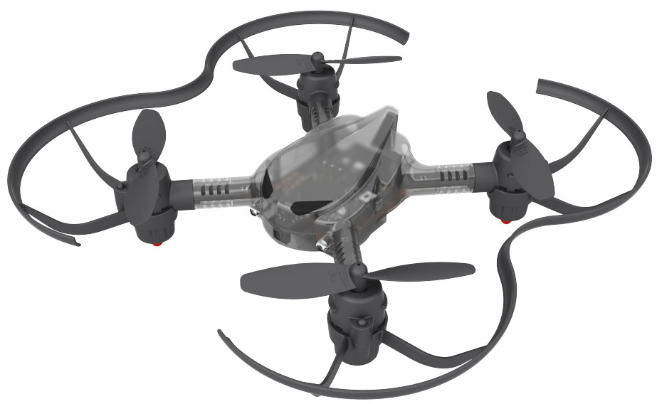

**[BATTLE DRONE](/documents/kr/products/e_drone/) User Manual**

Modified : 2020.4.13

---

<h3>BATTLE DRONE 사용자 설명서</h3>

---

* Kramdown table of contents
{:toc .toc}

 

# 1. 드론

    
    
배틀 드론

 

## 1.1. 사양

 

    <table>
        <tr>
            <td class="spec">
<b>항목</b>
</td>
            <td class="spec">
<b>BATTLE DRONE</b>
</td>
        </tr>
        <tr>
            <td class="spec">
모터 축간 대각선 길이
</td>
            <td class="white">
95 mm
</td>
        </tr>
        <tr>
            <td class="spec">
무게
</td>
            <td class="spec">
34.5g (배터리 포함)
</td>
        </tr>
        <tr>
            <td class="spec">
배터리
</td>
            <td class="white">
3.7V, 300mAh, 15C LiPo battery (Lithium polymer) 
</td>
        </tr>
        <tr>
            <td class="spec">
비행시간
</td>
            <td class="spec">
8분(Max)
</td>
        </tr>
        <tr>
            <td class="spec">
최대조종거리
</td>
            <td class="white">
50m
</td>
        </tr>
        <tr>
            <td class="spec">
통신방식
</td>
            <td class="spec">
2.4Ghz RF
</td>
        </tr>
        <tr>
            <td class="spec">
조종 모드
</td>
            <td class="white">
Mode 1, 2
</td>
        </tr>
        <tr>
            <td rowspan="3" class="spec">
센서
</td>
            <td class="spec">
6-Axis MEMS MotionTracking
</td>
        </tr>
        <tr>
            <td class="white">
Barometer
</td>
        </tr>
        <tr>
            <td class="spec">
IR Transmitter, Receiver
</td>
        </tr>
        <tr>
            <td rowspan="2" class="spec">
주요기능
</td>
            <td class="white">
드론 배틀 게임
</td>
        </tr>
        <tr>
            <td class="spec">
엔트리, 파이썬 코딩
</td>
        </tr>
    </table>

 

## 1.2. 좌표계

BATTLE DRONE은 오른손 좌표계를 사용하고 있습니다.

    <table>
        <tr>
            <td class="coord">
<b>좌표축</b>
</td>
            <td class="coord">
<b>+</b>
</td>
            <td class="coord">
<b>-</b>
</td>
        </tr>
        <tr>
            <td class="coord">
X
</td>
            <td class="white">
앞
</td>
            <td class="white">
뒤
</td>
        </tr>
        <tr>
            <td class="coord">
Y
</td>
            <td class="coord">
왼쪽
</td>
            <td class="coord">
오른쪽
</td>
        </tr>
        <tr>
            <td class="coord">
Z
</td>
            <td class="white">
위
</td>
            <td class="white">
아래
</td>
        </tr>
        <tr>
            <td class="coord">
Z 회전
</td>
            <td class="coord">
반시계
</td>
            <td class="coord">
시계
</td>
        </tr>
    </table>

아래 문서의 Figure 6 이미지를 참고하시기 바랍니다.

[http://www.physics.brocku.ca/PPLATO/h-flap/math2_5.html#section_3](http://www.physics.brocku.ca/PPLATO/h-flap/math2_5.html#section_3)

 

 

# 2. 조종기

## 2.1. 버튼 구성 및 기능

    
    
배틀 드론 조종기

 

    <table>
        <tr>
            <td class="coord">
<b>번호</b>
</td>
            <td class="coord">
<b>짧게 눌렀을 때</b>
</td>
            <td class="coord">
<b>길게 눌렀을 때</b>
</td>
        </tr>
        <tr>
            <td class="coord">
1
</td>
            <td class="white">
속도 변경 ( 1 / 2 / 3 )
</td>
            <td class="white">
이륙 (대기 상태) 착륙 (비행 상태) 강제 정지 (Throttle 아래 방향)
</td>
        </tr>
        <tr>
            <td class="coord">
2
</td>
            <td class="coord">
미사일 발사 (Red, Blue) LED 색상 변경 (Magenta)
</td>
            <td class="coord">
Flip 준비 (비행 상태) Flip (Flip 준비가 완료된 상태에서 Roll 또는 Pitch 조작 시)
</td>
        </tr>
        <tr>
            <td class="coord">
3
</td>
            <td class="white">
Heading Reset
</td>
            <td class="white">
Headless 모드 ON / OFF
</td>
        </tr>
        <tr>
            <td class="coord">
4
</td>
            <td class="coord">
팀 변경
</td>
            <td class="coord">
Red, Blue(배틀 모드) Magenta(조종 모드)
</td>
        </tr>
        <tr>
            <td class="coord">
5
</td>
            <td class="white">
Trim Pitch 증가
</td>
            <td class="white">
-
</td>
        </tr>
        <tr>
            <td class="coord">
6
</td>
            <td class="coord">
Trim Roll 감소
</td>
            <td class="coord">
Mode 1
</td>
        </tr>
        <tr>
            <td class="coord">
7
</td>
            <td class="white">
조종 모드 / Link 모드 전환 (USB로 데이터를 수신받은 적이 있는 경우에만)
</td>
            <td class="white">
전원 ON / OFF
</td>
        </tr>
        <tr>
            <td class="coord">
8
</td>
            <td class="coord">
Trim Roll 증가
</td>
            <td class="coord">
Mode 2
</td>
        </tr>
        <tr>
            <td class="coord">
9
</td>
            <td class="white">
Trim Pitch 감소
</td>
            <td class="white">
-
</td>
        </tr>
        <tr>
            <td class="coord">
10
</td>
            <td class="coord">
-
</td>
            <td class="coord">
드론 Motion 센서 리셋(드론과 연결된 경우) 조이스틱 캘리브레이션 리셋(드론과 연결이 끊어진 경우)
</td>
        </tr>
        <tr>
            <td class="coord">
11
</td>
            <td class="white">
-
</td>
            <td class="white">
페어링(드론이 연결되어 있고, 비행중인 경우엔 무시함)
</td>
        </tr>
    </table>

 

 

## 2.2. MODE

### 2.2.1. MODE 1

    
    
MODE 1

 

 

### 2.2.2. MODE 2

    
    
MODE 2

 
 
 

# 3. 동작

 

## 3.1. 페어링

    <table>
        <tr>
            <td class="explain">

                1. 드론에 배터리가 연결되어 있다면 제거하세요.
            
</td>
        </tr>
        <tr>
            <td class="white">

                2. 드론에 배터리를 연결합니다.
            
</td>
        </tr>
        <tr>
            <td class="explain">

                3. 드론의 양 옆을 잡고, 좌우로 흔들어줍니다.
            
</td>
        </tr>
        <tr>
            <td class="white">

                4. 드론의 프로펠러 쪽 LED가 파란색-빨간색 순서로 계속해서 깜빡이면 드론의 페어링 준비가 완료된 것입니다.
            
</td>
        </tr>
        <tr>
            <td class="explain">

                5. 조종기의 전원을 켭니다.
            
</td>
        </tr>
        <tr>
            <td class="white">

                6. 조종기 오른쪽 하단의 둥근 버튼(11번 버튼)을 3초 이상 길게 누르면 페어링이 완료됩니다.
            
</td>
        </tr>
    </table>

 

## 3.2. 모드 구분

4번 버튼을 누르면 차례대로 팀 색상이 **Red**, **Blue**, **Magenta**(Red,Blue 동시 켜짐)로 바뀝니다.

    <table>
        <tr>
            <td class="team">
<b>모드</b>
</td>
            <td class="team">
<b>색상</b>
</td>
            <td class="team">
<b>동작</b>
</td>
            <td class="team">
<b>2번 버튼 동작</b>
</td>
        </tr>
        <tr>
            <td class="team" rowspan="2">
배틀 모드
</td>
            <td class="red">
RED
</td>
            <td class="red">
전투
</td>
            <td class="red">
미사일 발사
</td>
        </tr>
        <tr>
            <td class="blue">
BLUE
</td>
            <td class="blue">
전투
</td>
            <td class="blue">
미사일 발사
</td>
        </tr>
        <tr>
            <td class="team">
비행 모드
</td>
            <td class="magenta">
MAGENTA
</td>
            <td class="magenta">
비행
</td>
            <td class="magenta">
LED 색 변경
</td>
        </tr>
    </table>

 
 
 

# 4. 배틀 모드

배틀 모드는 RED 팀과 BLUE 팀이 배틀 게임을 하는 모드입니다. 
기본적인 규칙은 다음과 같습니다.

    <table>
        <tr>
            <td class="explain">

                1. 비행 중에는 <b>팀 변경</b>을 할 수 없습니다.
            
</td>
        </tr>
        <tr>
            <td class="white">

                2. 사용 가능한 무기는 <b>6종류</b>입니다.
            
</td>
        </tr>
        <tr>
            <td class="explain">

                3. 기본 무기는 <b>레이저</b>입니다.
            
</td>
        </tr>
        <tr>
            <td class="white">

                4. 레이저 이외의 무기는 따로 <b>장전</b>과 <b>발사</b> 동작이 필요합니다.
            
</td>
        </tr>
        <tr>
            <td class="explain">

                5. 무기 장전 방법 및 효과는 <b>'4.1. 무기'</b>를 참고하시기 바랍니다.
            
</td>
        </tr>
        <tr>
            <td class="white">

                6. 레이저 이외의 무기는 장전되면 <b>5초</b> 동안 장탄량 이내로 계속 발사할 수 있습니다.
            
</td>
        </tr>
        <tr>
            <td class="explain">

                7. <b>실드</b>는 사용 시 바로 적용되고, 선택 무기가 레이저로 변경됩니다.
            
</td>
        </tr>
        <tr>
            <td class="white">

                8. 무기를 장전한 후 <b>5초</b>가 지나면 다시 레이저로 바뀝니다.
            
</td>
        </tr>
        <tr>
            <td class="explain">

                9. <b>같은 편</b>이 발사한 무기에 대해서는 피격되지 않습니다.
            
</td>
        </tr>
        <tr>
            <td class="white">

                10. 에너지는 전체 6칸이며 <b>레이저</b>에 1회 피격을 당할 때마다 1개씩 줄어듭니다.
            
</td>
        </tr>
        <tr>
            <td class="explain">

                11. 특수 무기에 피격된 이후 <b>레이저</b>로 공격받으면 조작 제한 상태가 풀립니다.
            
</td>
        </tr>
        <tr>
            <td class="white">

                12. 에너지가 <b>0</b>이 되면 드론이 <b>착륙</b>합니다.
            
</td>
        </tr>
    </table>

 

## 4.1. 무기

무기를 무제한 연속 사용하는 것을 막고자 <b>최대 장탄 수</b>와 <b>무기 보충 시간</b> 제한을 두었습니다.

    <table>
        <tr>
            <td class="coord">
<b>무기</b>
</td>
            <td class="coord">
<b>최대 장탄 수</b>
</td>
            <td class="coord">
<b>무기 보충 시간</b>
</td>
            <td class="coord">
<b>사용 방법</b>
</td>
            <td class="coord">
<b>효과</b>
</td>
        </tr>
        <tr>
            <td class="coord">
레이저
</td>
            <td class="white">
12
</td>
            <td class="white">
0.6초
</td>
            <td class="white">
기본 무기
</td>
            <td class="white">
피격 시 에너지가 1칸 떨어집니다.
</td>
        </tr>
        <tr>
            <td class="coord">
쉴드
</td>
            <td class="coord">
12
</td>
            <td class="coord">
1초
</td>
            <td class="coord">
오른쪽 조이스틱을 오른쪽-왼쪽-오른쪽-왼쪽으로 조작
</td>
            <td class="coord">
5초간 무적 상태가 됩니다
</td>
        </tr>
        <tr>
            <td class="coord">
데몬
</td>
            <td class="white">
12
</td>
            <td class="white">
1초
</td>
            <td class="white">
오른쪽 조이스틱을 왼쪽 방향부터 반시계 방향으로 두 바퀴 회전
</td>
            <td class="white">
5초 동안 적 기체의 앞뒤와 좌우를 반대로 움직이게 합니다.
</td>
        </tr>
        <tr>
            <td class="coord">
물폭탄
</td>
            <td class="coord">
12
</td>
            <td class="coord">
1초
</td>
            <td class="coord">
오른쪽 조이스틱을 오른쪽 방향부터 시계 방향으로 두 바퀴 회전
</td>
            <td class="coord">
5초 동안 무기 사용을 차단합니다.
</td>
        </tr>
        <tr>
            <td class="coord">
증폭
</td>
            <td class="white">
12
</td>
            <td class="white">
1초
</td>
            <td class="white">
왼쪽 조이스틱을 왼쪽 방향부터 반시계 방향으로 두 바퀴 회전
</td>
            <td class="white">
5초 동안 모든 방향의 조작을 최대값으로 만들어 세밀한 조종을 할 수 없게합니다.
</td>
        </tr>
        <tr>
            <td class="coord">
헤딩락
</td>
            <td class="coord">
12
</td>
            <td class="coord">
1초
</td>
            <td class="coord">
왼쪽 조이스틱을 오른쪽 방향부터 시계 방향으로 두 바퀴 회전
</td>
            <td class="coord">
5초 동안 적 기체의 좌우 회전 조작을 못하게 합니다.
</td>
        </tr>
    </table>

 
 
 

여기까지 BATTLE DRONE 조종기와 드론에 대한 간략한 설명이었습니다.

