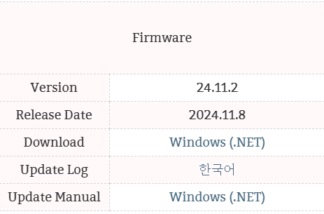
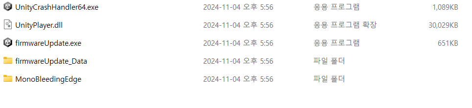
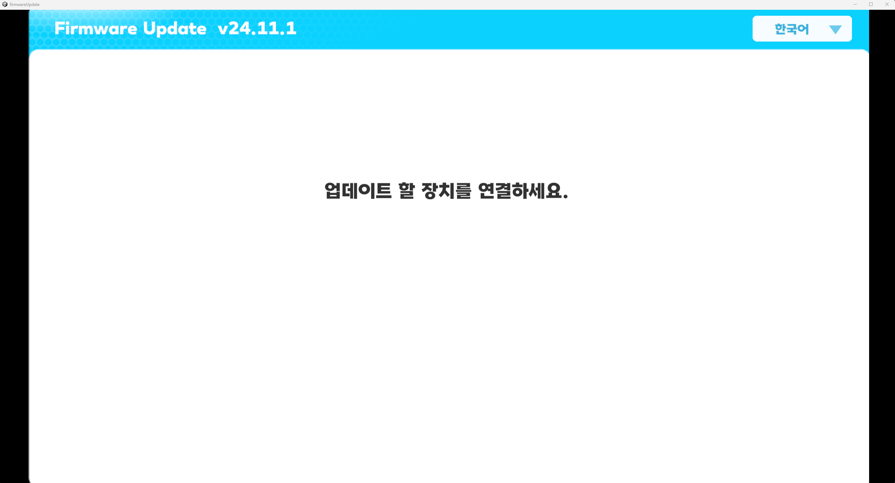
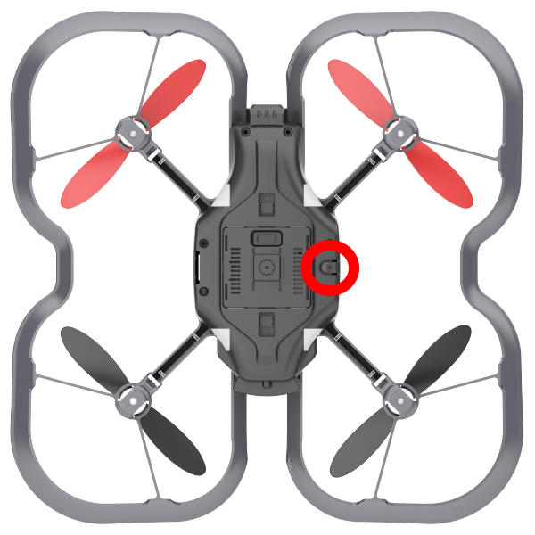
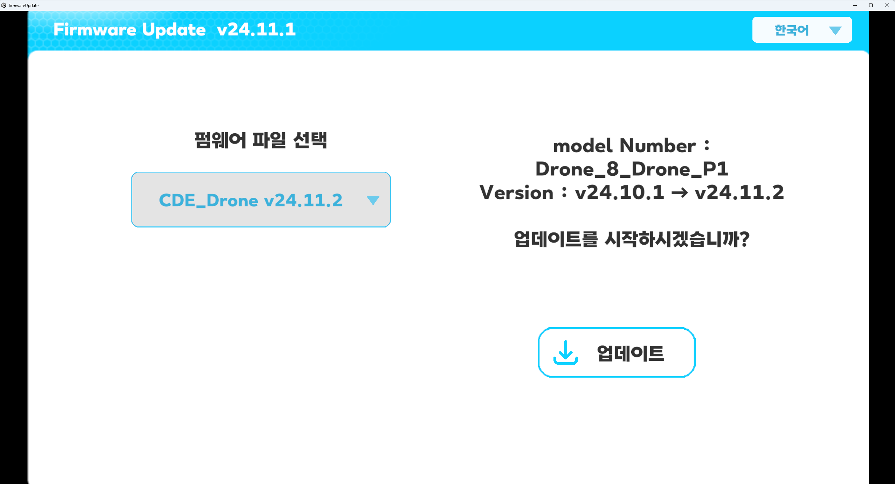
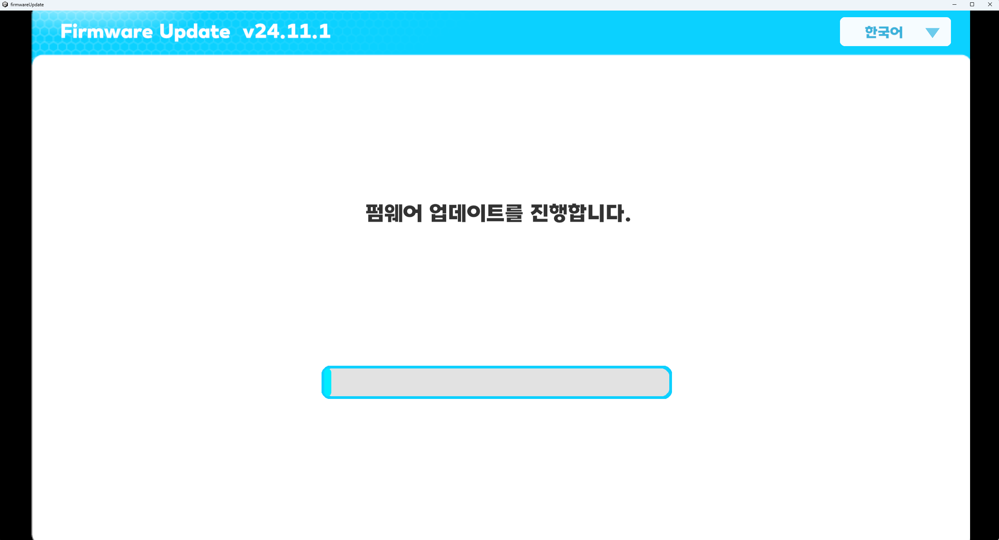
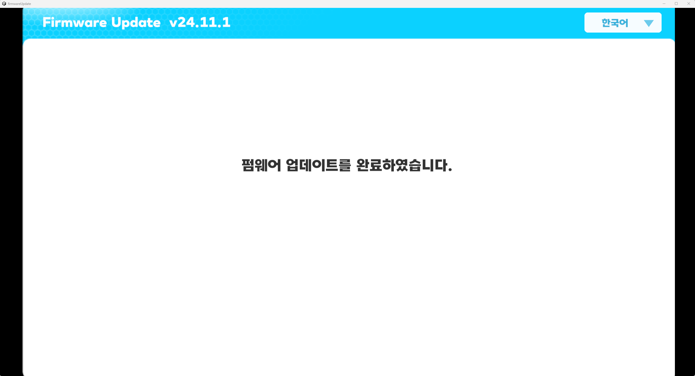
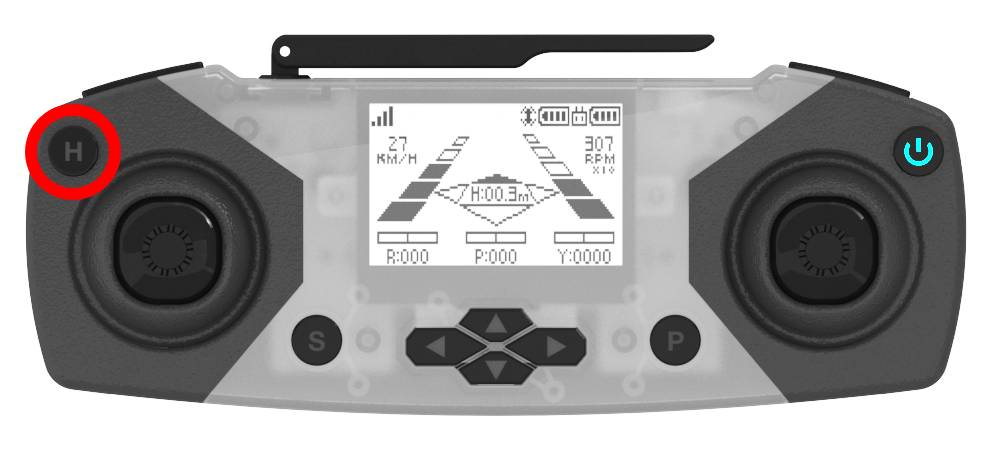
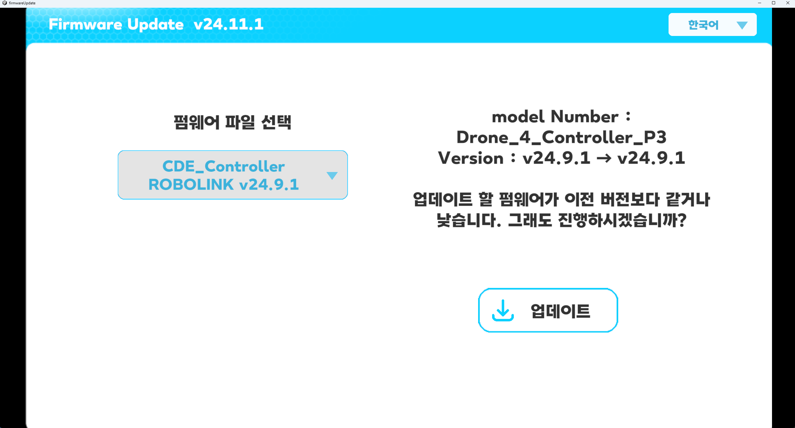

**[CODING DRONE](/documents/kr/products/coding_drone/) firmware Update**

Modified : 2024.11.8

---

<h3>Coding Drone 펌웨어 업데이트</h3>

---

- **Firmware_update**
- [Drone4AutoUpdaterLight](../drone4autoupdaterlight/)
- [drone_4_updater_windows](../drone_4_updater_windows/)
- [drone_4_updater_mac](../drone_4_updater_mac/)
- [drone_4_updater_linux](../drone_4_updater_linux/)
- [drone_4_updater_raspberry_pi](../drone_4_updater_raspberry_pi/)
<!--- [Python Library](../python/)-->

---

* Kramdown table of contents
{:toc .toc}

 

# 1. 링크에서 프로그램 다운로드

[CODING DRONE](/documents/kr/products/coding_drone/) 페이지에서 최신 Coding Drone 펌웨어를 내려받습니다.

    
    
펌웨어 업데이트 프로그램 다운로드 링크 [Download의 'Windows (.NET)']

 

 

# 2. 펌웨어 자동 업데이트

드론 또는 조종기를 부트로더 모드로 연결하면 자동으로 펌웨어를 업데이트해 주는 프로그램입니다.

 

## 2.1. 드론 업데이트

(1) "firmwareUpdate.exe"를 실행합니다.

    
    
펌웨어 업데이트 프로그램 폴더

 

    
    
펌웨어 업데이트 프로그램 실행 화면

 

(2) 드론에 배터리가 연결되어 있다면 제거합니다.

 

(3) 드론 바닥 면의 버튼(아래 그림에서 빨간색 원으로 표시)을 누른 채로 USB 커넥터를 연결합니다.

    
    
드론 부트로더 진입 버튼

 

(4) 다운로드 받을 펌웨어의 버전을 선택합니다.

    
    
드론 펌웨어 선택 화면

 

(5) 드론의 전원이 켜지고 자동으로 업데이트를 진행합니다.

    
    
드론 펌웨어 업데이트 진행 화면

 

    
    
드론 펌웨어 업데이트 완료 화면

 

 

## 2.2. 조종기 업데이트

(1) "firmwareUpdate.exe"를 실행합니다.

    
    
펌웨어 업데이트 프로그램 폴더

 

    
    
펌웨어 업데이트 프로그램 실행 화면

 

(2) 조종기의 전원이 켜져 있으면 꺼주시기 바랍니다.

 

(3) 조종기 왼쪽 위의 버튼(아래 그림에서 빨간색 원으로 표시)을 누른 채로 USB 커넥터를 연결합니다.

    
    
조종기 부트로더 진입 버튼

 

(4) 다운로드 받을 펌웨어의 버전을 선택합니다.

    
    
조종기 펌웨어 선택 화면

 

(5) 자동으로 조종기 업데이트를 진행합니다.

    
    
조종기 펌웨어 업데이트 진행 화면

 

    
    
조종기 펌웨어 업데이트 완료 화면

 

 

여기까지 Coding Drone 드론과 조종기의 펌웨어 업데이트를 완료하였습니다.

