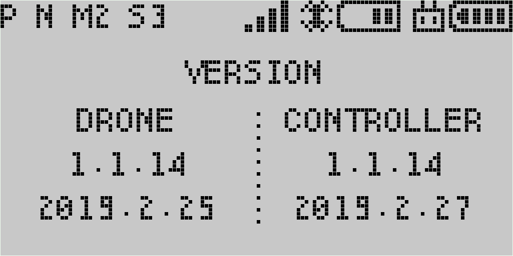
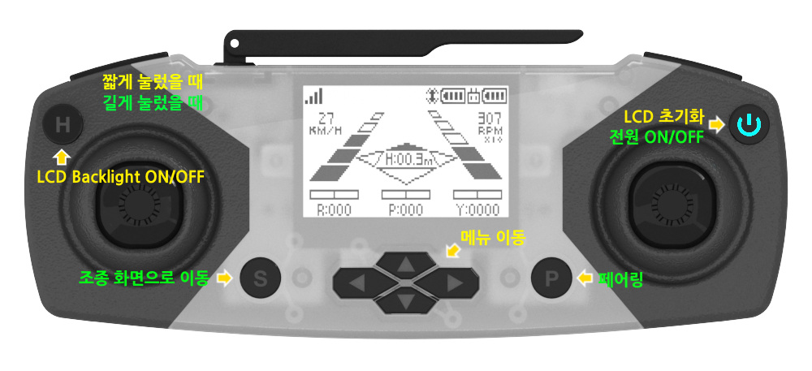

**[CODING DRONE](/documents/kr/products/e_drone/) User Manual**

Modified : 2020.4.28

---

<h3>Coding Drone 사용자 설명서</h3>

---

* Kramdown table of contents
{:toc .toc}

 

# 1. 드론

    
    
CODING DRONE

 

## 1.1. 사양

 

    <table>
        <tr>
            <td class="spec">
<b>항목</b>
</td>
            <td class="spec">
<b>Coding Drone</b>
</td>
        </tr>
        <tr>
            <td class="spec">
모터 축간 대각선 길이
</td>
            <td class="white">
103 mm
</td>
        </tr>
        <tr>
            <td class="spec">
무게
</td>
            <td class="spec">
55g (배터리 포함)
</td>
        </tr>
        <tr>
            <td class="spec">
배터리
</td>
            <td class="white">
3.7V, 530mAh LiPo battery (Lithium polymer)
</td>
        </tr>
        <tr>
            <td class="spec">
비행시간
</td>
            <td class="spec">
7 ~ 10분
</td>
        </tr>
        <tr>
            <td class="spec">
최대조종거리
</td>
            <td class="white">
50m
</td>
        </tr>
        <tr>
            <td class="spec">
통신방식
</td>
            <td class="spec">
2.4Ghz RF
</td>
        </tr>
        <tr>
            <td class="spec">
조종 모드
</td>
            <td class="white">
Mode 1, 2, 3, 4
</td>
        </tr>
        <tr>
            <td class="spec" rowspan="4">
센서
</td>
            <td class="spec">
Optical flow
</td>
        </tr>
        <tr>
            <td class="white">
6-Axis MEMS MotionTracking
</td>
        </tr>
        <tr>
            <td class="spec">
IR Time of Flight
</td>
        </tr>
        <tr>
            <td class="white">
Barometer
</td>
        </tr>
        <tr>
            <td class="spec" rowspan="3">
주요기능
</td>
            <td class="spec">
실내 위치 인식
</td>
        </tr>
        <tr>
            <td class="white">
Return Home
</td>
        </tr>
        <tr>
            <td class="spec">
엔트리, 파이썬 코딩
</td>
        </tr>
    </table>

 
 
 

## 1.2. 좌표계

Coding Drone은 오른손 좌표계를 사용하고 있습니다.

    <table>
        <tr>
            <td class="coord">
<b>좌표축</b>
</td>
            <td class="coord">
<b>+</b>
</td>
            <td class="coord">
<b>-</b>
</td>
        </tr>
        <tr>
            <td class="coord">
X
</td>
            <td class="white">
앞
</td>
            <td class="white">
뒤
</td>
        </tr>
        <tr>
            <td class="coord">
Y
</td>
            <td class="coord">
왼쪽
</td>
            <td class="coord">
오른쪽
</td>
        </tr>
        <tr>
            <td class="coord">
Z
</td>
            <td class="white">
위
</td>
            <td class="white">
아래
</td>
        </tr>
        <tr>
            <td class="coord">
Z 회전
</td>
            <td class="coord">
반시계
</td>
            <td class="coord">
시계
</td>
        </tr>
    </table>

아래 문서의 Figure 6 이미지를 참고하시기 바랍니다.

[http://www.physics.brocku.ca/PPLATO/h-flap/math2_5.html#section_3](http://www.physics.brocku.ca/PPLATO/h-flap/math2_5.html#section_3)

 
 
 

## 1.3. 동작 모드

Coding Drone은 여러 동작 모드를 가지고 있습니다.

| 이름                | 설명                                                                                                   |
|--------------------:|:-------------------------------------------------------------------------------------------------------|
| **조종**            | 조종기로 드론을 조종할 때 사용하는 모드입니다                                                          |
| **카드 코딩**       | 카드 코딩 모드입니다. 드론을 켰을 때 처음 시작하는 모드입니다                                          |
| **모션 코딩**       | 드론를 앞, 뒤, 좌, 우 방향으로 기울여서 코딩하는 모드입니다                                            |
| **피아노**          | 카드를 사용하여 음악 연주를 하는 모드입니다                                                            |

 

센서 초기화 기능

| 이름                          | 설명                                                                                                      |
|:-----------------------------:|:----------------------------------------------------------------------------------------------------------|
| **모션 센서 캘리브레이션**    | 동작 센서의 바이어스를 초기화합니다.                                                                      |
| **컬러 캘리브레이션**    | 검정, 흰색, 빨강, 노랑, 초록, 하늘, 파랑, 자홍 색을 차례로 눌러서 카드 색상을 잘 인식하게 합니다          |

 
 
 

## 1.4. 버튼

Coding Drone은 두 개의 버튼이 있습니다. 여기에서는 편의에 따라 *드론 윗면 앞 부분의 버튼*은 **설정 버튼**,  
드론 바닥 부분의 좌측에(뒤집어서 봤을 때 우측) 있는 버튼은 **모드 버튼**이라고 하겠습니다. 
버튼을 사용 방법은 **여러번 연속으로 누르기**와 **길게 누르가**를 사용합니다.

 

### 1.4.1. 설정 버튼 동작

| 버튼 누른 횟수 | 동작                         |
|:--------------:|:-----------------------------|
| 1              | **카드 읽기**                |
| 2              | **시작** 또는 **실행**       |
| 4              | 모션 센서 캘리브레이션 시작  |
| 5              | 컬러 캘리브레이션 시작       |
| 9              | 설정값 초기화                |

 
 

### 1.4.2. 모드 버튼 동작

| 버튼 누른 횟수 | 동작                      |
|:--------------:|:--------------------------|
| 2              | 카드 코딩 모드            |
| 3              | 모션 코딩 모드            |
| 4              | 피아노 모드               |
| 5              | 컬러 캘리브레이션 모드    |

  

| 버튼 누른 시간 | 동작                      |
|:--------------:|:--------------------------|
| 3초            | **페어링**                |

 
 
 

## 1.5. 카드

 

### 1.5.1. 모드 변경(버튼 1회 입력)

<table>
    <tr>
        <td>
분류
</td>
        <td>
앞
</td>
        <td>
뒤
</td>
        <td>
동작
</td>
    </tr>
    <tr>
        <td rowspan="3">
모드
</td>
        <td rowspan="3" class="w"></td>
        <td class="r"></td><td>카드 코딩 모드(초기 모드)</td>
    </tr>
        <tr><td class="y"></td><td>모션 코딩 모드</td></tr>
        <tr><td class="k"></td><td>피아노 모드</td></tr>
</table>

 

### 1.5.2. 카드 코딩

<table>
    <tr>
        <td>
분류
</td>
        <td>
앞
</td>
        <td>
뒤
</td>
        <td>
기본 동작(1회 누름)
</td>
    </tr>
    <tr>
        <td rowspan="8">
기능
</td>
        <td rowspan="8" class="r"></td>
        <td class="w"></td><td>카드 입력 시작</td>
    </tr>
        <tr><td class="r"></td><td>카드 입력 종료</td></tr>
        <tr><td class="y"></td><td>함수 입력 시작</td></tr>
        <tr><td class="g"></td><td>함수 입력 종료</td></tr>
        <tr><td class="c"></td><td>함수 호출</td></tr>
        <tr><td class="b"></td><td>멜로디 호출</td></tr>
        <tr><td class="m"></td><td>속도 조절(카드를 읽을 때 마다 1, 2, 3 단계가 차례로 바뀜)</td></tr>
        <tr><td class="k"></td><td>1초 기다림</td></tr>
    <tr>
        <td rowspan="8">
RGB LED
</td>
        <td rowspan="8" class="y"></td>
        <td class="w"></td><td>흰색</td>
    </tr>
        <tr><td class="r"></td><td>빨강</td></tr>
        <tr><td class="y"></td><td>노랑</td></tr>
        <tr><td class="g"></td><td>초록</td></tr>
        <tr><td class="c"></td><td>하늘</td></tr>
        <tr><td class="b"></td><td>파랑</td></tr>
        <tr><td class="m"></td><td>자홍</td></tr>
        <tr><td class="k"></td><td>검정(꺼짐)</td></tr>
    <tr>
        <td rowspan="8">
동작 설정
</td>
        <td rowspan="8" class="g"></td>
        <td class="w"></td><td>이륙</td>
    </tr>
        <tr><td class="r"></td><td>착륙</td></tr>
        <tr><td class="y"></td><td>이동 단위를 <b>30cm</b>로 설정</td></tr>
        <tr><td class="g"></td><td>이동 단위를 <b>50cm</b>로 설정</td></tr>
        <tr><td class="c"></td><td>이동 단위를 <b>1m</b>로 설정</td></tr>
        <tr><td class="b"></td><td>회전 단위를 <b>30도</b>로 설정</td></tr>
        <tr><td class="m"></td><td>회전 단위를 <b>45도</b>로 설정</td></tr>
        <tr><td class="k"></td><td>회전 단위를 <b>90도</b>로 설정</td></tr>
    <tr>
        <td rowspan="8">
이동, 회전
</td>
        <td rowspan="8" class="c"></td>
        <td class="w"></td><td>앞으로 이동</td>
    </tr>
        <tr><td class="r"></td><td>뒤로 이동</td></tr>
        <tr><td class="y"></td><td>왼쪽으로 이동</td></tr>
        <tr><td class="g"></td><td>오른쪽으로 이동</td></tr>
        <tr><td class="c"></td><td>위로 이동</td></tr>
        <tr><td class="b"></td><td>아래로 이동</td></tr>
        <tr><td class="m"></td><td>왼쪽으로 회전</td></tr>
        <tr><td class="k"></td><td>오른쪽으로 회전</td></tr>
    <tr>
        <td rowspan="8">
조건
</td>
        <td rowspan="8" class="b"></td>
        <td class="w"></td><td>장애물 발견 시(If)</td>
    </tr>
        <tr><td class="r"></td><td>바닥 빨간색을 발견 시(If)</td></tr>
        <tr><td class="y"></td><td>바닥 노란색을 발견 시(If)</td></tr>
        <tr><td class="g"></td><td>바닥 초록색을 발견 시(If)</td></tr>
        <tr><td class="c"></td><td>바닥 하늘색을 발견 시(If)</td></tr>
        <tr><td class="b"></td><td>바닥 파란색을 발견 시(If)</td></tr>
        <tr><td class="m"></td><td>아니면(Else)</td></tr>
        <tr><td class="k"></td><td>조건 끝(End)</td></tr>
    <tr>
        <td rowspan="8">
반복
</td>
        <td rowspan="8" class="m"></td>
        <td class="w"></td><td>무한 반복</td>
    </tr>
        <tr><td class="r"></td><td>2회 반복</td></tr>
        <tr><td class="y"></td><td>3회 반복</td></tr>
        <tr><td class="g"></td><td>4회 반복</td></tr>
        <tr><td class="c"></td><td>5회 반복</td></tr>
        <tr><td class="b"></td><td>10회 반복</td></tr>
        <tr><td class="m"></td><td>중단(Break)</td></tr>
        <tr><td class="k"></td><td>반복 끝</td></tr>
    <tr>
        <td rowspan="8">
음계
</td>
        <td rowspan="8" class="k"></td>
        <td class="w"></td><td>도(5 옥타브)</td>
    </tr>
        <tr><td class="r"></td><td>레</td></tr>
        <tr><td class="y"></td><td>미</td></tr>
        <tr><td class="g"></td><td>파</td></tr>
        <tr><td class="c"></td><td>솔</td></tr>
        <tr><td class="b"></td><td>라</td></tr>
        <tr><td class="m"></td><td>시</td></tr>
        <tr><td class="k"></td><td>도(6 옥타브)</td></tr>
</table>

 

### 1.5.3. 피아노 모드

 

#### 1.5.3.1. 기능
<table>
    <tr>
        <td>
분류
</td>
        <td>
앞
</td>
        <td>
뒤
</td>
        <td>
기본 동작
</td>
    </tr>
    <tr>
        <td rowspan="8">
기능
</td>
        <td rowspan="8" class="r"></td>
        <td class="w"></td><td>사용자 정의 멜로디 입력 시작</td>
    </tr>
        <tr><td class="r"></td><td>사용자 정의 멜로디 입력 종료</td></tr>
        <tr><td class="y"></td><td>멜로디 1</td></tr>
        <tr><td class="g"></td><td>멜로디 2</td></tr>
        <tr><td class="c"></td><td>멜로디 3</td></tr>
        <tr><td class="b"></td><td>저장한 멜로디 실행</td></tr>
        <tr><td class="m"></td><td>쉼표 0.5초</td></tr>
        <tr><td class="k"></td><td>쉼표 1초</td></tr>
</table>

 

#### 1.5.3.2. 3 Octave

<table>
    <tr>
        <td></td>
        <td colspan="8">
3 Octave Sharp
</td>
    </tr>
    <tr>
        <td width="50">
앞
</td>
        <td width="50" class="y">&nbsp;&nbsp;&nbsp;&nbsp;</td>
        <td width="50" class="y">&nbsp;</td>
        <td width="50" class="lightgrey">&nbsp;</td>
        <td width="50" class="y">&nbsp;</td>
        <td width="50" class="y">&nbsp;</td>
        <td width="50" class="y">&nbsp;</td>
        <td width="50" class="lightgrey">&nbsp;</td>
        <td width="50" class="lightgrey">&nbsp;</td>
    </tr>
    <tr>
        <td>
뒤
</td>
        <td class="w">&nbsp;</td>
        <td class="r">&nbsp;</td>
        <td class="lightgrey">&nbsp;</td>
        <td class="g">&nbsp;</td>
        <td class="c">&nbsp;</td>
        <td class="b">&nbsp;</td>
        <td class="lightgrey">&nbsp;</td>
        <td class="lightgrey">&nbsp;</td>
    </tr>
    <tr>
        <td></td>
        <td>
C#
</td>
        <td>
D#
</td>
        <td class="lightgrey">
&nbsp;
</td>
        <td>
F#
</td>
        <td>
G#
</td>
        <td>
A#
</td>
        <td class="lightgrey">
&nbsp;
</td>
        <td class="lightgrey">
&nbsp;
</td>
    </tr>
    <tr>
        <td></td>
        <td colspan="8">
3 Octave
</td>
    </tr>
    <tr>
        <td>
앞
</td>
        <td class="g">&nbsp;</td>
        <td class="g">&nbsp;</td>
        <td class="g">&nbsp;</td>
        <td class="g">&nbsp;</td>
        <td class="g">&nbsp;</td>
        <td class="g">&nbsp;</td>
        <td class="g">&nbsp;</td>
        <td class="lightgrey">&nbsp;</td>
    </tr>
    <tr>
        <td>
뒤
</td>
        <td class="w">&nbsp;</td>
        <td class="r">&nbsp;</td>
        <td class="y">&nbsp;</td>
        <td class="g">&nbsp;</td>
        <td class="c">&nbsp;</td>
        <td class="b">&nbsp;</td>
        <td class="m">&nbsp;</td>
        <td class="lightgrey">&nbsp;</td>
    </tr>
    <tr>
        <td></td>
        <td>
C
</td>
        <td>
D
</td>
        <td>
E
</td>
        <td>
F
</td>
        <td>
G
</td>
        <td>
A
</td>
        <td>
B
</td>
        <td class="lightgrey">
&nbsp;
</td>
    </tr>
</table>

 

#### 1.5.3.3. 4 Octave

<table>
    <tr>
        <td></td>
        <td colspan="8">
4 Octave Sharp
</td>
    </tr>
    <tr>
        <td width="50">
앞
</td>
        <td width="50" class="c">&nbsp;</td>
        <td width="50" class="c">&nbsp;</td>
        <td width="50" class="lightgrey">&nbsp;</td>
        <td width="50" class="c">&nbsp;</td>
        <td width="50" class="c">&nbsp;</td>
        <td width="50" class="c">&nbsp;</td>
        <td width="50" class="lightgrey">&nbsp;</td>
        <td width="50" class="lightgrey">&nbsp;</td>
    </tr>
    <tr>
        <td>
뒤
</td>
        <td class="w">&nbsp;</td>
        <td class="r">&nbsp;</td>
        <td class="lightgrey">&nbsp;</td>
        <td class="g">&nbsp;</td>
        <td class="c">&nbsp;</td>
        <td class="b">&nbsp;</td>
        <td class="lightgrey">&nbsp;</td>
        <td class="lightgrey">&nbsp;</td>
    </tr>
    <tr>
        <td></td>
        <td>
C#
</td>
        <td>
D#
</td>
        <td class="lightgrey">
&nbsp;
</td>
        <td>
F#
</td>
        <td>
G#
</td>
        <td>
A#
</td>
        <td class="lightgrey">
&nbsp;
</td>
        <td class="lightgrey">
&nbsp;
</td>
    </tr>
    <tr>
        <td></td>
        <td colspan="8">
4 Octave
</td>
    </tr>
    <tr>
        <td>
앞
</td>
        <td class="b">&nbsp;</td>
        <td class="b">&nbsp;</td>
        <td class="b">&nbsp;</td>
        <td class="b">&nbsp;</td>
        <td class="b">&nbsp;</td>
        <td class="b">&nbsp;</td>
        <td class="b">&nbsp;</td>
        <td class="lightgrey">&nbsp;</td>
    </tr>
    <tr>
        <td>
뒤
</td>
        <td class="w">&nbsp;</td>
        <td class="r">&nbsp;</td>
        <td class="y">&nbsp;</td>
        <td class="g">&nbsp;</td>
        <td class="c">&nbsp;</td>
        <td class="b">&nbsp;</td>
        <td class="m">&nbsp;</td>
        <td class="lightgrey">&nbsp;</td>
    </tr>
    <tr>
        <td></td>
        <td>
C
</td>
        <td>
D
</td>
        <td>
E
</td>
        <td>
F
</td>
        <td>
G
</td>
        <td>
A
</td>
        <td>
B
</td>
        <td class="lightgrey">
&nbsp;
</td>
    </tr>
</table>

 

#### 1.5.3.4. 5 Octave

<table>
    <tr>
        <td></td>
        <td colspan="8">
5 Octave Sharp
</td>
    </tr>
    <tr>
        <td width="50">
앞
</td>
        <td width="50" class="m">&nbsp;</td>
        <td width="50" class="m">&nbsp;</td>
        <td width="50" class="lightgrey">&nbsp;</td>
        <td width="50" class="m">&nbsp;</td>
        <td width="50" class="m">&nbsp;</td>
        <td width="50" class="m">&nbsp;</td>
        <td width="50" class="lightgrey">&nbsp;</td>
        <td width="50" class="lightgrey">&nbsp;</td>
    </tr>
    <tr>
        <td>
뒤
</td>
        <td class="w">&nbsp;</td>
        <td class="r">&nbsp;</td>
        <td class="lightgrey">&nbsp;</td>
        <td class="g">&nbsp;</td>
        <td class="c">&nbsp;</td>
        <td class="b">&nbsp;</td>
        <td class="lightgrey">&nbsp;</td>
        <td class="lightgrey">&nbsp;</td>
    </tr>
    <tr>
        <td></td>
        <td>
C#
</td>
        <td>
D#
</td>
        <td class="lightgrey">
&nbsp;
</td>
        <td>
F#
</td>
        <td>
G#
</td>
        <td>
A#
</td>
        <td class="lightgrey">
&nbsp;
</td>
        <td class="lightgrey">
&nbsp;
</td>
    </tr>
    <tr>
        <td></td>
        <td colspan="8">
5 Octave
</td>
    </tr>
    <tr>
        <td>
앞
</td>
        <td class="k">&nbsp;</td>
        <td class="k">&nbsp;</td>
        <td class="k">&nbsp;</td>
        <td class="k">&nbsp;</td>
        <td class="k">&nbsp;</td>
        <td class="k">&nbsp;</td>
        <td class="k">&nbsp;</td>
        <td class="lightgrey">&nbsp;</td>
    </tr>
    <tr>
        <td>
뒤
</td>
        <td class="w">&nbsp;</td>
        <td class="r">&nbsp;</td>
        <td class="y">&nbsp;</td>
        <td class="g">&nbsp;</td>
        <td class="c">&nbsp;</td>
        <td class="b">&nbsp;</td>
        <td class="m">&nbsp;</td>
        <td class="lightgrey">&nbsp;</td>
    </tr>
    <tr>
        <td></td>
        <td>
C
</td>
        <td>
D
</td>
        <td>
E
</td>
        <td>
F
</td>
        <td>
G
</td>
        <td>
A
</td>
        <td>
B
</td>
        <td class="lightgrey">
&nbsp;
</td>
    </tr>
</table>

 
 
 

# 2. 조종기

## 2.1 조종기 화면 구성

Coding Drone의 조종기는 크게 ***조종***과 ***설정*** 두 화면으로 구성되어 있습니다.

    <table>
        <tr>
            <td class="lightgrey">
                
            </td>
        </tr>
    </table>
    〈조종 화면〉

조종 화면에서는 드론 조종, 트림 설정, 상태 확인 등을 할 수 있습니다.

 

    <table>
        <tr>
            <td class="lightgrey">
                
            </td>
        </tr>
    </table>
    〈설정 화면〉

설정 화면에서는 드론 설정 변경, 상태 확인 등을 할 수 있습니다.

 
 
 

## 2.2 조종 화면 세부 구성

 

### 2.2.1. 높이-자세-RPM

<table>
    <tr>
        <td class="lightgrey">
            

                
            

        </td>
        <td></td>
        <td class="darkgrey">
            

                
            

        </td>
    </tr>
</table>

 

### 2.2.2. 높이-방향-RPM-자세-고도-위치

<table>
    <tr>
        <td class="lightgrey">
            

                
            

        </td>
        <td></td>
        <td class="darkgrey">
            

                
            

        </td>
    </tr>
</table>

 

### 2.2.3. 속도-위치-자세

<table>
    <tr>
        <td class="lightgrey">
            

                
            

        </td>
        <td></td>
        <td class="darkgrey">
            

                
            

        </td>
    </tr>
</table>

 

### 2.2.4. 자세-높이

<table>
    <tr>
        <td class="lightgrey">
            

                
            

        </td>
        <td></td>
        <td class="darkgrey">
            

                
            

        </td>
    </tr>
</table>

 

### 2.2.5. 위치-트림

<table>
    <tr>
        <td class="lightgrey">
            

                
            

        </td>
        <td></td>
        <td class="darkgrey">
            

                
            

        </td>
    </tr>
</table>

 

### 2.2.6. RF 정보 및 상태 

<table>
    <tr>
        <td class="lightgrey">
            

                
            

        </td>
        <td></td>
        <td class="darkgrey">
            

                
            

        </td>
    </tr>
</table>

 

### 2.2.7. 조이스틱 입력 값 

<table>
    <tr>
        <td class="lightgrey">
            

                
            

        </td>
        <td></td>
        <td class="darkgrey">
            

                
            

        </td>
    </tr>
</table>

 

### 2.2.8. 버전

<table>
    <tr>
        <td class="lightgrey">
            

                
            

        </td>
        <td></td>
        <td class="darkgrey">
            

                
            

        </td>
    </tr>
</table>

 
 
 

## 2.3. 버튼 구성 및 기능

 

### 2.3.1. 조종 화면

    
    
조종 화면에서 전면 버튼의 기능

 

    
    
조종 화면에서 상단 버튼의 기능

 

 

### 2.3.2. 설정 화면

    
    
설정 화면에서 전면 버튼의 기능

 

    
    
설정 화면에서 상단 버튼의 기능

 

 
 
 

## 2.4. 설정 화면 메뉴 구성

    <table>
        <tr>
            <td class="setup_even">
                

                    1단계
                

            </td>
            <td class="setup_even">
                

                    2단계
                

            </td>
            <td class="setup_even" colspan="4">
                

                    설명
                

            </td>
        </tr>
        <tr>
            <td class="setup_odd" rowspan="7">
                

                    DISPLAY
                

            </td>
            <td class="setup_odd">
                

                    높이-자세-RPM
                

            </td>
            <td class="setup_odd" colspan="4">
                

                    조종 화면에서 보여줄 것인지를 설정(SHOW / HIDE)
                

            </td>
        </tr>
        <tr>
            <td class="white">
                

                    높이-방향-RPM-자세-고도-위치
                

            </td>
            <td class="white" colspan="4">
                

                    조종 화면에서 보여줄 것인지를 설정(SHOW / HIDE)
                

            </td>
        </tr>
        <tr>
            <td class="setup_odd">
                

                    속도-위치-자세
                

            </td>
            <td class="setup_odd" colspan="4">
                

                    조종 화면에서 보여줄 것인지를 설정(SHOW / HIDE)
                

            </td>
        </tr>
        <tr>
            <td class="white">
                

                    자세-높이
                

            </td>
            <td class="white" colspan="4">
                

                    조종 화면에서 보여줄 것인지를 설정(SHOW / HIDE)
                

            </td>
        </tr>
        <tr>
            <td class="setup_odd">
                

                    위치-트림
                

            </td>
            <td class="setup_odd" colspan="4">
                

                    조종 화면에서 보여줄 것인지를 설정(SHOW / HIDE)
                

            </td>
        </tr>
        <tr>
            <td class="white">
                

                    RF 정보 및 상태
                

            </td>
            <td class="white" colspan="4">
                

                    조종 화면에서 보여줄 것인지를 설정(SHOW / HIDE)
                

            </td>
        </tr>
        <tr>
            <td class="setup_odd">
                

                    조이스틱 입력 값
                

            </td>
            <td class="setup_odd" colspan="4">
                

                    조종 화면에서 보여줄 것인지를 설정(SHOW / HIDE)
                

            </td>
        </tr>
        <tr>
            <td class="setup_even" rowspan="2">
                

                    LIGHT
                

            </td>
            <td class="setup_even">
                

                    DRONE
                

            </td>
            <td class="setup_even" colspan="4">
                

                    드론 LED 기본 색 설정 변경
                

            </td>
        </tr>
        <tr>
            <td class="white">
                

                    CONTROLLER
                

            </td>
            <td class="white" colspan="4">
                

                    조종기 LED 기본 색 설정 변경
                

            </td>
        </tr>
        <tr>
            <td class="setup_odd" rowspan="2">
                

                    CONTROL
                

            </td>
            <td class="setup_odd">
                

                    ATTITUDE
                

            </td>
            <td class="setup_odd" colspan="4">
                

                    자세 제어
                

            </td>
        </tr>
        <tr>
            <td class="white">
                

                    POSITION
                

            </td>
            <td class="white" colspan="4">
                

                    위치 제어
                

            </td>
        </tr>
        <tr>
            <td class="setup_even" rowspan="5">
                

                    MODE
                

            </td>
            <td class="setup_even">
                

                    MODE
                

            </td>
            <td class="joystick_left">
                

                    Left ↕
                

            </td>
            <td class="joystick_left">
                

                    Left ↔
                

            </td>
            <td class="joystick_right">
                

                    Right ↕
                

            </td>
            <td class="joystick_right">
                

                    Right ↔
                

            </td>
        </tr>
        <tr>
            <td class="white">
                

                    MODE 1
                

            </td>
            <td class="elevator">
                

                    앞뒤 (Elevator)
                

            </td>
            <td class="rudder">
                

                    좌우 회전 (Rudder)
                

            </td>
            <td class="throttle">
                

                    위아래 (Throttle)
                

            </td>
            <td class="aileron">
                

                    좌우 (Aileron)
                

            </td>
        </tr>
        <tr>
            <td class="setup_even">
                

                    MODE 2
                

            </td>
            <td class="throttle">
                

                    위아래 (Throttle)
                

            </td>
            <td class="rudder">
                

                    좌우 회전 (Rudder)
                

            </td>
            <td class="elevator">
                

                    앞뒤 (Elevator)
                

            </td>
            <td class="aileron">
                

                    좌우 (Aileron)
                

            </td>
        </tr>
        <tr>
            <td class="white">
                

                    MODE 3
                

            </td>
            <td class="elevator">
                

                    앞뒤 (Elevator)
                

            </td>
            <td class="aileron">
                

                    좌우 (Aileron)
                

            </td>
            <td class="throttle">
                

                    위아래 (Throttle)
                

            </td>
            <td class="rudder">
                

                    좌우 회전 (Rudder)
                

            </td>
        </tr>
        <tr>
            <td class="setup_even">
                

                    MODE 4
                

            </td>
            <td class="throttle">
                

                    위아래 (Throttle)
                

            </td>
            <td class="aileron">
                

                    좌우 (Aileron)
                

            </td>
            <td class="elevator">
                

                    앞뒤 (Elevator)
                

            </td>
            <td class="rudder">
                

                    좌우 회전 (Rudder)
                

            </td>
        </tr>
        <tr>
            <td class="setup_odd" rowspan="2">
                

                    HEADLESS
                

            </td>
            <td class="setup_odd">
                

                    HEADLESS
                

            </td>
            <td class="setup_odd" colspan="4">
                

                    헤드리스(방향 고정)
                

            </td>
        </tr>
        <tr>
            <td class="white">
                

                    NORMAL
                

            </td>
            <td class="white" colspan="4">
                

                    일반(드론의 현재 방향 기준)
                

            </td>
        </tr>
        <tr>
            <td class="setup_even" rowspan="3">
                

                    SPEED
                

            </td>
            <td class="setup_even">
                

                    S1
                

            </td>
            <td class="setup_even" colspan="4">
                

                    속도 1단계(느림)
                

            </td>
        </tr>
        <tr>
            <td class="white">
                

                    S2
                

            </td>
            <td class="white" colspan="4">
                

                    속도 2단계
                

            </td>
        </tr>
        <tr>
            <td class="setup_even">
                

                    S3
                

            </td>
            <td class="setup_even" colspan="4">
                

                    속도 3단계(빠름)
                

            </td>
        </tr>
        <tr>
            <td class="setup_odd" rowspan="2">
                

                    FHSS
                

            </td>
            <td class="setup_odd">
                

                    ON
                

            </td>
            <td class="setup_odd" colspan="4">
                

                    채널 호핑
                

            </td>
        </tr>
        <tr>
            <td class="white">
                

                    OFF
                

            </td>
            <td class="white" colspan="4">
                

                    고정 채널
                

            </td>
        </tr>
        <tr>
            <td class="setup_even" rowspan="3">
                

                    FUNCTION
                

            </td>
            <td class="setup_even">
                

                    SENSOR RESET
                

            </td>
            <td class="setup_even" colspan="4">
                

                    드론의 자이로 바이어스 리셋
                

            </td>
        </tr>
        <tr>
            <td class="white">
                

                    PAIRING
                

            </td>
            <td class="white" colspan="4">
                

                    페어링
                

            </td>
        </tr>
        <tr>
            <td class="setup_even">
                

                    SET DEFAULT
                

            </td>
            <td class="setup_even" colspan="4">
                

                    설정값 초기화(드론이 연결된 경우 드론 설정도 초기화 됨)
                

            </td>
        </tr>
        <tr>
            <td class="setup_odd" rowspan="10">
                

                    INFORMATION
                

            </td>
            <td class="setup_odd">
                

                    COUNT
                

            </td>
            <td class="setup_odd" colspan="4">
                

                    비행 시간 및 이벤트 카운트 값 표시
                

            </td>
        </tr>
        <tr>
            <td class="white">
                

                    BIAS
                

            </td>
            <td class="white" colspan="4">
                

                    가속도, 자이로 바이어스 값 표시
                

            </td>
        </tr>
        <tr>
            <td class="setup_odd">
                

                    TRIM
                

            </td>
            <td class="setup_odd" colspan="4">
                

                    Trim 값 표시
                

            </td>
        </tr>
        <tr>
            <td class="white">
                

                    MOTION
                

            </td>
            <td class="white" colspan="4">
                

                    IMU 센서 데이터를 연산하여 변환한 결과 표시
                

            </td>
        </tr>
        <tr>
            <td class="setup_odd">
                

                    ALTITUDE
                

            </td>
            <td class="setup_odd" colspan="4">
                

                    높이-고도와 관련된 센서 데이터 표시
                

            </td>
        </tr>
        <tr>
            <td class="white">
                

                    POSITION
                

            </td>
            <td class="white" colspan="4">
                

                    위치 데이터 표시
                

            </td>
        </tr>
        <tr>
            <td class="setup_odd">
                

                    RF
                

            </td>
            <td class="setup_odd" colspan="4">
                

                    RF 설정 데이터 표시
                

            </td>
        </tr>
        <tr>
            <td class="white">
                

                    ADDRESS
                

            </td>
            <td class="white" colspan="4">
                

                    드론과 조종기의 고유번호 표시
                

            </td>
        </tr>
        <tr>
            <td class="setup_odd">
                

                    BOOT
                

            </td>
            <td class="setup_odd" colspan="4">
                

                    조종기의 부트 정보 및 장치 등록 여부 표시
                

            </td>
        </tr>
        <tr>
            <td class="white">
                

                    CRC32
                

            </td>
            <td class="white" colspan="4">
                

                    드론과 조종기의 부트로더 및 앱 영역 CRC32 값 표시
                

            </td>
        </tr>
    </table>

 
 
 

## 2.5. MODE

### 2.5.1. MODE 1

    
    
MODE 1

 
 

### 2.5.2. MODE 2

    
    
MODE 2

 

 

여기까지 Coding Drone 조종기와 드론에 대한 간략한 설명이었습니다.
