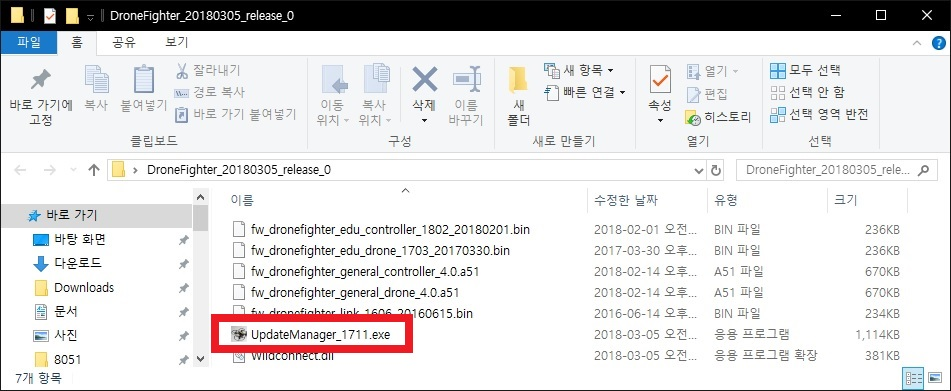

**Drone Fighter firmware Update**

Modified : 2018.3.29

---

<h3>Drone Fighter 펌웨어 업데이트</h3>

---

* Kramdown table of contents
{:toc .toc}

 

# 1. 펌웨어 다운로드

[Download](/download/) 페이지에서 최신 Drone Fighter 펌웨어를 다운로드 받습니다.

 

# 2. 조종기 펌웨어 업데이트

<b>(1) 펌웨어 업데이트 프로그램을 실행합니다.</b>

    
    
펌웨어 업데이트 프로그램

 

    
    
펌웨어 업데이트 프로그램이 실행된 모습

 

<b>(2) 조종기에 USB 커넥터를 연결합니다.</b>
 

<b>(3) 조종기 우측 상단의 빨간색 버튼을 누른 채로, 하단 중앙의 스위치를 <i>ON</i>에서 <i>USB</i>로 밀어서 전원을 켭니다.</b>

    
    
조종기에 USB 커넥터를 연결한 상태

 

<b>(4) 조종기의 전원이 켜지면서 부트로더의 펌웨어 업데이트 모드를 시작합니다.</b>

    
    
조종기 펌웨어 업데이트 대기 상태

 

<b>(5) SCAN 버튼을 눌러 시리얼 포트 검색을 실행합니다.</b>

    
    
스캔 버튼

 

    
    
새로운 장치가 검색된 화면

 

<b>(6) 업데이트 대상 장치가 아닌 경우에 해당 장치를 클릭하여 해제합니다.</b>

    
    
포트 선택 해제

 

    
    
포트 선택이 해제된 화면

 

<b>(7) 펌웨어를 선택합니다. 여기에서는 일반 조종기 펌웨어를 선택하였습니다.</b>

    
    
펌웨어 파일 선택 콤보박스

 

    
    
펌웨어 파일을 선택한 화면

 

<b>(8) SEND 버튼을 눌러 펌웨어 업데이트를 시작합니다.</b>

    
    
SEND 버튼

 

    
    
업데이트 진행 화면

 

<b>(9) 업데이트가 완료되면 조종기는 자동으로 재시작합니다.</b>

    
    
업데이트 완료 화면

 

 

# 3. 드론 펌웨어 업데이트

<b>(1) 펌웨어 업데이트 프로그램을 실행합니다.</b>

    
    
펌웨어 업데이트 프로그램

 

    
    
펌웨어 업데이트 프로그램이 실행된 모습

 

<b>(2) 드론 뒷면 좌측 하단의 리셋 버튼을 누른 채로 배터리를 연결합니다.</b>

    
    
드론 리셋 버튼

 

<b>(3) 드론의 전원이 켜지면서 부트로더의 펌웨어 업데이트 모드를 시작합니다.</b>

    
    
드론 펌웨어 업데이트 대기 상태

 

<b>(4) 드론에 USB 커넥터를 연결합니다.</b>

    
    
USB 커넥터를 연결

 

<b>(5) SCAN 버튼을 눌러 시리얼 포트 검색을 실행합니다.</b>

    
    
스캔 버튼

 

    
    
새로운 장치가 검색된 화면

 

<b>(6) 업데이트 대상 장치가 아닌 경우에 해당 장치를 클릭하여 해제합니다.</b>

    
    
포트 선택 해제

 

    
    
포트 선택이 해제된 화면

 

<b>(7) 펌웨어를 선택합니다. 여기에서는 일반 드론 펌웨어를 선택하였습니다.</b>

    
    
펌웨어 파일 선택 콤보박스

 

    
    
펌웨어 파일을 선택한 화면

 

<b>(8) SEND 버튼을 눌러 펌웨어 업데이트를 시작합니다.</b>

    
    
SEND 버튼

 

    
    
업데이트 진행 화면

 

<b>(9) 업데이트가 완료되면 드론은 자동으로 재시작합니다.</b>

    
    
업데이트 완료 화면

 

 

여기까지 Drone Fighter 조종기와 드론의 펌웨어 업데이트를 완료하였습니다.

교육용 버젼인 경우 펌웨어 파일 이름 중간에 ***'edu'***가 들어가있고, 일반용 버젼은 펌웨어 파일 이름 중간에 ***'general'***이 들어가있습니다.
