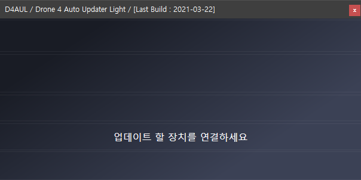
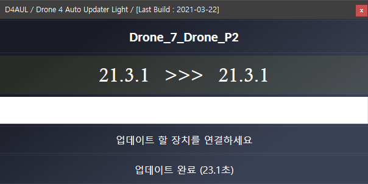

**[GO CAR](/documents/kr/products/e_drone/) firmware Update**

Modified : 2021.4.13

---

<h3>GO CAR 펌웨어 업데이트</h3>

---

- **Drone4AutoUpdaterLight**
- [drone_4_updater_windows](../drone_4_updater_windows/)
- [drone_4_updater_mac](../drone_4_updater_mac/)
- [drone_4_updater_linux](../drone_4_updater_linux/)
- [drone_4_updater_raspberry_pi](../drone_4_updater_raspberry_pi/)
- [Python Library](../python/)

---

* Kramdown table of contents
{:toc .toc}

 

# 1. 펌웨어 다운로드

[GO CAR](/documents/kr/products/e_drive/) 페이지에서 최신 GO CAR 펌웨어를 내려받습니다.

    
    
펌웨어 업데이트 프로그램 다운로드 링크 [빨간색 상자 안의 'Windows (.NET)']

 

 

# 2. 펌웨어 자동 업데이트

GO CAR를 부트로더 모드로 연결하면 자동으로 펌웨어를 업데이트해 주는 프로그램입니다.

 

## 2.1. 자동차 업데이트

(1) "Drone4AutoUpdaterLight.exe"를 실행합니다.

    
    
펌웨어 업데이트 프로그램 폴더

 

    
    
펌웨어 업데이트 프로그램 실행 화면

 

(2) 자동차의 전원이 켜져 있다면 전원을 꺼주세요.

 

(3) 자동차 바닥 면의 버튼(아래 그림의 빨간색 박스)을 누른 채로 스위치(아래 그림의 노란색 박스)를 켭니다.

    
    
자동차 부트로더 진입 버튼과 전원 스위치

 

(4) 자동차의 전원이 켜진 후 USB 커넥터를 연결하시면 자동으로 업데이트를 진행합니다.

    
    
자동차 펌웨어 업데이트 진행 화면

 

    
    
자동차 펌웨어 업데이트 완료 화면

 

    
    
자동차 펌웨어 업데이트 완료 후 재부팅 시 화면

 

 

여기까지 GO CAR 펌웨어 업데이트를 완료하였습니다.

