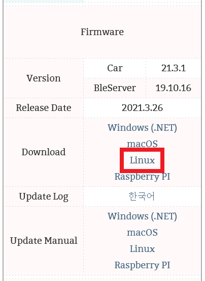
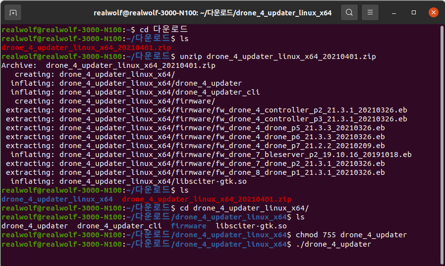
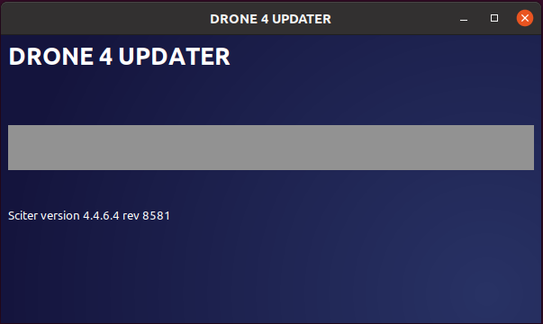
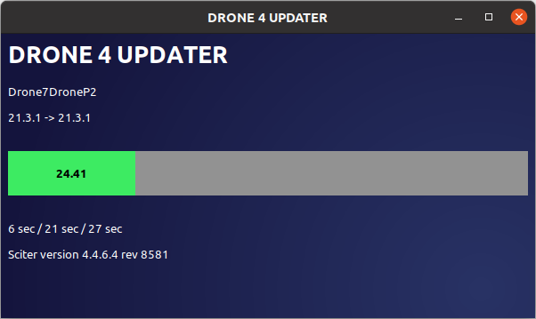
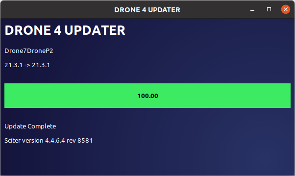

**[GO CAR](/documents/kr/products/e_drone/) firmware Update**

Modified : 2021.4.1

---

<h3>GO CAR 펌웨어 업데이트</h3>

---

- [Drone4AutoUpdaterLight](../drone4autoupdaterlight/)
- [drone_4_updater_windows](../drone_4_updater_windows/)
- [drone_4_updater_mac](../drone_4_updater_mac/)
- **drone_4_updater_linux**
- [drone_4_updater_raspberry_pi](../drone_4_updater_raspberry_pi/)
- [Python Library](../python/)

---

* Kramdown table of contents
{:toc .toc}

<br>

# 1. 펌웨어 다운로드 및 업데이트 프로그램 실행

## 1.1. 펌웨어 다운로드
[GO CAR](/documents/kr/products/e_drive/) 페이지에서 최신 GO CAR 펌웨어를 내려받습니다.

<div align="center">
    
    <p>펌웨어 업데이트 프로그램 다운로드 링크(빨간색 상자 안의 'Linux')</p>
</div>
<br>

<br>

## 1.2. 프로그램 실행

<div align="center">
    
    <p>Terminal에서 프로그램을 실행하기까지의 명령 입력 예</p>
</div>
<br>

### 1.2.1. Terminal 프로그램을 실행합니다.

<br>

### 1.2.2. 다운로드 폴더로 이동합니다.

```
cd 다운로드/
```

<br>

### 1.2.3. 다운 받은 프로그램의 압축을 풀어줍니다.

파일명을 입력하실 때 처음 몇 글자를 입력한 후 'Tab' 키를 누르면 자동으로 남은 이름을 채워줍니다.

```
unzip drone_4_updater_linux_x64_20210401.zip
```

<br>

### 1.2.4. 압축 푼 경로로 이동합니다.

폴더명을 입력할 때에도 처음 몇 글자를 입력한 후 'Tab' 키를 누르면 자동으로 남은 이름을 채워줍니다.

```
cd drone_4_updater_linux_x64
```

<br>

### 1.2.5. 프로그램의 권한을 변경합니다.

```
chmod 755 drone_4_updater
```

<br>

### 1.2.6. 프로그램을 실행합니다.

```
./drone_4_updater
```

<br>


<br>


# 2. 드론 업데이트

(1) "drone_4_updater"를 실행합니다.

<div align="center">
    
    <p>펌웨어 업데이트 프로그램 실행 화면</p>
</div>
<br>

(2) 드론에 배터리가 연결되어 있다면 제거합니다.

<br>

(3) 드론 바닥 면의 버튼(아래 그림에서 노란색 원으로 표시)을 누른 채로 USB 커넥터를 연결합니다.

<div align="center">
    
    <p>드론 부트로더 진입 버튼</p>
</div>
<br>

(4) 드론의 전원이 켜지고 자동으로 업데이트를 진행합니다.

<div align="center">
    
    <p>드론 펌웨어 업데이트 진행 화면</p>
</div>
<br>

<div align="center">
    
    <p>드론 펌웨어 업데이트 완료 화면</p>
</div>
<br>


<br>


여기까지 GO CAR의 펌웨어 업데이트를 완료하였습니다.

