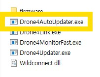
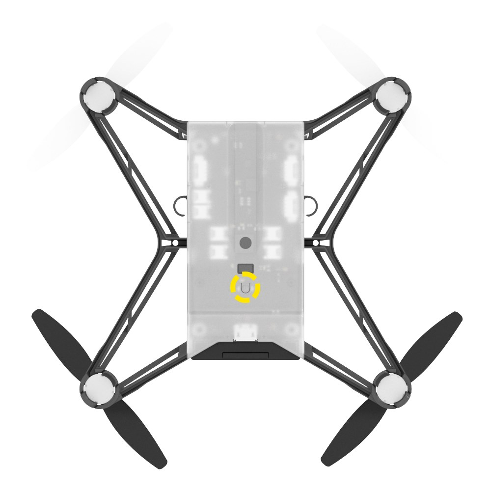
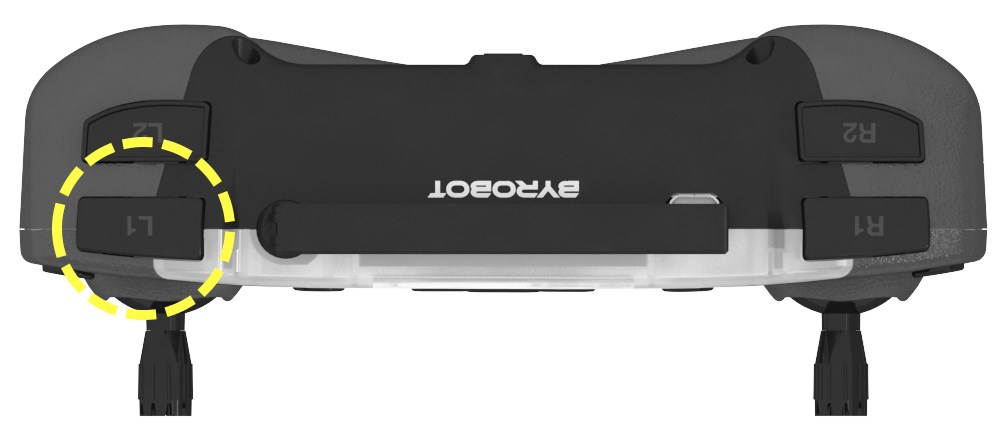

**[E-DRONE](/documents/kr/products/e_drone/) firmware Update**

Modified : 2018.10.12

---

<h3>E-Drone 펌웨어 업데이트</h3>

---

* Kramdown table of contents
{:toc .toc}

 

# 1. 펌웨어 다운로드

[E-DRONE](/documents/kr/products/e_drone/) 페이지에서 최신 E-Drone 펌웨어를 내려받습니다.

 

# 2. 펌웨어 자동 업데이트

<b>드론 또는 조종기를 부트로더 모드로 연결하면 자동으로 펌웨어를 업데이트해 주는 프로그램입니다.</b>

 

## 2.1. 드론 업데이트

<b>(1) "Drone4AutoUpdater.exe"를 실행합니다.</b>

    
    
Drone4AutoUpdater.exe

 

<b>(2) 드론에 배터리가 연결되어 있다면 제거합니다.</b>

 

<b>(3) 드론 바닥 면의 버튼(아래 그림에서 노란색 원으로 표시)을 누른 채로 USB 커넥터를 연결합니다.</b>

    
    
드론 부트로더 진입 버튼

 

<b>(4) 드론의 전원이 켜지고 자동으로 업데이트를 진행합니다.</b>

 

## 2.2. 조종기 업데이트

<b>(1) "Drone4AutoUpdater.exe"를 실행합니다.</b>

    
    
Drone4AutoUpdater.exe

 

<b>(2) 조종기의 전원이 켜져 있으면 꺼주시기 바랍니다.</b>

 

<b>(3) 조종기 전면 왼쪽 위의 버튼(아래 그림에서 노란색 원으로 표시)을 누른 채로 USB 커넥터를 연결합니다.</b>

    
    
조종기 부트로더 진입 버튼

 

<b>(4) 조종기의 전원이 켜지고 자동으로 업데이트를 진행합니다.</b>

 

여기까지 E-Drone 드론과 조종기의 펌웨어 업데이트를 완료하였습니다.

