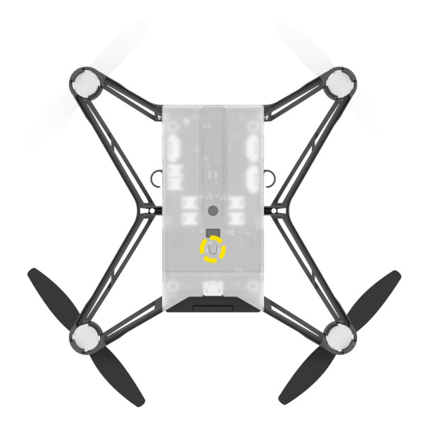
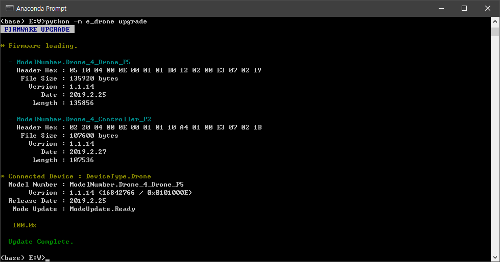
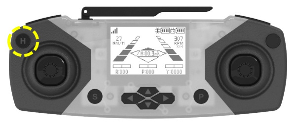
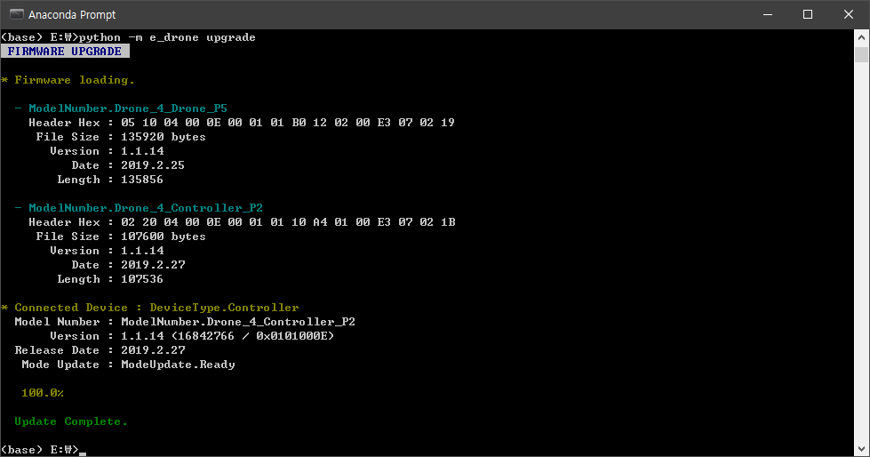

**[E-DRONE](/documents/kr/products/e_drone/) firmware Update**

Modified : 2020.4.7

---

<h3>E-Drone 펌웨어 업그레이드</h3>

---

- [Drone4AutoUpdaterLight](../drone4autoupdaterlight/)
- **Python Library**

---

* Kramdown table of contents
{:toc .toc}

<br>

# 1. 파이썬 설치

[Python Download](https://www.python.org/downloads/) 페이지에서 파이썬 최신 버전을 다운로드 받아서 설치합니다.

<br>


# 2. e_drone 파이썬 라이브러리 설치

아래의 문서를 참고하여 e_drone 파이썬 라이브러리를 설치하시기 바랍니다.

0.1.25 버전부터 펌웨어 업그레이드를 지원합니다.

<a href="/documents/kr/products/e_drone/library/python/e_drone/01_intro/">e_drone 설치 메뉴얼</a>

<br>


# 3. 펌웨어 업그레이드

<br>


## 3.1. 드론 업그레이드

(1) 드론에 배터리가 연결되어 있다면 제거합니다.

<br>

(2) 드론 바닥 면의 버튼(아래 그림에서 노란색 원으로 표시)을 누른 채로 USB 커넥터를 연결합니다.

<div align="center">
    
    <p>드론 부트로더 진입 버튼</p>
</div>

<br>

(3) 펌웨어 업그레이드 명령을 실행합니다.

```
> python -m e_drone upgrade
```

**macOS** 에서는 아래와 같이 실행하시기 바랍니다.

```
> python3 -m e_drone upgrade
```

<br>

<div align="center">
    
    <p>드론 펌웨어 업데이트 완료 화면</p>
</div>
<br>

<br>


## 3.2. 조종기 업그레이드

(1) 조종기의 전원이 켜져 있으면 꺼주시기 바랍니다.

<br>

(2) 조종기 왼쪽 위의 버튼(아래 그림에서 노란색 원으로 표시)을 누른 채로 USB 커넥터를 연결합니다.

<div align="center">
    
    <p>조종기 부트로더 진입 버튼</p>
</div>
<br>

(3) 펌웨어 업그레이드 명령을 실행합니다.

```
> python -m e_drone upgrade
```

**macOS** 에서는 아래와 같이 실행하시기 바랍니다.

```
> python3 -m e_drone upgrade
```

<br>

<div align="center">
    
    <p>조종기 펌웨어 업데이트 완료 화면</p>
</div>
<br>


<br>


여기까지 E-Drone 드론과 조종기의 펌웨어 업그레이드를 완료하였습니다.

