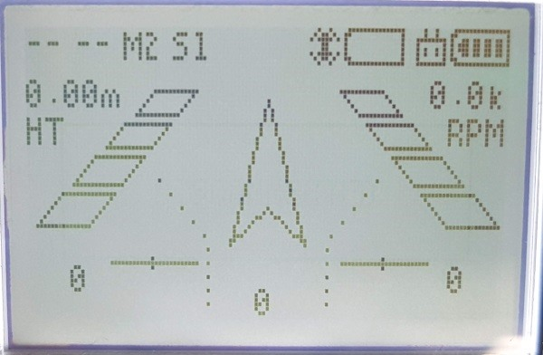
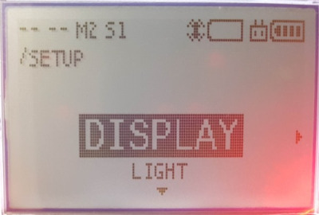
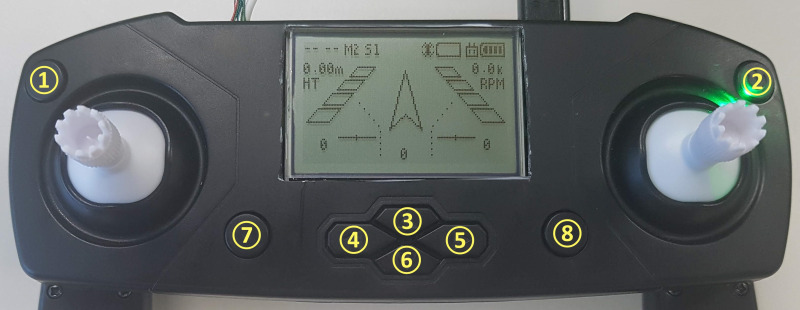
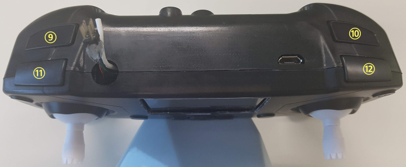

**[E-DRONE](/documents/kr/products/e_drone/) User Manual**

Modified : 2018.9.10

---

<h3>E-Drone 사용자 설명서</h3>

---

* Kramdown table of contents
{:toc .toc}

 

# 1. E-Drone

E-Drone에 대한 사용자 설명서입니다.

E-Drone의 조종기는 크게 ***조종***과 ***설정*** 두 화면으로 구성되어 있습니다.

     
    〈조종 화면〉

조종 화면에서는 드론 조종, 트림 설정, 상태 확인 등을 할 수 있습니다.

 

     
    〈설정 화면〉

설정 화면에서는 드론 설정 변경, 상태 확인 등을 할 수 있습니다.

 

 

# 2. 버튼 구성 및 기본 기능

    

 

    

 

## 2.1. 조종 화면에서의 기능

| 번호 | 짧게 눌렀을 때                              | 길게 눌렀을 때                           |
|:----:|:--------------------------------------------|:-----------------------------------------|
| 1    | LCD 백라이트 ON/OFF                         | Return Home                              |
| 2    | -                                           | 전원 ON/OFF                              |
| 3    | Trim Pitch 증가(드론을 앞으로 향하게 함)    | -                                        |
| 4    | Trim Roll 감소(드론을 왼쪽으로 향하게 함)   | -                                        |
| 5    | Trim Roll 증가(드론을 오른쪽으로 향하게 함) | -                                        |
| 6    | Trim Pitch 감소(드론을 뒤로 향하게 함)      | -                                        |
| 7    | 이전 조종 화면으로 전환                     | 설정 화면으로 이동                       |
| 8    | 다음 조종 화면으로 전환                     | 페어링(비행 중에는 작동하지 않음)        |
| 9    | -                                           | -                                        |
| 10   | -                                           | -                                        |
| 11   | -                                           | -                                        |
| 12   | -                                           | -                                        |

 

## 2.2. 설정 화면에서의 기능

| 번호 | 짧게 눌렀을 때                              | 길게 눌렀을 때                           |
|:----:|:--------------------------------------------|:-----------------------------------------|
| 1    | -                                           | -                                        |
| 2    | -                                           | 전원 ON/OFF                              |
| 3    | 메뉴 위로 이동                              | -                                        |
| 4    | 메뉴 왼쪽으로 이동                          | -                                        |
| 5    | 메뉴 오른쪽으로 이동                        | -                                        |
| 6    | 메뉴 아래로 이동                            | -                                        |
| 7    | -                                           | 조종 화면으로 이동                       |
| 8    | -                                           | 페어링(비행 중에는 작동하지 않음)        |
| 10   | -                                           | -                                        |
| 11   | -                                           | -                                        |
| 12   | -                                           | -                                        |
| 12   | 메뉴 선택 또는 메뉴 오른쪽으로 이동         | -                                        |

 

 

# 3. 설정 화면의 메뉴 구성

| 1단계             | 2단계                                     | 설명                                              |
|:------------------|:------------------------------------------|---------------------------------------------------|
| DISPLAY           | 높이-자세-RPM                             | 조종 화면에서 보여줄 것인지를 설정(SHOW / HIDE)   |
|                   | 높이-방향-RPM-자세-고도-위치              | 조종 화면에서 보여줄 것인지를 설정(SHOW / HIDE)   |
|                   | 속도-위치-자세                            | 조종 화면에서 보여줄 것인지를 설정(SHOW / HIDE)   |
|                   | 자세-높이                                 | 조종 화면에서 보여줄 것인지를 설정(SHOW / HIDE)   |
|                   | 위치-트림                                 | 조종 화면에서 보여줄 것인지를 설정(SHOW / HIDE)   |
|                   | RF 정보 및 상태                           | 조종 화면에서 보여줄 것인지를 설정(SHOW / HIDE)   |
|                   | 조이스틱 입력 값                          | 조종 화면에서 보여줄 것인지를 설정(SHOW / HIDE)   |
| LIGHT             | DRONE                                     | 드론 LED 기본 색 설정 변경                        |
|                   | CONTROLLER                                | 조종기 LED 기본 색 설정 변경                      |
| CONTROL           | ATTITUDE                                  | 자세 제어                                         |
|                   | POSITION                                  | 위치 제어                                         |
| MODE              | MODE 1                                    | L↕ Elevator, L↔ Rudder, R↕ Throttle, R↔, Aileron  |
|                   | MODE 2                                    | L↕ Throttle, L↔ Rudder, R↕ Elevator, R↔, Aileron  |
|                   | MODE 3                                    | L↕ Elevator, L↔ Aileron, R↕ Throttle, R↔, Rudder  |
|                   | MODE 4                                    | L↕ Throttle, L↔ Aileron, R↕ Elevator, R↔, Rudder  |
| HEADLESS          | HEADLESS                                  | 헤드리스(방향 고정)                               |
|                   | NORMAL                                    | 일반(드론의 현재 방향 기준)                       |
| SPEED             | S1 (50%)                                  | 속도 1단계 (50 %)                                 |
|                   | S2 (75%)                                  | 속도 2단계 (75 %)                                 |
|                   | S3 (100%)                                 | 속도 3단계 (100 %)                                |
| WEIGHT            | 100g ~ 150g                               | 드론 + 추가 장치의 무게                           |
| FUNCTION          | SENSOR RESET                              | 드론의 자이로 바이어스 리셋                       |
|                   | PAIRING                                   | 페어링                                            |
| INFORMATION       | COUNT                                     | 비행 시간 및 이벤트 카운트 값 표시                |
|                   | BIAS                                      | 가속도, 자이로 바이어스 값 표시                   |
|                   | TRIM                                      | Trim 값 표시                                      |
|                   | MOTION                                    | IMU 센서 데이터를 연산하여 변환한 결과 표시       |
|                   | ALTITUDE                                  | 높이-고도와 관련된 센서 데이터 표시               |
|                   | POSITION                                  | 위치 데이터 표시                                  |
|                   | ADDRESS/D                                 | 드론의 고유번호 표시                              |
|                   | ADDRESS/C                                 | 조종기의 고유번호 표시                            |
|                   | BOOT                                      | 조종기의 부트 정보 및 등록 여부 표시              |
|                   | CRC32                                     | 드론과 조종기의 부트로더 및 앱 영역 CRC32 값 표시 |

 * Elevator : 앞뒤 이동(Pitch)
 * Rudder : 좌우 회전(Yaw)
 * Throttle : 위아래 이동(Throttle)
 * Aileron : 좌우 이동(Roll)

 

여기까지 E-Drone 조종기와 드론에 대한 간략한 설명이었습니다.

