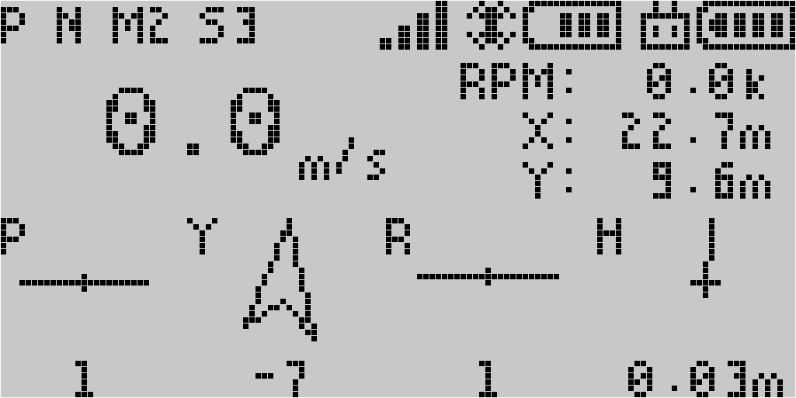
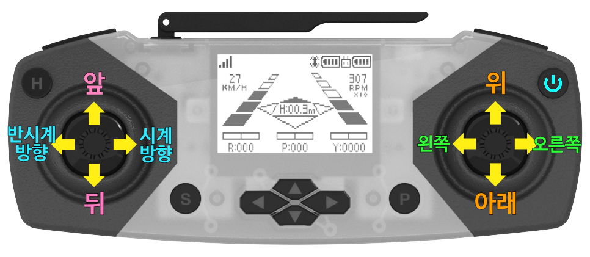
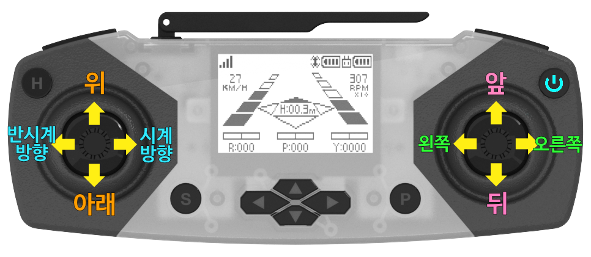

**[E-DRONE](/documents/kr/products/e_drone/) User Manual**

Modified : 2019.3.11

---

<h3>E-Drone 사용자 설명서</h3>

---

* Kramdown table of contents
{:toc .toc}

 

# 1. 드론

## 1.1. 좌표계

E-Drone은 오른손 좌표계를 사용하고 있습니다.

| 좌표축  | +        | -        |
|:-------:|:--------:|:--------:|
| X       | 앞       | 뒤       |
| Y       | 왼쪽     | 오른쪽   |
| Z       | 위       | 아래     |
| Z 회전  | 반시계   | 시계     |

아래 문서의 Figure 6 이미지를 참고하시기 바랍니다.

[http://www.physics.brocku.ca/PPLATO/h-flap/math2_5.html#section_3](http://www.physics.brocku.ca/PPLATO/h-flap/math2_5.html#section_3)

 

 

# 2. 조종기

## 2.1 조종기 화면 구성

E-Drone의 조종기는 크게 ***조종***과 ***설정*** 두 화면으로 구성되어 있습니다.

     
    〈조종 화면〉

조종 화면에서는 드론 조종, 트림 설정, 상태 확인 등을 할 수 있습니다.

 

     
    〈설정 화면〉

설정 화면에서는 드론 설정 변경, 상태 확인 등을 할 수 있습니다.

 

## 2.2 조종 화면 세부 구성

 

### 2.2.1. 높이-자세-RPM

<table>
    <tr>
        <td>
            

                
            

        </td>
        <td>
            

                
            

        </td>
    </tr>
</table>

 

### 2.2.2. 높이-방향-RPM-자세-고도-위치

<table>
    <tr>
        <td>
            

                
            

        </td>
        <td>
            

                
            

        </td>
    </tr>
</table>

 

### 2.2.3. 속도-위치-자세

<table>
    <tr>
        <td>
            

                
            

        </td>
        <td>
            

                
            

        </td>
    </tr>
</table>

 

### 2.2.4. 자세-높이

<table>
    <tr>
        <td>
            

                
            

        </td>
        <td>
            

                
            

        </td>
    </tr>
</table>

 

### 2.2.5. 위치-트림

<table>
    <tr>
        <td>
            

                
            

        </td>
        <td>
            

                
            

        </td>
    </tr>
</table>

 

### 2.2.6. RF 정보 및 상태 

<table>
    <tr>
        <td>
            

                
            

        </td>
        <td>
            

                
            

        </td>
    </tr>
</table>

 

### 2.2.7. 조이스틱 입력 값 

<table>
    <tr>
        <td>
            

                
            

        </td>
        <td>
            

                
            

        </td>
    </tr>
</table>

 

### 2.2.8. 버전

<table>
    <tr>
        <td>
            

                
            

        </td>
        <td>
            

                
            

        </td>
    </tr>
</table>

 

 

## 2.3. 버튼 구성 및 기능

 

### 2.3.1. 조종 화면

    
    
조종 화면에서 전면 버튼의 기능

 

    
    
조종 화면에서 상단 버튼의 기능

 

 

### 2.3.2. 설정 화면

    
    
설정 화면에서 전면 버튼의 기능

 

    
    
설정 화면에서 상단 버튼의 기능

 

 

 

## 2.4. 설정 화면 메뉴 구성

<table>
    <tr>
        <td>
            

                1단계
            

        </td>
        <td>
            

                2단계
            

        </td>
        <td>
            

                설명
            

        </td>
    </tr>
    <tr>
        <td rowspan="7">
            

                DISPLAY
            

        </td>
        <td>
            

                높이-자세-RPM
            

        </td>
        <td>
            

                조종 화면에서 보여줄 것인지를 설정(SHOW / HIDE)
            

        </td>
    </tr>
    <tr>
        <td>
            

                높이-방향-RPM-자세-고도-위치
            

        </td>
        <td>
            

                조종 화면에서 보여줄 것인지를 설정(SHOW / HIDE)
            

        </td>
    </tr>
    <tr>
        <td>
            

                속도-위치-자세
            

        </td>
        <td>
            

                조종 화면에서 보여줄 것인지를 설정(SHOW / HIDE)
            

        </td>
    </tr>
    <tr>
        <td>
            

                자세-높이
            

        </td>
        <td>
            

                조종 화면에서 보여줄 것인지를 설정(SHOW / HIDE)
            

        </td>
    </tr>
    <tr>
        <td>
            

                위치-트림
            

        </td>
        <td>
            

                조종 화면에서 보여줄 것인지를 설정(SHOW / HIDE)
            

        </td>
    </tr>
    <tr>
        <td>
            

                RF 정보 및 상태
            

        </td>
        <td>
            

                조종 화면에서 보여줄 것인지를 설정(SHOW / HIDE)
            

        </td>
    </tr>
    <tr>
        <td>
            

                조이스틱 입력 값
            

        </td>
        <td>
            

                조종 화면에서 보여줄 것인지를 설정(SHOW / HIDE)
            

        </td>
    </tr>
    <tr>
        <td rowspan="2">
            

                LIGHT
            

        </td>
        <td>
            

                DRONE
            

        </td>
        <td>
            

                드론 LED 기본 색 설정 변경
            

        </td>
    </tr>
    <tr>
        <td>
            

                CONTROLLER
            

        </td>
        <td>
            

                조종기 LED 기본 색 설정 변경
            

        </td>
    </tr>
    <tr>
        <td rowspan="2">
            

                CONTROL
            

        </td>
        <td>
            

                ATTITUDE
            

        </td>
        <td>
            

                자세 제어
            

        </td>
    </tr>
    <tr>
        <td>
            

                POSITION
            

        </td>
        <td>
            

                위치 제어
            

        </td>
    </tr>
    <tr>
        <td rowspan="4">
            

                MODE
            

        </td>
        <td>
            

                MODE 1
            

        </td>
        <td>
            

                L↕ Elevator, L↔ Rudder, R↕ Throttle, R↔ Aileron 
                L↕ 앞뒤, L↔ 좌우 회전, R↕ 위아래, R↔ 좌우
            

        </td>
    </tr>
    <tr>
        <td>
            

                MODE 2
            

        </td>
        <td>
            

                L↕ Throttle, L↔ Rudder, R↕ Elevator, R↔ Aileron 
                L↕ 위아래, L↔ 좌우 회전, R↕ 앞뒤, R↔ 좌우
            

        </td>
    </tr>
    <tr>
        <td>
            

                MODE 3
            

        </td>
        <td>
            

                L↕ Elevator, L↔ Aileron, R↕ Throttle, R↔ Rudder 
                L↕ 앞뒤, L↔ 좌우, R↕ 위아래, R↔ 좌우 회전
            

        </td>
    </tr>
    <tr>
        <td>
            

                MODE 4
            

        </td>
        <td>
            

                L↕ Throttle, L↔ Aileron, R↕ Elevator, R↔ Rudder 
                L↕ 위아래, L↔ 좌우, R↕ 앞뒤, R↔ 좌우 회전
            

        </td>
    </tr>
    <tr>
        <td rowspan="2">
            

                HEADLESS
            

        </td>
        <td>
            

                HEADLESS
            

        </td>
        <td>
            

                헤드리스(방향 고정)
            

        </td>
    </tr>
    <tr>
        <td>
            

                NORMAL
            

        </td>
        <td>
            

                일반(드론의 현재 방향 기준)
            

        </td>
    </tr>
    <tr>
        <td rowspan="3">
            

                SPEED
            

        </td>
        <td>
            

                S1
            

        </td>
        <td>
            

                속도 1단계(느림)
            

        </td>
    </tr>
    <tr>
        <td>
            

                S2
            

        </td>
        <td>
            

                속도 2단계
            

        </td>
    </tr>
    <tr>
        <td>
            

                S3
            

        </td>
        <td>
            

                속도 3단계(빠름)
            

        </td>
    </tr>
    <tr>
        <td rowspan="2">
            

                FHSS
            

        </td>
        <td>
            

                ON
            

        </td>
        <td>
            

                채널 호핑
            

        </td>
    </tr>
    <tr>
        <td>
            

                OFF
            

        </td>
        <td>
            

                고정 채널
            

        </td>
    </tr>
    <tr>
        <td rowspan="3">
            

                FUNCTION
            

        </td>
        <td>
            

                SENSOR RESET
            

        </td>
        <td>
            

                드론의 자이로 바이어스 리셋
            

        </td>
    </tr>
    <tr>
        <td>
            

                PAIRING
            

        </td>
        <td>
            

                페어링
            

        </td>
    </tr>
    <tr>
        <td>
            

                SET DEFAULT
            

        </td>
        <td>
            

                설정값 초기화(드론이 연결된 경우 드론 설정도 초기화 됨)
            

        </td>
    </tr>
    <tr>
        <td rowspan="10">
            

                INFORMATION
            

        </td>
        <td>
            

                COUNT
            

        </td>
        <td>
            

                비행 시간 및 이벤트 카운트 값 표시
            

        </td>
    </tr>
    <tr>
        <td>
            

                BIAS
            

        </td>
        <td>
            

                가속도, 자이로 바이어스 값 표시
            

        </td>
    </tr>
    <tr>
        <td>
            

                TRIM
            

        </td>
        <td>
            

                Trim 값 표시
            

        </td>
    </tr>
    <tr>
        <td>
            

                MOTION
            

        </td>
        <td>
            

                IMU 센서 데이터를 연산하여 변환한 결과 표시
            

        </td>
    </tr>
    <tr>
        <td>
            

                ALTITUDE
            

        </td>
        <td>
            

                높이-고도와 관련된 센서 데이터 표시
            

        </td>
    </tr>
    <tr>
        <td>
            

                POSITION
            

        </td>
        <td>
            

                위치 데이터 표시
            

        </td>
    </tr>
    <tr>
        <td>
            

                RF
            

        </td>
        <td>
            

                RF 설정 데이터 표시
            

        </td>
    </tr>
    <tr>
        <td>
            

                ADDRESS
            

        </td>
        <td>
            

                드론과 조종기의 고유번호 표시
            

        </td>
    </tr>
    <tr>
        <td>
            

                BOOT
            

        </td>
        <td>
            

                조종기의 부트 정보 및 장치 등록 여부 표시
            

        </td>
    </tr>
    <tr>
        <td>
            

                CRC32
            

        </td>
        <td>
            

                드론과 조종기의 부트로더 및 앱 영역 CRC32 값 표시
            

        </td>
    </tr>
</table>

 * Elevator : 앞뒤 이동(Pitch)
 * Rudder : 좌우 회전(Yaw)
 * Throttle : 위아래 이동(Throttle)
 * Aileron : 좌우 이동(Roll)

 

 

## 2.5. MODE

### 2.5.1. MODE 1

    
    
MODE 1

 

 

### 2.5.2. MODE 2

    
    
MODE 2

 

 

여기까지 E-Drone 조종기와 드론에 대한 간략한 설명이었습니다.

