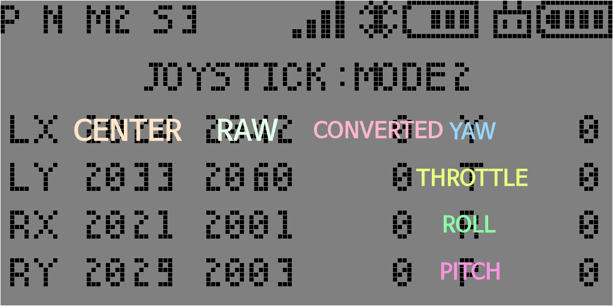
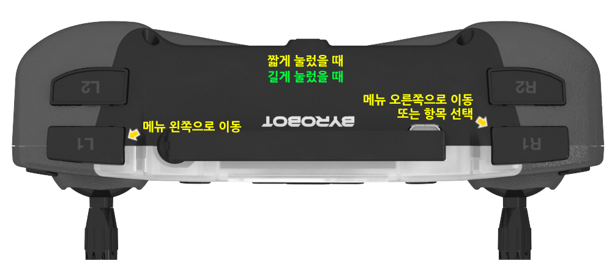

**[E-DRONE](/documents/kr/products/e_drone/) User Manual**

Modified : 2020.4.10

---

<h3>E-DRONE 사용자 설명서</h3>

---

* Kramdown table of contents
{:toc .toc}

 

# 1. 드론

    
    
E-DRONE

 

## 1.1. 사양

 

    <table>
        <tr>
            <td class="spec">
<b>항목</b>
</td>
            <td class="spec">
<b>E-DRONE</b>
</td>
        </tr>
        <tr>
            <td class="spec">
모터 축간 대각선 길이
</td>
            <td class="white">
135 mm
</td>
        </tr>
        <tr>
            <td class="spec">
무게
</td>
            <td class="spec">
113g (배터리 포함)
</td>
        </tr>
        <tr>
            <td class="spec">
배터리
</td>
            <td class="white">
7.4V 1,000mAh LiPo(Lithium polymer) battery
</td>
        </tr>
        <tr>
            <td class="spec">
비행시간
</td>
            <td class="spec">
7 ~ 10분
</td>
        </tr>
        <tr>
            <td class="spec">
최대조종거리
</td>
            <td class="white">
50m
</td>
        </tr>
        <tr>
            <td class="spec">
통신방식
</td>
            <td class="spec">
2.4Ghz RF
</td>
        </tr>
        <tr>
            <td class="spec">
조종 모드
</td>
            <td class="white">
Mode 1, 2, 3, 4
</td>
        </tr>
        <tr>
            <td class="spec" rowspan="4">
센서
</td>
            <td class="spec">
Optical flow
</td>
        </tr>
        <tr>
            <td class="white">
6-Axis MEMS MotionTracking
</td>
        </tr>
        <tr>
            <td class="spec">
IR Time of Flight
</td>
        </tr>
        <tr>
            <td class="white">
Barometer
</td>
        </tr>
        <tr>
            <td class="spec" rowspan="3">
확장
</td>
            <td class="spec">
4핀 UART 포트(RX, TX, 5V, GND) x 2
</td>
        </tr>
        <tr>
            <td class="white">
RGB LED 포트 x 1
</td>
        </tr>
        <tr>
            <td class="spec">
단색 LED 포트 x 2
</td>
        </tr>
        <tr>
            <td class="spec" rowspan="3">
주요기능
</td>
            <td class="white">
실내 위치 인식
</td>
        </tr>
        <tr>
            <td class="spec">
Return Home
</td>
        </tr>
        <tr>
            <td class="white">
앱, 파이썬 코딩
</td>
        </tr>
    </table>

 

## 1.2. 좌표계

E-DRONE은 오른손 좌표계를 사용하고 있습니다.

    <table>
        <tr>
            <td class="coord">
<b>좌표축</b>
</td>
            <td class="coord">
<b>+</b>
</td>
            <td class="coord">
<b>-</b>
</td>
        </tr>
        <tr>
            <td class="coord">
X
</td>
            <td class="white">
앞
</td>
            <td class="white">
뒤
</td>
        </tr>
        <tr>
            <td class="coord">
Y
</td>
            <td class="coord">
왼쪽
</td>
            <td class="coord">
오른쪽
</td>
        </tr>
        <tr>
            <td class="coord">
Z
</td>
            <td class="white">
위
</td>
            <td class="white">
아래
</td>
        </tr>
        <tr>
            <td class="coord">
Z 회전
</td>
            <td class="coord">
반시계
</td>
            <td class="coord">
시계
</td>
        </tr>
    </table>

아래 문서의 Figure 6 이미지를 참고하시기 바랍니다.

[http://www.physics.brocku.ca/PPLATO/h-flap/math2_5.html#section_3](http://www.physics.brocku.ca/PPLATO/h-flap/math2_5.html#section_3)

 

 

# 2. 조종기

## 2.1 조종기 화면 구성

E-DRONE의 조종기는 크게 ***조종***과 ***설정*** 두 화면으로 구성되어 있습니다.

     
    〈조종 화면〉

조종 화면에서는 드론 조종, 트림 설정, 상태 확인 등을 할 수 있습니다.

 

     
    〈설정 화면〉

설정 화면에서는 드론 설정 변경, 상태 확인 등을 할 수 있습니다.

 

## 2.2 조종 화면 세부 구성

 

### 2.2.1. 높이-자세-RPM

<table>
    <tr>
        <td>
            

                
            

        </td>
        <td>
            

                
            

        </td>
    </tr>
</table>

 

### 2.2.2. 높이-방향-RPM-자세-고도-위치

<table>
    <tr>
        <td>
            

                
            

        </td>
        <td>
            

                
            

        </td>
    </tr>
</table>

 

### 2.2.3. 속도-위치-자세

<table>
    <tr>
        <td>
            

                
            

        </td>
        <td>
            

                
            

        </td>
    </tr>
</table>

 

### 2.2.4. 자세-높이

<table>
    <tr>
        <td>
            

                
            

        </td>
        <td>
            

                
            

        </td>
    </tr>
</table>

 

### 2.2.5. 위치-트림

<table>
    <tr>
        <td>
            

                
            

        </td>
        <td>
            

                
            

        </td>
    </tr>
</table>

 

### 2.2.6. RF 정보 및 상태 

<table>
    <tr>
        <td>
            

                
            

        </td>
        <td>
            

                
            

        </td>
    </tr>
</table>

 

### 2.2.7. 조이스틱 입력 값 

<table>
    <tr>
        <td>
            

                
            

        </td>
        <td>
            

                
            

        </td>
    </tr>
</table>

 

### 2.2.8. 버전

<table>
    <tr>
        <td>
            

                
            

        </td>
        <td>
            

                
            

        </td>
    </tr>
</table>

 

 

## 2.3. 버튼 구성 및 기능

 

### 2.3.1. 조종 화면

    
    
조종 화면에서 전면 버튼의 기능

 

    
    
조종 화면에서 상단 버튼의 기능

 

 

### 2.3.2. 설정 화면

    
    
설정 화면에서 전면 버튼의 기능

 

    
    
설정 화면에서 상단 버튼의 기능

 

 

 

## 2.4. 설정 화면 메뉴 구성

    <table>
        <tr>
            <td class="setup_even">
                

                    1단계
                

            </td>
            <td class="setup_even">
                

                    2단계
                

            </td>
            <td class="setup_even" colspan="4">
                

                    설명
                

            </td>
        </tr>
        <tr>
            <td class="setup_odd" rowspan="7">
                

                    DISPLAY
                

            </td>
            <td class="setup_odd">
                

                    높이-자세-RPM
                

            </td>
            <td class="setup_odd" colspan="4">
                

                    조종 화면에서 보여줄 것인지를 설정(SHOW / HIDE)
                

            </td>
        </tr>
        <tr>
            <td class="white">
                

                    높이-방향-RPM-자세-고도-위치
                

            </td>
            <td class="white" colspan="4">
                

                    조종 화면에서 보여줄 것인지를 설정(SHOW / HIDE)
                

            </td>
        </tr>
        <tr>
            <td class="setup_odd">
                

                    속도-위치-자세
                

            </td>
            <td class="setup_odd" colspan="4">
                

                    조종 화면에서 보여줄 것인지를 설정(SHOW / HIDE)
                

            </td>
        </tr>
        <tr>
            <td class="white">
                

                    자세-높이
                

            </td>
            <td class="white" colspan="4">
                

                    조종 화면에서 보여줄 것인지를 설정(SHOW / HIDE)
                

            </td>
        </tr>
        <tr>
            <td class="setup_odd">
                

                    위치-트림
                

            </td>
            <td class="setup_odd" colspan="4">
                

                    조종 화면에서 보여줄 것인지를 설정(SHOW / HIDE)
                

            </td>
        </tr>
        <tr>
            <td class="white">
                

                    RF 정보 및 상태
                

            </td>
            <td class="white" colspan="4">
                

                    조종 화면에서 보여줄 것인지를 설정(SHOW / HIDE)
                

            </td>
        </tr>
        <tr>
            <td class="setup_odd">
                

                    조이스틱 입력 값
                

            </td>
            <td class="setup_odd" colspan="4">
                

                    조종 화면에서 보여줄 것인지를 설정(SHOW / HIDE)
                

            </td>
        </tr>
        <tr>
            <td class="setup_even" rowspan="2">
                

                    LIGHT
                

            </td>
            <td class="setup_even">
                

                    DRONE
                

            </td>
            <td class="setup_even" colspan="4">
                

                    드론 LED 기본 색 설정 변경
                

            </td>
        </tr>
        <tr>
            <td class="white">
                

                    CONTROLLER
                

            </td>
            <td class="white" colspan="4">
                

                    조종기 LED 기본 색 설정 변경
                

            </td>
        </tr>
        <tr>
            <td class="setup_odd" rowspan="2">
                

                    CONTROL
                

            </td>
            <td class="setup_odd">
                

                    ATTITUDE
                

            </td>
            <td class="setup_odd" colspan="4">
                

                    자세 제어
                

            </td>
        </tr>
        <tr>
            <td class="white">
                

                    POSITION
                

            </td>
            <td class="white" colspan="4">
                

                    위치 제어
                

            </td>
        </tr>
        <tr>
            <td class="setup_even" rowspan="5">
                

                    MODE
                

            </td>
            <td class="setup_even">
                

                    MODE
                

            </td>
            <td class="joystick_left">
                

                    Left ↕
                

            </td>
            <td class="joystick_left">
                

                    Left ↔
                

            </td>
            <td class="joystick_right">
                

                    Right ↕
                

            </td>
            <td class="joystick_right">
                

                    Right ↔
                

            </td>
        </tr>
        <tr>
            <td class="white">
                

                    MODE 1
                

            </td>
            <td class="elevator">
                

                    앞뒤 (Elevator)
                

            </td>
            <td class="rudder">
                

                    좌우 회전 (Rudder)
                

            </td>
            <td class="throttle">
                

                    위아래 (Throttle)
                

            </td>
            <td class="aileron">
                

                    좌우 (Aileron)
                

            </td>
        </tr>
        <tr>
            <td class="setup_even">
                

                    MODE 2
                

            </td>
            <td class="throttle">
                

                    위아래 (Throttle)
                

            </td>
            <td class="rudder">
                

                    좌우 회전 (Rudder)
                

            </td>
            <td class="elevator">
                

                    앞뒤 (Elevator)
                

            </td>
            <td class="aileron">
                

                    좌우 (Aileron)
                

            </td>
        </tr>
        <tr>
            <td class="white">
                

                    MODE 3
                

            </td>
            <td class="elevator">
                

                    앞뒤 (Elevator)
                

            </td>
            <td class="aileron">
                

                    좌우 (Aileron)
                

            </td>
            <td class="throttle">
                

                    위아래 (Throttle)
                

            </td>
            <td class="rudder">
                

                    좌우 회전 (Rudder)
                

            </td>
        </tr>
        <tr>
            <td class="setup_even">
                

                    MODE 4
                

            </td>
            <td class="throttle">
                

                    위아래 (Throttle)
                

            </td>
            <td class="aileron">
                

                    좌우 (Aileron)
                

            </td>
            <td class="elevator">
                

                    앞뒤 (Elevator)
                

            </td>
            <td class="rudder">
                

                    좌우 회전 (Rudder)
                

            </td>
        </tr>
        <tr>
            <td class="setup_odd" rowspan="2">
                

                    HEADLESS
                

            </td>
            <td class="setup_odd">
                

                    HEADLESS
                

            </td>
            <td class="setup_odd" colspan="4">
                

                    헤드리스(방향 고정)
                

            </td>
        </tr>
        <tr>
            <td class="white">
                

                    NORMAL
                

            </td>
            <td class="white" colspan="4">
                

                    일반(드론의 현재 방향 기준)
                

            </td>
        </tr>
        <tr>
            <td class="setup_even" rowspan="3">
                

                    SPEED
                

            </td>
            <td class="setup_even">
                

                    S1
                

            </td>
            <td class="setup_even" colspan="4">
                

                    속도 1단계(느림)
                

            </td>
        </tr>
        <tr>
            <td class="white">
                

                    S2
                

            </td>
            <td class="white" colspan="4">
                

                    속도 2단계
                

            </td>
        </tr>
        <tr>
            <td class="setup_even">
                

                    S3
                

            </td>
            <td class="setup_even" colspan="4">
                

                    속도 3단계(빠름)
                

            </td>
        </tr>
        <tr>
            <td class="setup_odd" rowspan="2">
                

                    FHSS
                

            </td>
            <td class="setup_odd">
                

                    ON
                

            </td>
            <td class="setup_odd" colspan="4">
                

                    채널 호핑
                

            </td>
        </tr>
        <tr>
            <td class="white">
                

                    OFF
                

            </td>
            <td class="white" colspan="4">
                

                    고정 채널
                

            </td>
        </tr>
        <tr>
            <td class="setup_even" rowspan="3">
                

                    FUNCTION
                

            </td>
            <td class="setup_even">
                

                    SENSOR RESET
                

            </td>
            <td class="setup_even" colspan="4">
                

                    드론의 자이로 바이어스 리셋
                

            </td>
        </tr>
        <tr>
            <td class="white">
                

                    PAIRING
                

            </td>
            <td class="white" colspan="4">
                

                    페어링
                

            </td>
        </tr>
        <tr>
            <td class="setup_even">
                

                    SET DEFAULT
                

            </td>
            <td class="setup_even" colspan="4">
                

                    설정값 초기화(드론이 연결된 경우 드론 설정도 초기화 됨)
                

            </td>
        </tr>
        <tr>
            <td class="setup_odd" rowspan="10">
                

                    INFORMATION
                

            </td>
            <td class="setup_odd">
                

                    COUNT
                

            </td>
            <td class="setup_odd" colspan="4">
                

                    비행 시간 및 이벤트 카운트 값 표시
                

            </td>
        </tr>
        <tr>
            <td class="white">
                

                    BIAS
                

            </td>
            <td class="white" colspan="4">
                

                    가속도, 자이로 바이어스 값 표시
                

            </td>
        </tr>
        <tr>
            <td class="setup_odd">
                

                    TRIM
                

            </td>
            <td class="setup_odd" colspan="4">
                

                    Trim 값 표시
                

            </td>
        </tr>
        <tr>
            <td class="white">
                

                    MOTION
                

            </td>
            <td class="white" colspan="4">
                

                    IMU 센서 데이터를 연산하여 변환한 결과 표시
                

            </td>
        </tr>
        <tr>
            <td class="setup_odd">
                

                    ALTITUDE
                

            </td>
            <td class="setup_odd" colspan="4">
                

                    높이-고도와 관련된 센서 데이터 표시
                

            </td>
        </tr>
        <tr>
            <td class="white">
                

                    POSITION
                

            </td>
            <td class="white" colspan="4">
                

                    위치 데이터 표시
                

            </td>
        </tr>
        <tr>
            <td class="setup_odd">
                

                    RF
                

            </td>
            <td class="setup_odd" colspan="4">
                

                    RF 설정 데이터 표시
                

            </td>
        </tr>
        <tr>
            <td class="white">
                

                    ADDRESS
                

            </td>
            <td class="white" colspan="4">
                

                    드론과 조종기의 고유번호 표시
                

            </td>
        </tr>
        <tr>
            <td class="setup_odd">
                

                    BOOT
                

            </td>
            <td class="setup_odd" colspan="4">
                

                    조종기의 부트 정보 및 장치 등록 여부 표시
                

            </td>
        </tr>
        <tr>
            <td class="white">
                

                    CRC32
                

            </td>
            <td class="white" colspan="4">
                

                    드론과 조종기의 부트로더 및 앱 영역 CRC32 값 표시
                

            </td>
        </tr>
    </table>

 

 

## 2.5. MODE

### 2.5.1. MODE 1

    
    
MODE 1

 

 

### 2.5.2. MODE 2

    
    
MODE 2

 

 

여기까지 E-DRONE 조종기와 드론에 대한 간략한 설명이었습니다.

