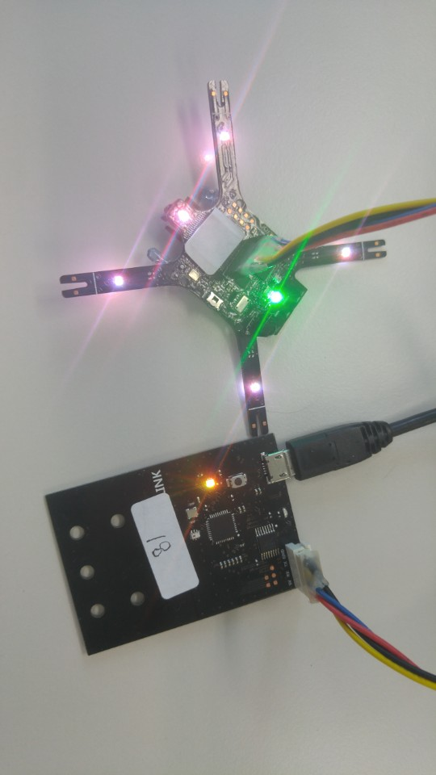
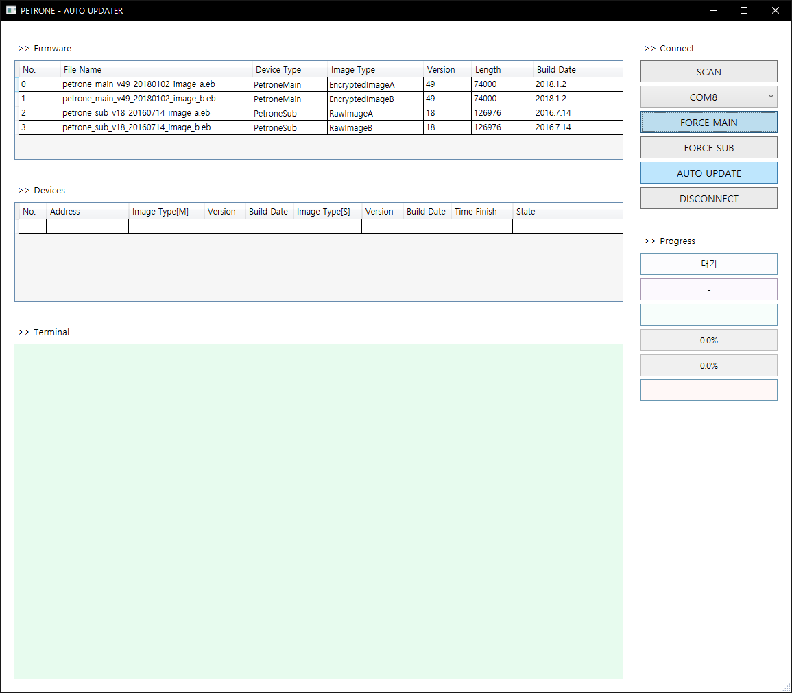
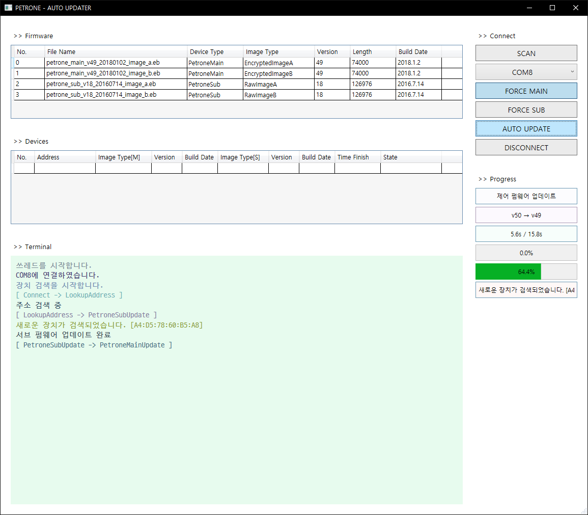
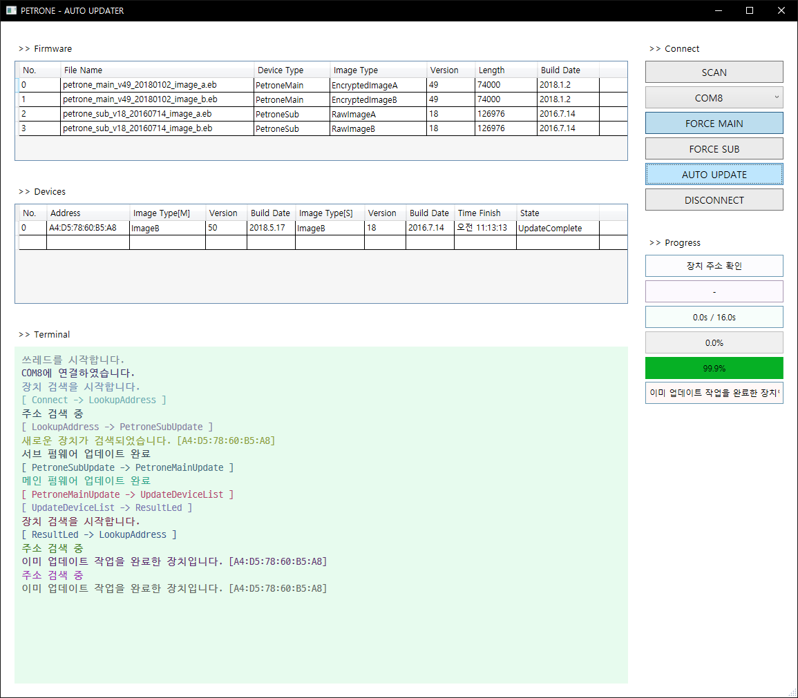

**PETRONE Auto Updater Wired**

Modified : 2018.6.12

---

<h3>Petrone 펌웨어 자동 업데이트 프로그램 사용 방법</h3>

---

* Kramdown table of contents
{:toc .toc}

 

# 1. Drone1AutoUpdaterWired 다운로드

[<a href="https://goo.gl/JrDbj3" target="_blank">Download <b>Drone1AutoUpdaterWired</b></a>]

위의 링크를 클릭하여 Drone1AutoUpdaterWired 프로그램을 다운로드 받습니다.

 

# 2. PETRONE 펌웨어 업데이트

<b>(1) 업데이트 전 장치 준비. LINK 모듈을 PC에 연결한 후 연결 케이블을 사용해 PETRONE에 연결합니다. 이 때 LINK 모듈은 시리얼 통신 중계용으로 사용하므로 LED가 노란색으로 깜빡이도록 버튼을 눌러 설정을 변경합니다.</b>

    
    
LINK 모듈과 업데이트를 준비중인 PETRONE

 

<b>(2) 펌웨어 업데이트 프로그램을 실행합니다. 메인 펌웨어를 강제로 업데이트하려면 'FORCE MAIN' 버튼을 누르시기 바랍니다. LINK 모듈의 시리얼 통신 포트를 선택하신 후 'AUTO UPDATE' 버튼을 누르시면 자동 업데이트를 진행합니다.</b>

    
    
펍웨어 업데이트 프로그램 실행 및 업데이트 준비

 

    
    
펌웨어 업데이트 진행

 

    
    
펌웨어 업데이트 완료

 

<b>(3) 하나의 PETRONE 업데이트가 완료되면 다른 PETRONE을 연결하여 계속해서 업데이트를 진행할 수 있습니다. 업데이트를 중단하기를 원하시면 'DISCONNECT' 버튼을 누르고 프로그램을 종료하시기 바랍니다.</b>

여기까지 Drone1AutoUpdaterWired 프로그램 사용 방법을 알려드렸습니다.

