**PETRONE firmware Update**

Modified : 2018.6.12

---

<h3>Petrone 펌웨어 업데이트</h3>

---

* Kramdown table of contents
{:toc .toc}

 

# 1. 펌웨어 다운로드

[Download](/download/) 페이지에서 최신 Petrone 펌웨어를 다운로드 받습니다.

Petrone은 앱에서 펌웨어 업데이트를 진행하므로 여기에서는 ***Petrone Link***의 펌웨어 업데이트에 대해서만 설명하겠습니다.

 

# 2. Petrone Link 펌웨어 업데이트

<b>(1) 펌웨어 업데이트 프로그램을 실행합니다.</b>

    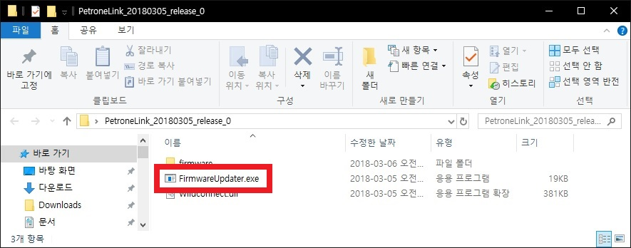
    
펌웨어 업데이트 프로그램

 

    
    
펌웨어 업데이트 프로그램이 실행된 모습

 

<b>(2) 펌웨어를 선택합니다. 여기에서는 최신 버젼인 '17b'를 선택하였습니다.</b>

    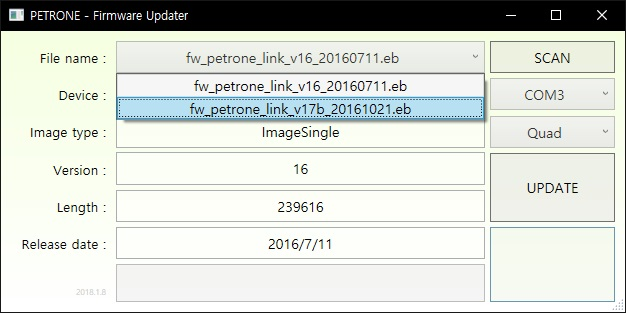
    
펌웨어 파일 선택 콤보박스

 

    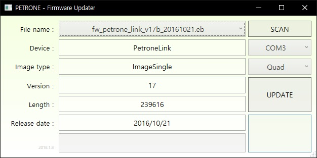
    
펌웨어 파일을 선택한 화면

 

<b>(3) Petrone Link 보드 우측 하단의 리셋 버튼을 누른 채로, USB 커넥터를 연결합니다.</b>

    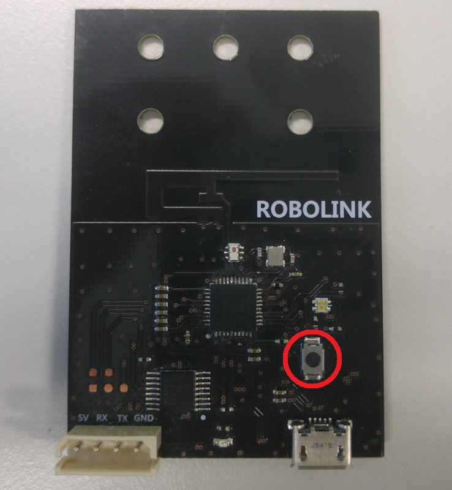
    
Petrone Link 보드의 리셋 버튼

 

<b>(4) Petrone Link 보드의 전원이 켜지면서 부트로더 펌웨어 업데이트 모드를 시작합니다.</b>

    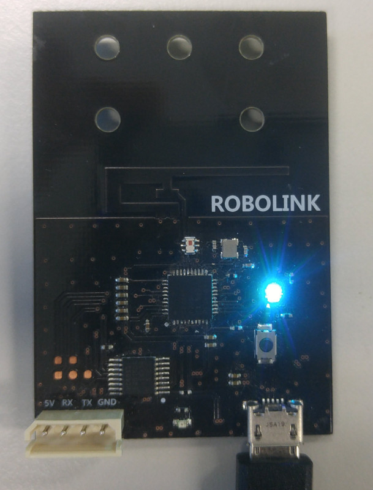
    
펌웨어 업데이트 대기 상태

 

<b>(5) SCAN 버튼을 눌러 시리얼 포트 검색을 실행합니다.</b>

    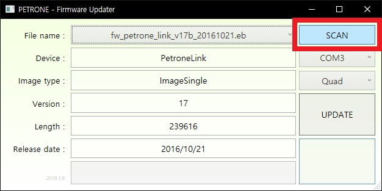
    
스캔 버튼

 

    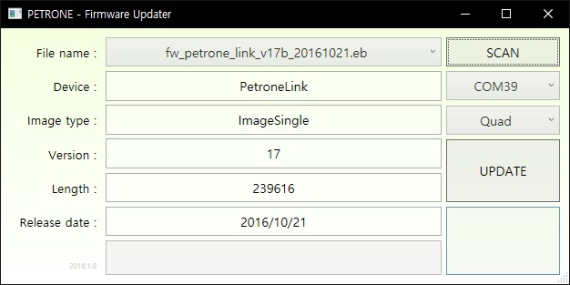
    
새로운 장치가 검색된 화면

 

    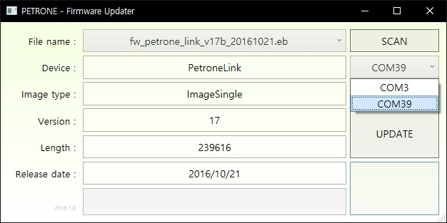
    
포트 선택 콤보박스

 

<b>(8) UPDATE 버튼을 눌러 펌웨어 업데이트를 시작합니다.</b>

    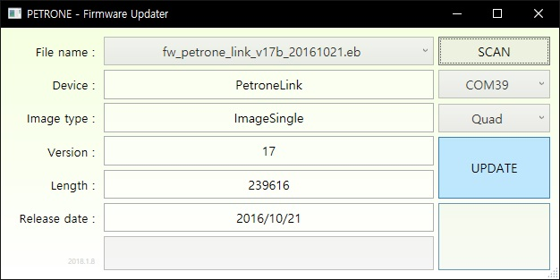
    
UPDATE 버튼

 

    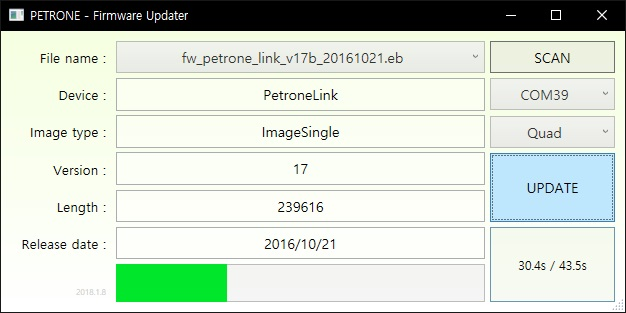
    
업데이트 진행 화면

 

<b>(9) 업데이트가 완료되면 자동으로 재시작합니다.</b>

    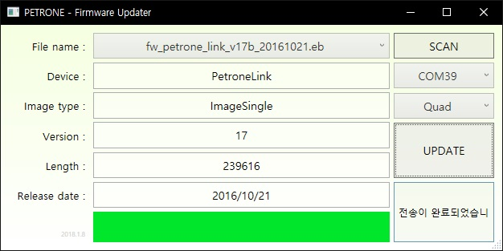
    
업데이트 완료 화면

 

여기까지 Petrone Link 펌웨어 업데이트를 완료하였습니다.

