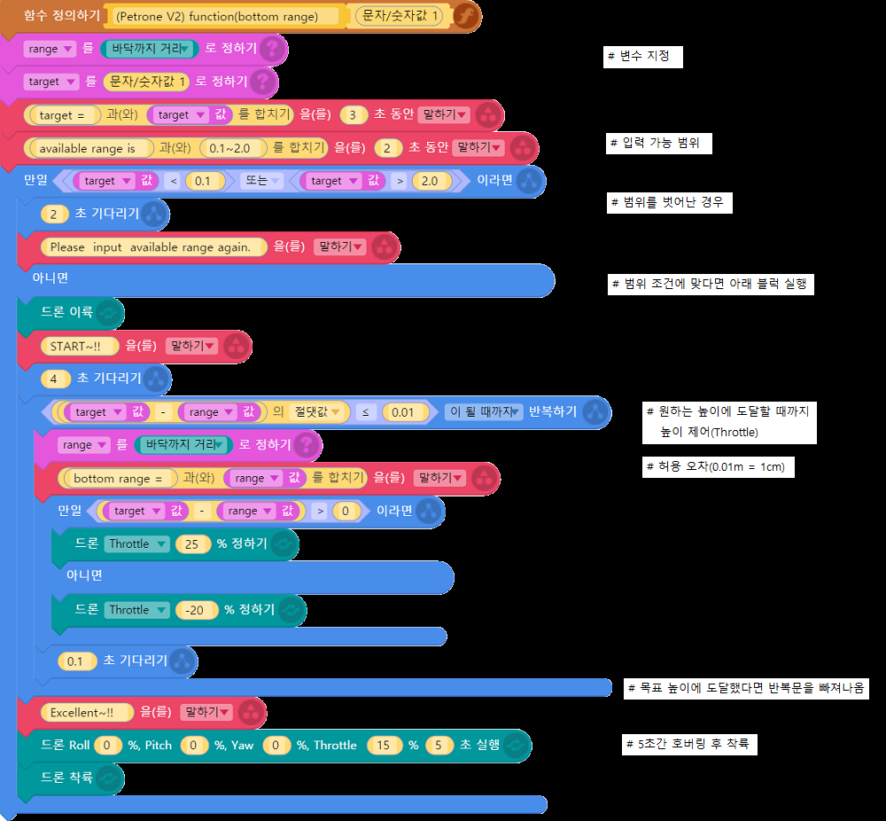

**[*petrone_v2* for entry](./index.md)** / **Examples** / **Bottom range(Korean)**

Modified : 2017.10.27

---

 

## <a name="Bottom range(Korean)">Bottom range(Korean)</a>

Petrone V2의 **Range sensor**를 이용하여 원하는 **높이**만큼 드론을 제어하는 예제입니다.

원하는 높이 값을 입력받아야 하므로 함수를 사용했습니다.

 

    

 

---

<h3><i>petrone_v2</i> for entry</H3>

 1. **Examples - Bottom range(Korean)**
 2. [Examples - Bottom range(English)](./examples_01_bottom_range_english/)

 

[Index](./index.md)
