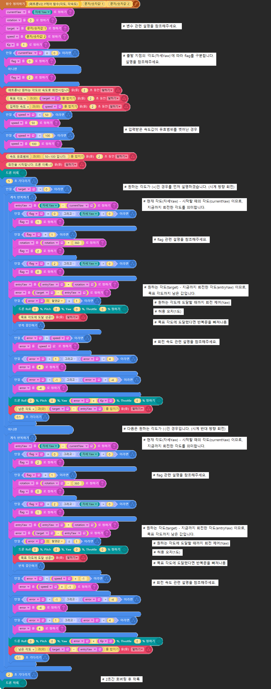
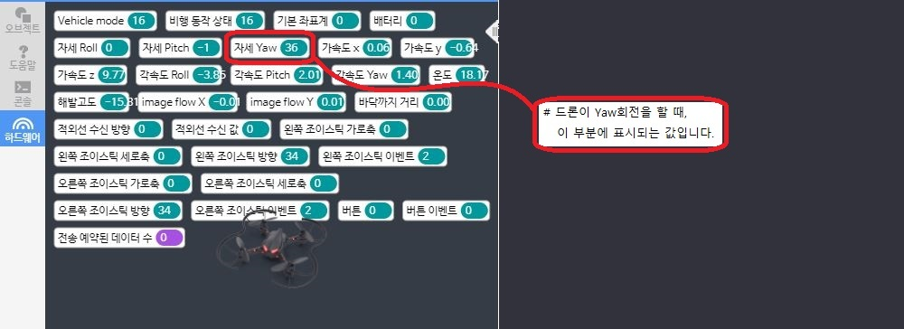
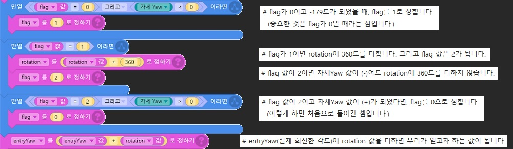
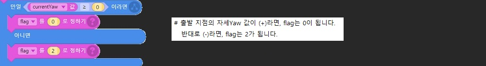
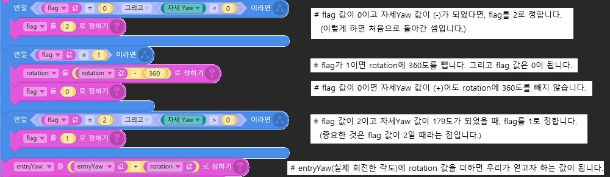
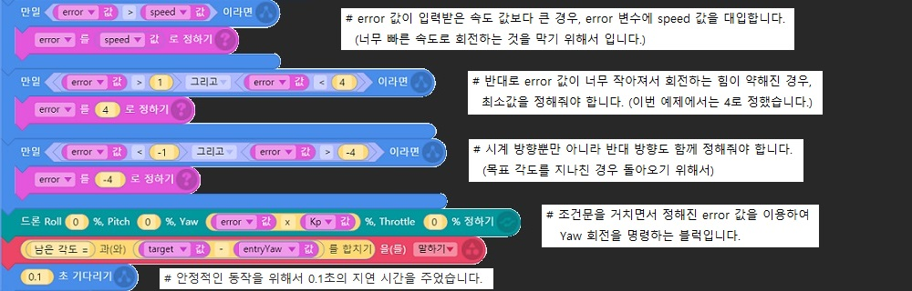

**[*petrone_v2* for entry](../index.md)** / **Examples** / **Yaw rotation(Korean)**

Modified : 2017.10.30

---

 

## <a name="Yaw rotation(Korean)">Yaw rotation(Korean)</a>

Petrone V2의 **Gyroscope sensor**를 이용하여 원하는 **각도와 속도**만큼 드론을 제어하는 예제입니다.

원하는 각도와 회전속도 값을 입력받아야 하므로 함수를 사용했습니다.

정확한 제어를 위해서 변수와 조건문이 다소 사용되어 복잡하게 느껴질 수 있습니다.

따라서 전체 블럭을 먼저 보여드린 후, 세부적인 설명을 아래부분에 추가하겠습니다.

 

    

 
 

## <a name="변수 설명">변수 설명</a>

이번 예제에서 사용된 변수들을 설명하겠습니다.

| 변수 이름      | 범위       | 설명                                                   |
|:-------------:|:----------:|:-------------------------------------------------------|
| currentYaw    | -180 ~ 180 | 출발 지점의 '각도(자세Yaw)'값을 저장하는데 사용됩니다.     |
| rotation      | -          | 자세Yaw 값이 180도 이상을(혹은 -180도 이하를) 넘어가는 경우에 계산하기 위해 사용됩니다. |
| target        | -          | 입력받은 값. 원하는 회전 각도입니다. (+ 시계 방향) (- 시계 반대 방향)  |
| speed         | 50 ~ 100   | 입력받은 값. 원하는 회전 속도입니다. (속도 유효 범위 변경 가능)  |
| Kp            | 1          | P제어(비례제어)의 매개변수입니다. 이번 예제에서는 1로 고정했습니다.  |
| flag          | 0 ~ 2      | rotation 값을 정확히 계산하기 위해서 사용됩니다.            |
| entryYaw      | -          | 실제 회전한 각도입니다. (자세Yaw - currentYaw + rotation)  |
| error         | -          | 목표 각도까지 남은 값입니다. 더 회전해야하는 각도입니다.     |

 
 

## <a name="flag">flag</a>

flag는 rotation 값을 정확히 계산하기 위해서 사용됩니다. 이러한 계산을 하는 이유는 드론이 **실제로 회전한 각도를 정확히 알기 위해서**입니다.

**시계 방향** 회전의 경우를 먼저 설명하겠습니다.

Petrone V2의 자세Yaw 값은 -180도에서 180도까지의 범위를 가집니다. 따라서 181도라는 자세Yaw 값은 없으며, -179도라고 표시됩니다.

이런 경우에 rotation이라는 변수를 사용하여 360도를 더해준다면, (-179 + 360 = 181) 우리가 얻고자 하는 값을 구할 수 있습니다.

(엔트리 화면 좌측 하단에 있는 하드웨어 센서 창입니다. 이 부분을 확인하면서 보시면 도움이 될 것입니다.)

    

 

결국, 자세Yaw 값이 180도를 넘는 순간 (-) 값을 가지므로 360도를 더해줘야 하지만, 주의할 사항이 있습니다.

목표 각도까지 회전하기 위해서 '계속 반복하기'라는 **반복문(무한루프)**을 사용하고 있다는 점입니다.

'자세Yaw 값이 (-)일 때 360도를 더하라'라는 블럭을 만든다면 반복할 때마다 360도를 계속 더하게 될 것입니다.

그래서 **flag** 변수를 사용하여 360도라는 값을 **한 번만** 더하게 만들었습니다.

    

 

그리고 중요한 사항이 하나 더 있습니다. 코딩에서 변수를 사용할 때 중요한 부분 중 하나는 **'변수의 초기화'** 입니다.

그래서 전체 블럭의 맨 윗부분을 보시면 이러한 블럭들이 있습니다. 만약 이 부분이 없다면 오작동이 일어나게 됩니다.

    

 

지금까지 시계 방향 회전의 경우를 알아보았습니다. flag와 관련된 부분을 처음 접해보셨다면 꽤 어렵게 느껴질 수 있습니다. 

그런 점이 단점이라면 반대로 장점도 있겠죠? flag의 장점은 바로 강력한 기능성입니다.

앞으로 살펴볼 시계 반대 방향 회전의 경우에도 flag가 똑같이 사용됩니다. 시계 방향 회전에서 확실히 이해하셨다면 이번에는 쉽게 느껴질 것입니다.

 

다음은 시계 **반대** 방향 회전의 경우입니다.

앞에서 말한 바와 같이 Petrone V2의 자세Yaw 값은 -180도에서 180도까지의 범위를 가집니다. 

따라서 -181도라는 자세Yaw 값은 없으며, 179도라고 표시됩니다.

이런 경우에 rotation 변수를 사용하여 360도를 빼준다면, (179 - 360 = -181) 우리가 얻고자 하는 값을 구할 수 있습니다.

결국, 자세Yaw 값이 -180도를 넘는 순간 (+) 값을 가지므로 360도를 빼줘야 하지만, 주의할 사항이 있습니다.

앞서 말한 것처럼 **반복문(무한루프)**을 사용하고 있다는 점입니다.

그래서 이번에도 **flag** 변수를 사용하여 360도라는 값을 **한 번만** 빼도록 만들었습니다.

    

 

그리고 **'변수의 초기화'**는 전체 블럭의 맨 윗부분에서 이미 실행되었으므로 다시 할 필요가 없습니다.

 

이것으로 **flag**와 관련된 설명이 끝났습니다. 수고 많으셨습니다.

 
 

## <a name="rotation">rotation</a>

rotation 변수를 사용해서 얻은 장점은 **확장성**입니다.

이 변수를 사용하기 전에 만든 알고리즘에서는 -360도에서 360도까지만 측정 가능했습니다.

하지만 이제는 360도를 넘어서 720도, 1080도, 1440도, 그 이상 무한히(배터리가 가능할 때까지) 측정 가능합니다.

또한, rotation 변수가 이렇게 큰 역할을 할 수 있는 것은 **flag 변수** 덕분이기도 합니다.

이번 기회에 두 변수의 사용법을 잘 이해하셨다면 앞으로 다양한 경우에 응용할 수 있을 것입니다.

 
 

## <a name="speed">speed</a>

입력받은 **회전 속도** 값을 speed 변수에 저장합니다. 

이번 예제에서 설정한 속도 유효 범위는 50 ~ 100 입니다. 범위를 벗어난 입력값은 자동으로 조정됩니다.

 

**시계 방향** 회전의 경우를 먼저 설명하겠습니다.

이번 예제에서는 Yaw 회전 속도를 error 변수로 제어합니다. 장점은 목표 각도에 가까워질수록 속도가 줄어들기 때문에 회전 동작의 안정성이 높은 것입니다.

**error** = target - entryYaw = 목표 각도 - 지금까지 회전한 각도 = **목표 각도까지 남은 값**입니다.

    

 

다음은 시계 **반대** 방향 회전의 경우입니다.

회전 방향을 반대로 하기 위해서 speed 변수에 -1을 곱한 것 외에는 같습니다.

 

---

<h3><i>petrone_v2</i> for entry</H3>

 1. [Examples - Bottom range(Korean)](../examples_01_bottom_range_korean/)
 2. [Examples - Bottom range(English)](../examples_01_bottom_range_english/)
 3. **Examples - Yaw rotation(Korean)**
 4. [Examples - Yaw rotation(English)](../examples_02_yaw_rotation_english/)

 

[Index](../index.md)
