**[*petrone_v2* for python](../index.md)** / **Tutorial for Mac**

Modified : 2017.10.27

---

<h3>맥에서 <b>파이썬</b>과 <b>Visual Studio Code</b>, <b>petrone_v2 라이브러리</b>를 설치하고, 예제 프로그램을 실행하는 과정을 자세히 알려드립니다.</h3>

---


<br>

# 1. 파이썬 설치

https://www.python.org 사이트를 방문합니다.

<div align="center">
    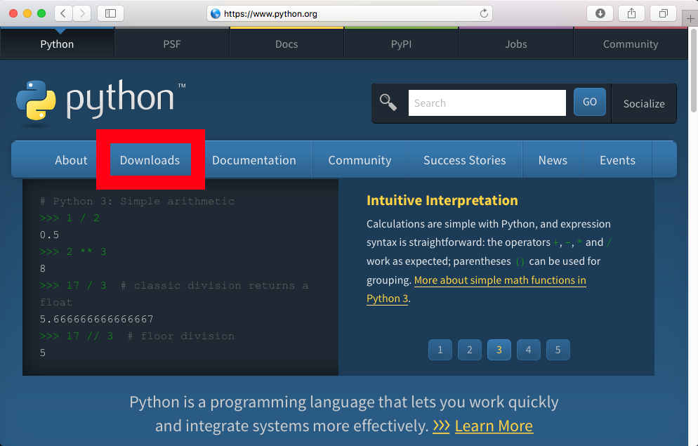
</div>

화면의 **Downloads**라는 글자를 클릭하세요.
<br>
<br>


<div align="center">
    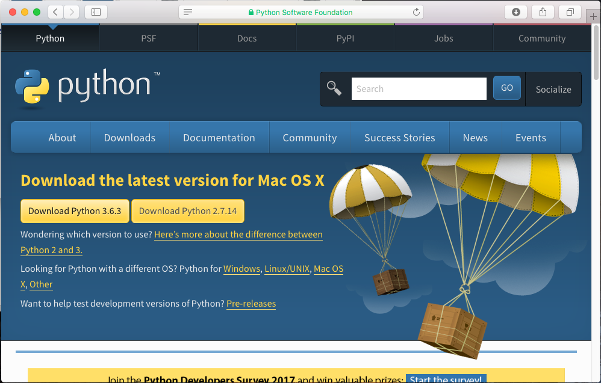
</div>

두 종류의 파이썬이 노란색 버튼으로 나타납니다. 여기에서 <b>Download Python 3.6.3</b>를 클릭하세요.
<br>
<br>


<div align="center">
    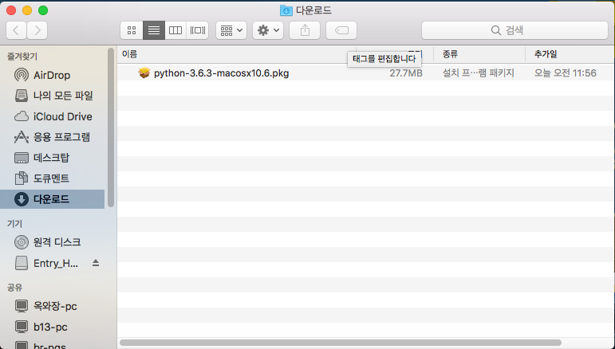
</div>

잠시 후 다운로드 폴더에 <b>python-3.6.3-macosx10.6.pkg</b> 파일을 받은 것을 확인하실 수 있습니다. 이 파일을 실행하면 설치를 시작합니다.
<br>
<br>


<div align="center">
    
</div>

<b>계속</b> 버튼을 누르면 다음으로 넘어갑니다
<br>
<br>


<div align="center">
    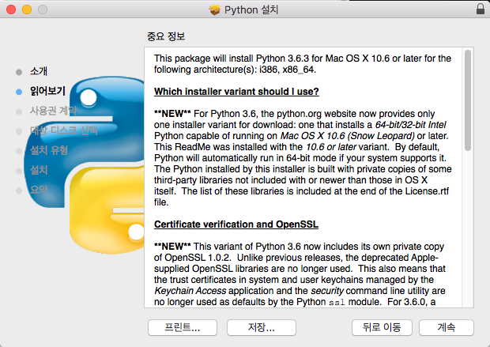
</div>

<b>계속</b> 버튼을 누르면 다음으로 넘어갑니다.
<br>
<br>


<div align="center">
    
</div>

<b>계속</b> 버튼을 누르면 다음으로 넘어갑니다.
<br>
<br>


<div align="center">
    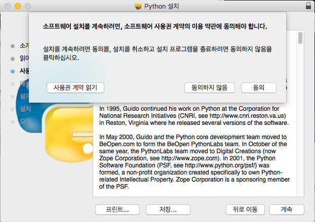
</div>

<b>동의</b> 버튼을 누르면 다음으로 넘어갑니다.
<br>
<br>


<div align="center">
    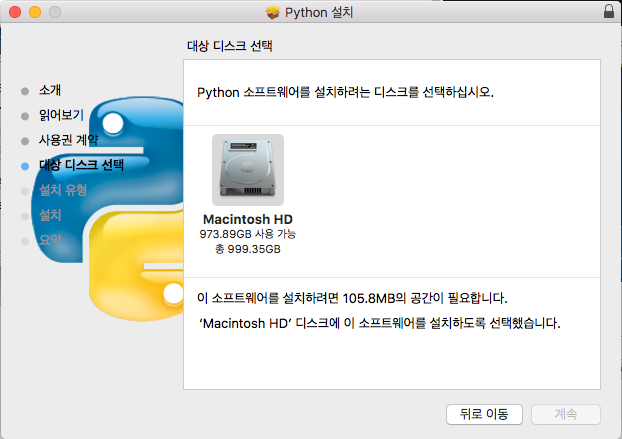
</div>

설치할 디스크를 묻는 화면입니다.
<br>
<br>


<div align="center">
    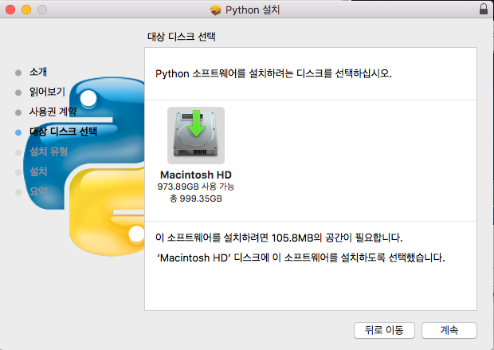
</div>

설치할 디스크를 지정하면 다음 단계로 넘어갈 수 있습니다. <b>계속</b> 버튼을 누르면 다음으로 넘어갑니다.
<br>
<br>


<div align="center">
    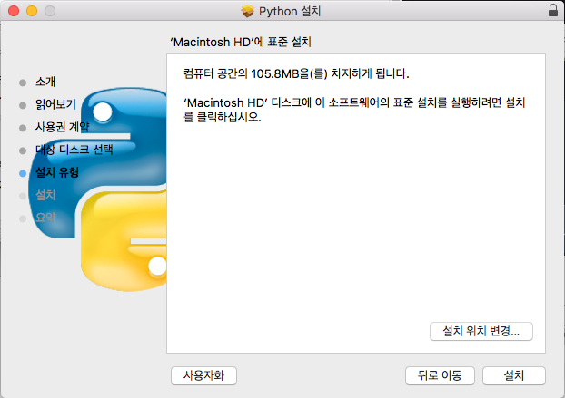
</div>

설치 용량을 알려주는 화면입니다. <b>설치</b> 버튼을 누르면 다음으로 넘어갑니다.
<br>
<br>


<div align="center">
    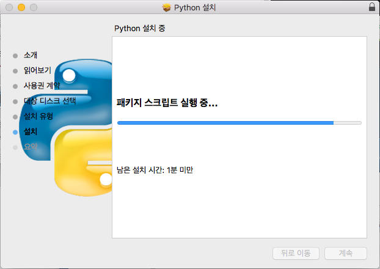
</div>

설치 중인 화면입니다.
<br>
<br>


<div align="center">
    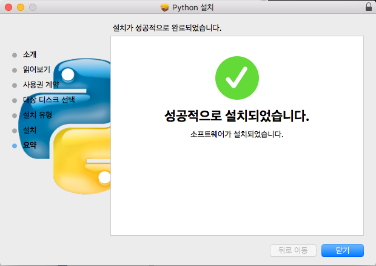
</div>

설치가 완료된 화면입니다. <b>닫기</b> 버튼을 누르면 다음으로 넘어갑니다.
<br>
<br>


<div align="center">
    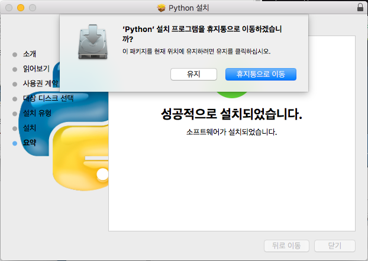
</div>

설치에 사용한 파일을 휴지통에 버릴 것인지를 묻는 화면입니다. <b>휴지통으로 이동</b>을 선택하시면 파이썬 설치가 완료됩니다.
<br>
<br>


<br>


# 2. Visual Studio Code 설치

https://code.visualstudio.com 사이트를 방문합니다.

<div align="center">
    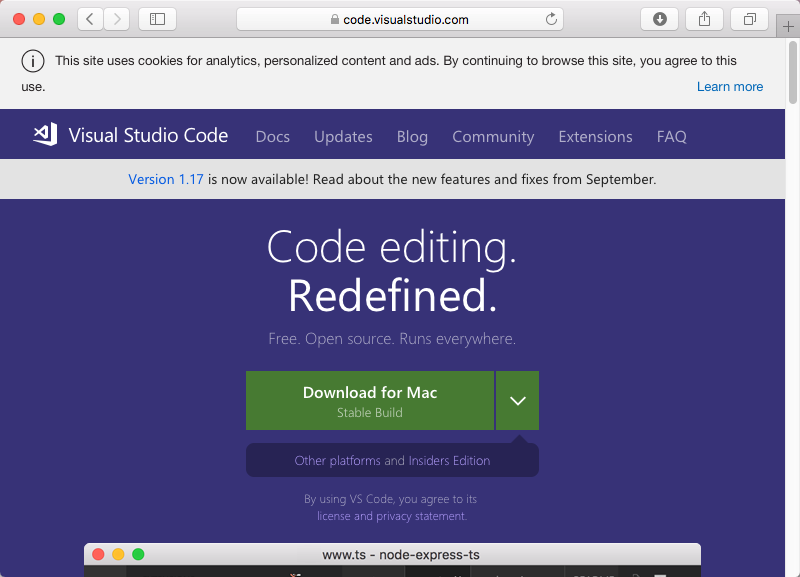
</div>

<b>Download for Mac</b> 버튼을 누르시면 Visual Studio Code를 다운받으실 수 있습니다.
<br>
<br>


<div align="center">
    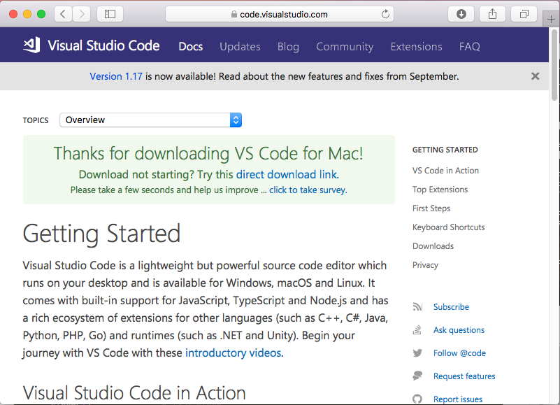
</div>

다운로드가 시작되면 위와 같은 화면으로 바뀝니다. 화면이 전환되고도 다운로드를 시작하지 않는다면, 화면 중앙의 <b>direct download link</b> 버튼을 누르시기 바랍니다.
<br>
<br>


<div align="center">
    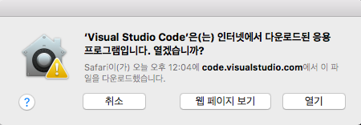
</div>

처음 프로그램을 실행하면 위와 같은 창이 나타납니다. 여기에서 <b>열기</b>를 누르시면 프로그램이 실행됩니다.
<br>
<br>


<div align="center">
    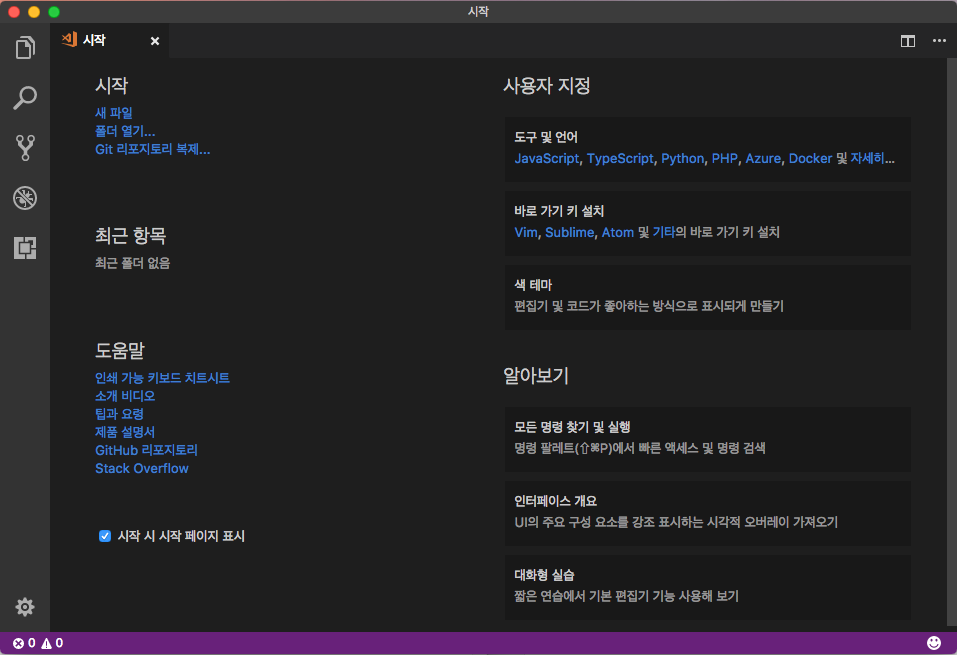
</div>

<b>Visual Studio Code</b>가 실행된 화면입니다.
<br>
<br>


<br>


# 3. Visual Studio 설정 변경

petrone_v2는 Python 3.6을 기반으로 작성하였습니다. 따라서 petrone_v2를 사용한 프로그램을 실행하려면 python3를 사용해야 합니다.

<div align="center">
    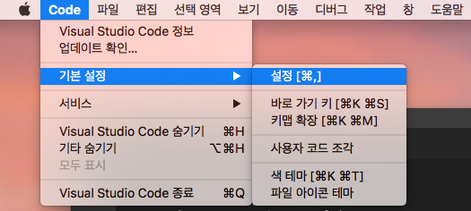
</div>

화면 상단의 메뉴에서 <b>Code</b> -> <b>기본 설정</b> -> <b>설정</b>을 선택합니다.
<br>
<br>


<div align="center">
    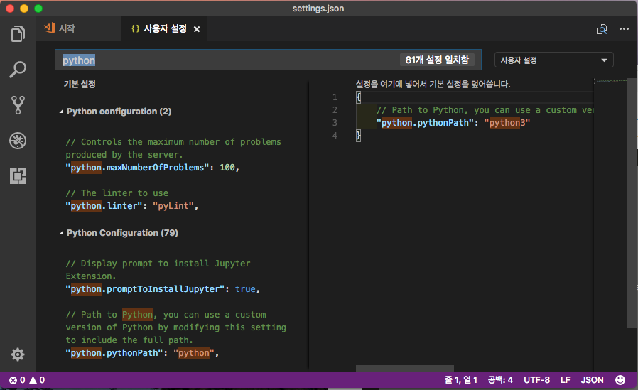
</div>

위의 그림과 같이 화면 우측에 다음의 설정을 추가합니다.

```python
"python.pythonPath": "python3"
```

<br>

<div align="center">
    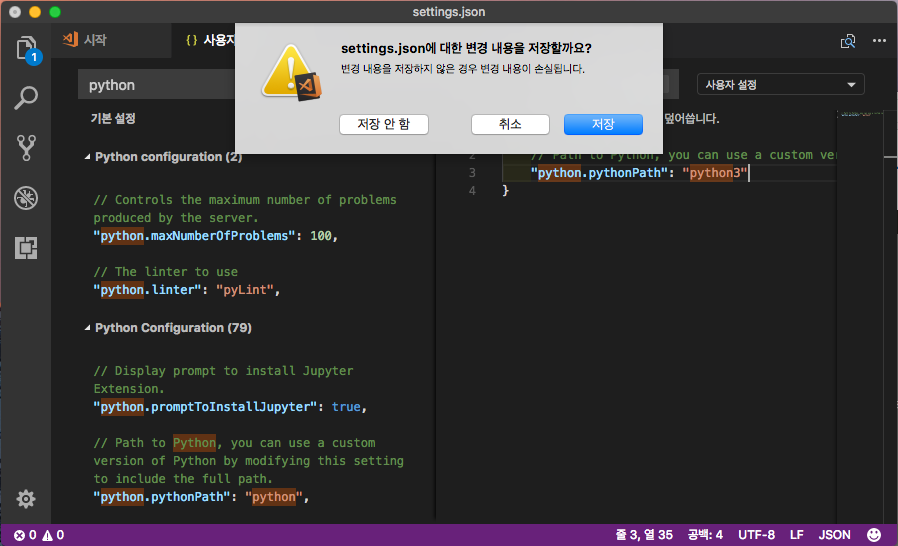
</div>

파일을 닫으면 설정 파일을 저장할 것인지를 묻습니다. 여기에서 <b>저장</b> 버튼을 누르시면 됩니다.
<br>
<br>


<div align="center">
    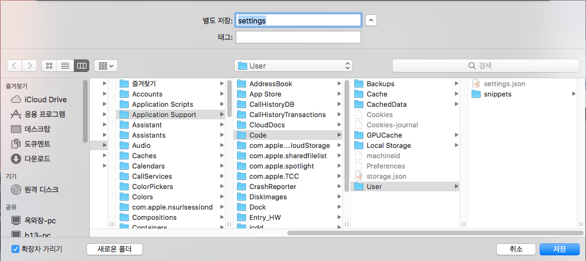
</div>

파일 저장 위치를 묻는 화면입니다. 바로 <b>저장</b> 버튼을 누르시면 변경된 설정이 저장됩니다.
<br>
<br>


<br>


# 4. Visual Studio 확장 프로그램 설치

Visual Studio Code에서 파이썬 프로그램 작성을 도와주는 몇 가지 확장 프로그램을 설치합니다.

<div align="center">
    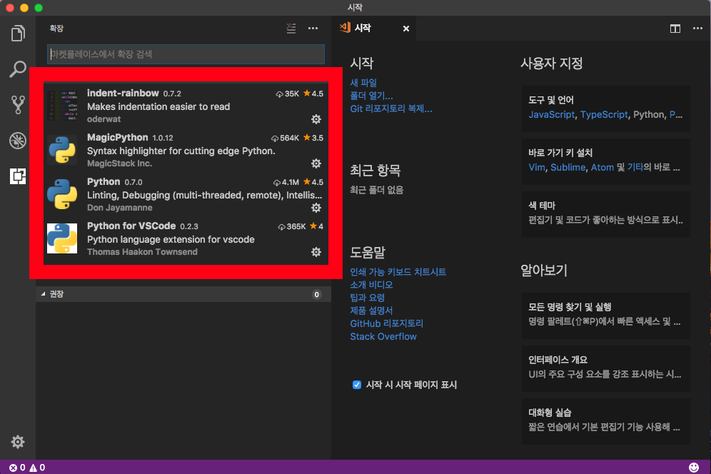
</div>

화면 좌측에서 다섯번째 아이콘을 클릭하시면 확장프로그램 창이 열립니다. 여기에서는 <b>indent-rainbow</b>, <b>MagicPython</b>, <b>Python</b>, <b>Python for VSCode</b>를 설치하였습니다. 상단의 <b>마켓플레이스에서 확장 검색</b>에 각각의 이름을 넣고 검색해서 설치하시면 됩니다.


<br>


# 5. pylint 설치

파이썬 정적 코드 분석기입니다. 아래의 명령을 실행하여 설치합니다.

```
> python3 -m pip install pylint
```

아래는 Visul Studio Code 의 터미널에서 설치한 화면입니다.

<div align="center">
    
</div>


<br>


# 6. petrone_v2 설치

PETRONE V2의 파이썬 라이브러리를 설치할 차례입니다. 터미널에서 아래의 명령을 실행하시면 라이브러리가 설치됩니다.

```
> pip3 install petrone_v2
```

<div align="center">
    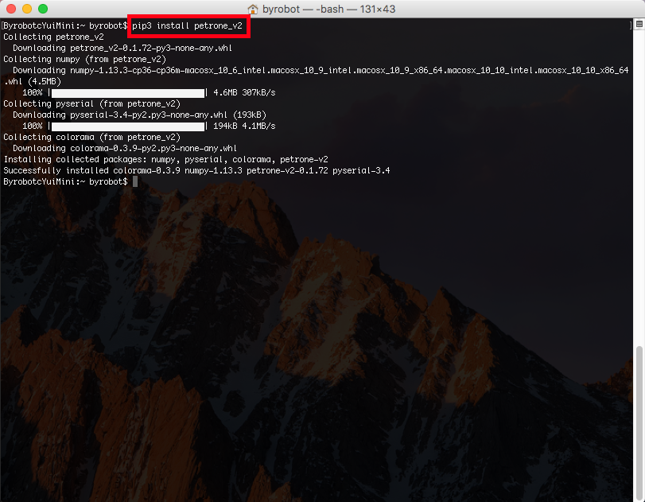
</div>


<br>


# 7. 예제 실행

petrone_v2 라이브러리를 사용하기 위한 모든 준비가 끝났습니다. 이제 처음으로 예제를 실행해보겠습니다. 다시 Visual Studio Code 처음 실행 화면입니다.

<div align="center">
    
</div>

여기에서 화면 좌측 상단의 <b>새 파일</b>을 선택하시면 빈 파일이 열립니다. 아래의 코드를 복사해서 붙여 넣으시면 됩니다.

```python
from time import sleep

from petrone_v2.drone import *
from petrone_v2.protocol import *


def eventInformation(information):
    print("eventInformation()")
    print("{0} / 0x{0:08X}".format(information.version.v))
    print("{0}.{1}.{2}.{3}".format(
        information.version.major,
        information.version.minor,
        information.version.stage.name,
        information.version.build))


if __name__ == '__main__':

    drone = Drone()
    drone.open()

    # 이벤트 핸들링 함수 등록
    drone.setEventHandler(DataType.Information, eventInformation)

    # Information 정보 요청
    drone.sendRequest(DeviceType.Controller, DataType.Information)
    sleep(0.1)

    drone.close()
```

예제는 아래의 소스에서 포트 이름을 지운 것입니다.

[조종기의 펌웨어 정보 요청(이벤트 함수 등록)](https://byrobot.github.io/documents/kr/products/petrone_v2/library/python/petrone_v2/examples_02_information/#Class_Information)

<div align="center">
    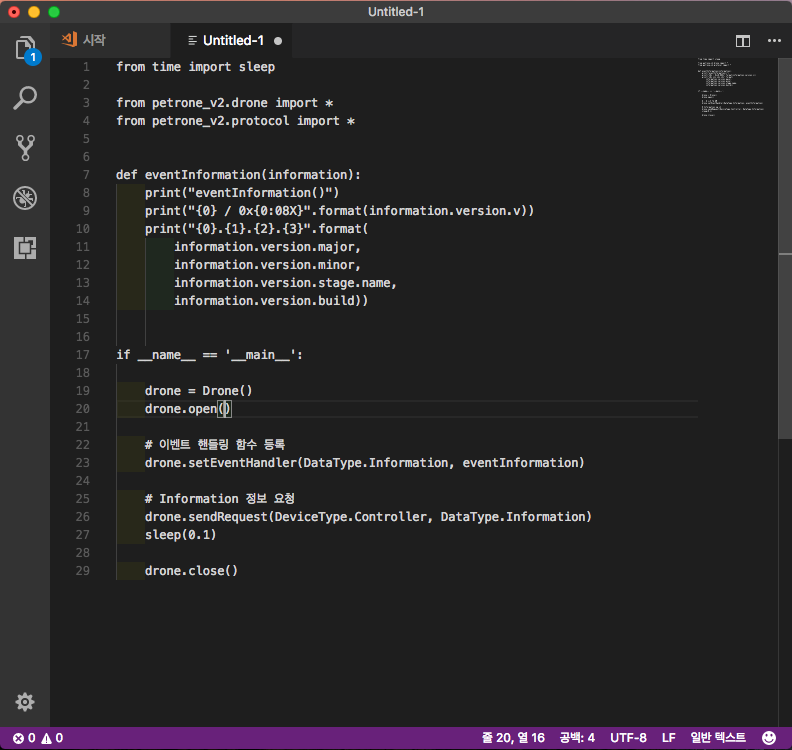
</div>

예제 코드를 붙여 넣은 화면입니다.
<br>
<br>


<div align="center">
    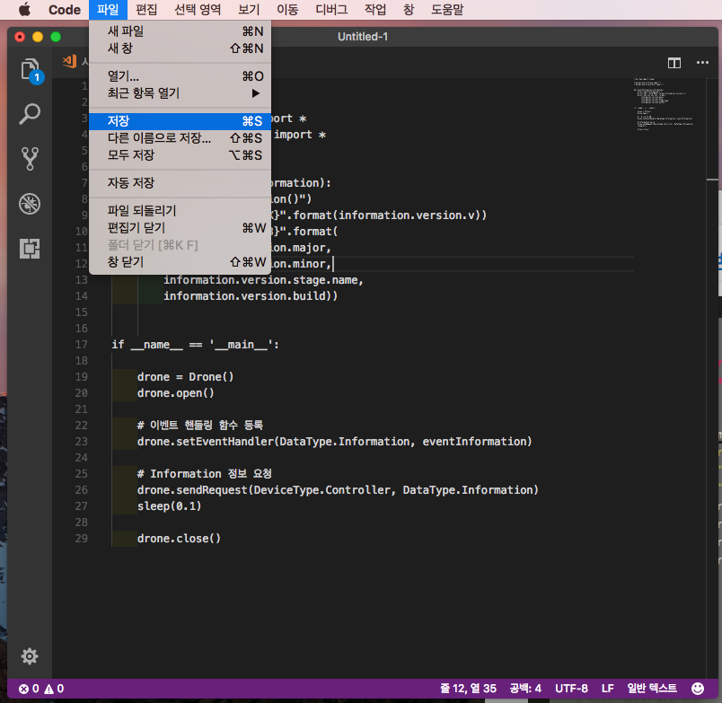
</div>

파일을 저장해야 실행할 수 있습니다. 메뉴에서 <b>파일</b> -> <b>저장</b>을 선택합니다.
<br>
<br>


<div align="center">
    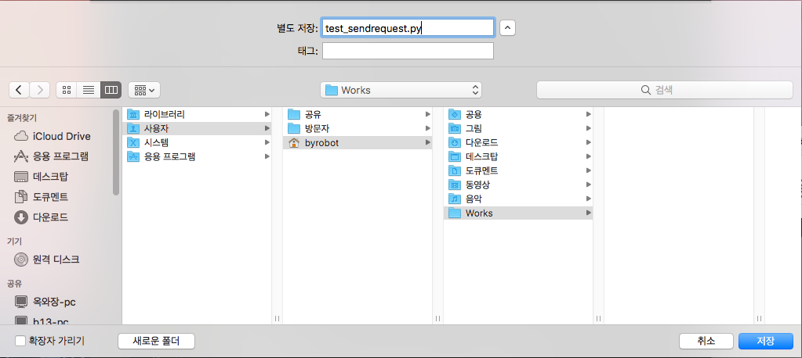
</div>

여기에서는 <b>사용자/byrobot/Works</b> 폴더에 <b>test_sendrequest.py</b> 라는 이름으로 저장하였습니다.
<br>
<br>


<div align="center">
    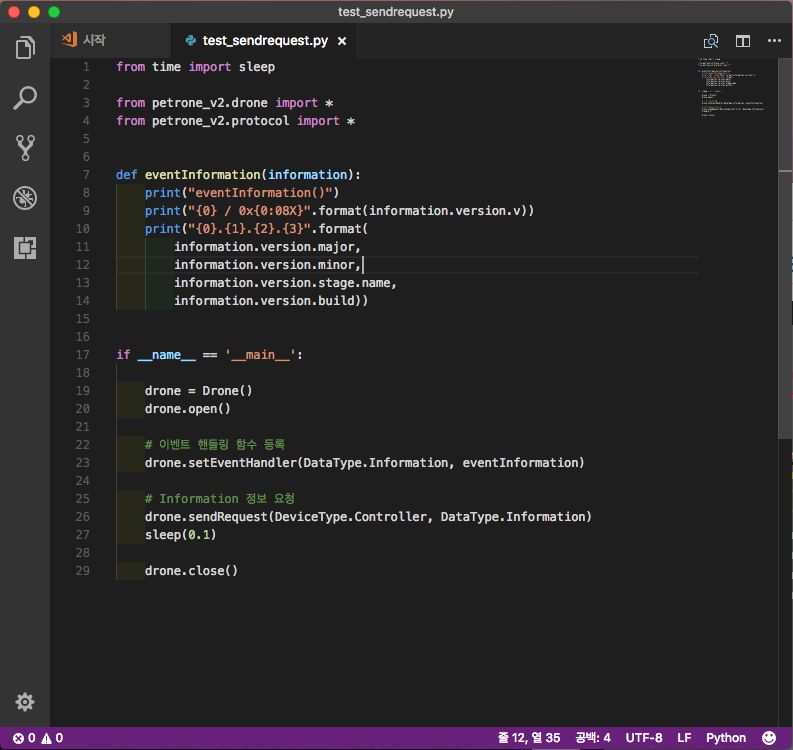
</div>

파일을 저장하자 코드 문법이 강조되었습니다.
<br>
<br>


<div align="center">
    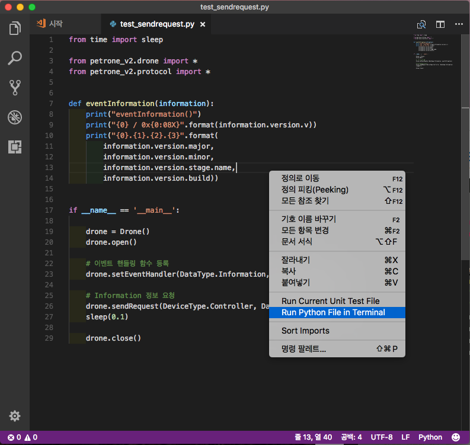
</div>

화면의 빈 공간에 오른클릭을 하면 위와 같은 메뉴를 볼 수 있습니다. 예제를 실행하려면 여기에서 <b>Run Python File in Terminal</b>를 선택하면 됩니다.
<br>
<br>


<div align="center">
    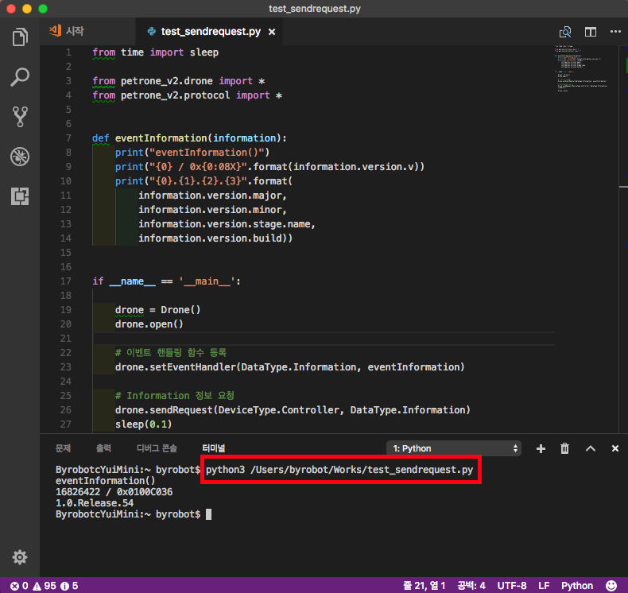
</div>

PETRONE V2 조종기가 맥에 연결되어 있다면 위와 비슷한 결과를 확인할 수 있습니다. 만약 조종기가 연결되지 않았거나 연결에 문제가 있다면 아무런 결과도 표시하지 않습니다.
<br>
<br>


<br>


여기까지 파이썬 설치부터 petrone_v2 라이브러리를 사용한 예제 실행까지 진행하였습니다. 실행 중에 문제가 발생할 경우 포럼에 글을 남겨주시기 바랍니다.


<br>


---

<h3><i>petrone_v2</i> for python</H3>

 1. [Intro](../01_intro.md)
 2. [System](../02_system.md)
 3. [Protocol](../03_protocol.md)
 4. [Drone](../04_drone.md)
 5. [Examples - Ping](../examples_01_ping.md)
 6. [Examples - Information](../examples_02_information.md)
 7. [Examples - Pairing](../examples_03_pairing.md)
 8. [Examples - Control](../examples_04_control.md)
 9. [Examples - Sensor](../examples_05_sensor.md)
10. [Examples - Motor](../examples_06_motor.md)
11. [Examples - Setup](../examples_07_setup.md)
12. [Examples - Buzzer](../examples_08_buzzer.md)
13. [Examples - Vibrator](../examples_09_vibrator.md)
14. [Examples - Light](../examples_10_light.md)
15. [Examples - Display](../examples_11_display.md)
16. [Examples - Input](../examples_12_input.md)
17. [Examples - Error](../examples_13_error.md)

**Tutorial for Mac**

<br>

[Index](../index.md)
