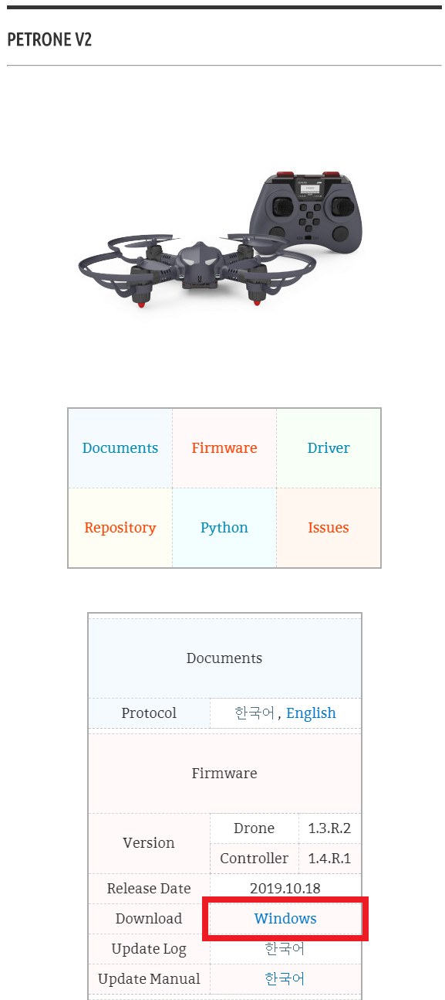

**[PETRONE V2](/documents/kr/products/petrone_v2/) firmware Update**

Modified : 2019.6.19

---

<h3>Petrone V2 펌웨어 업데이트</h3>

---

- [Drone2Updater](../drone2updater/)
- **Drone2AutoUpdaterLight**

---

* Kramdown table of contents
{:toc .toc}

 

# 1. 펌웨어 다운로드

[PETRONE V2](/documents/kr/products/petrone_v2/) 페이지에서 최신 Petrone V2 펌웨어를 다운로드 받습니다.

    
    
펌웨어 업데이트 프로그램 다운로드 링크(빨간색 점선 안의 'Windows')

 

 

# 2. 펌웨어 자동 업데이트

드론 또는 조종기를 부트로더 모드로 연결하면 자동으로 펌웨어를 업데이트해 주는 프로그램입니다.

 

## 2.1. 드론 업데이트

(1) "Drone2AutoUpdaterLight.exe"를 실행합니다.

    
    
펌웨어 업데이트 프로그램 폴더

 

    
    
펌웨어 업데이트 프로그램 실행 화면

 

(2) 조종기와 드론이 페어링되지 않았다면 먼저 페어링을 하시기 바랍니다.

 

(3) 드론에 배터리가 연결되어 있다면 제거합니다.

 

(4) 드론 측면의 버튼을 누른 상태로 배터리를 밀어 넣어 전원을 켭니다. 부트로더 모드일 때 LED가 하늘색으로 느리게 깜빡입니다.

    
    
드론 부트로더 진입 버튼

 

(5) 조종기의 스위치를 **USB**에 둔 상태로 USB 커넥터에 연결하면 자동으로 업데이트를 진행합니다.

    
    
드론 펌웨어 업데이트 진행 화면

 

    
    
드론 펌웨어 업데이트 완료 화면

 

 

## 2.2. 조종기 업데이트

(1) "Drone2AutoUpdaterLight.exe"를 실행합니다.

    
    
펌웨어 업데이트 프로그램 폴더

 

    
    
펌웨어 업데이트 프로그램 실행 화면

 

(2) 조종기의 배터리를 제거하고, 스위치를 **USB** 위치에 두시기 바랍니다.

 

(3) 조종기 우측 상단의 빨간색 버튼을 누른 상태로 USB 커넥터를 연결합니다.

    
    
조종기 부트로더 진입 버튼

 

(4) 조종기의 전원이 켜지고 자동으로 업데이트를 진행합니다.

    
    
조종기 펌웨어 업데이트 진행 화면

 

    
    
조종기 펌웨어 업데이트 완료 화면

 

 

여기까지 PETRONE V2 드론과 조종기의 펌웨어 업데이트를 완료하였습니다.

