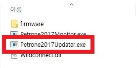

**[PETRONE V2](/documents/kr/products/petrone_v2/) firmware Update**

Modified : 2019.6.19

---

<h3>Petrone V2 펌웨어 업데이트</h3>

---

- **Drone2Updater**
- [Drone2AutoUpdaterLight](../drone2autoupdaterlight/)

---

* Kramdown table of contents
{:toc .toc}

 

# 1. 펌웨어 다운로드

[PETRONE V2](/documents/kr/products/petrone_v2/) 페이지에서 최신 Petrone V2 펌웨어를 다운로드 받습니다.

 

# 2. 조종기 펌웨어 업데이트

<b>(1) 조종기의 배터리를 제거하고, 스위치를 **ON**에 둔 상태로 USB 커넥터를 연결합니다.</b>

 

<b>(2) 조종기 우측 상단의 빨간색 버튼을 누른 상태로, 스위치를 **USB**로 밀어서 전원을 켭니다.</b>

    

 

<b>(3) 조종기의 전원이 켜지면서 부트로더의 펌웨어 업데이트 모드를 시작합니다.</b>

    
    
조종기 펌웨어 업데이트 대기 화면

 

<b>(4) 펌웨어 업데이트 프로그램을 실행합니다.</b>

    
    
펌웨어 업데이트 프로그램

 

<b>(5) 펌웨어를 선택합니다. 처음 실행하면 기본으로 조종기 펌웨어가 선택되어 있습니다.</b>

    
    
펌웨어 파일 선택 콤보박스

 

<b>(6) SCAN 버튼을 눌러 시리얼 포트 검색을 실행합니다. 그 후 SCAN 버튼 하단의 콤보 박스를 눌러 원하는 시리얼 포트를 선택합니다. 조종기를 먼저 연결한 후 프로그램을 실행하였다면 이 단계를 건너뛰셔도 됩니다.</b>

    
    
스캔 버튼

 

<b>(7) UPDATE 버튼을 눌러 펌웨어 업데이트를 시작합니다.</b>

    
    
업데이트 버튼

 

    
    
업데이트 진행 화면

 

    
    
조종기 업데이트 진행 상태

 

<b>(8) 업데이트가 완료되면 조종기는 자동으로 재시작합니다. USB 연결이 정상적으로 되려면 전원을 껐다가 다시 켜시기 바랍니다.</b>

    
    
조종기 업데이트 완료 상태

 

 

# 3. 드론 펌웨어 업데이트

<b>(1) 조종기와 드론이 연결되지 않은 상태라면 페어링하여 연결된 상태로 만들어줍니다.</b>

 

<b>(2) 조종기의 스위치를 **USB**로 두고 USB 커넥터를 연결합니다.</b>

 

<b>(3) 드론의 배터리 제거 후, 드론 측면의 버튼을 누른 채로 배터리를 밀어 넣어 전원을 켭니다. 드론이 부트로더 모드가 되면 LED가 하늘색으로 느리게 깜빡입니다.</b>

    
    
드론 측면 스위치를 누른 상태에서 배터리를 연결

 

<b>(4) 드론이 부트로더의 펌웨어 업데이트 모드로 켜진 상태에서 조종기와 연결된 경우 아래와 같은 화면을 볼 수 있습니다. 만약 드론과 조종기의 전원이 모두 켜진 상태에서 아래와 같은 화면이 나오지 않고 연결이 끊어졌다고 표시되는 경우 페어링을 하셔야 합니다. 보통 때의 페어링과 동일한 방법으로, 전원이 켜진 상태에서 드론 측면의 버튼을 길게 눌러서 페어링 대기 상태로 만들고, 조종기를 설정 모드로 바꾼 다음 조종기의 우측 하단의 원형 버튼을 길게 눌러서 페어링을 하시면 됩니다.</b>

    
    
드론 펌웨어 업데이트 모드

 

<b>(5) 펌웨어 업데이트 프로그램을 실행한 뒤 펌웨어 선택 콤보박스에서 드론 펌웨어를 선택합니다.</b>

    
    
펌웨어 선택 콤보박스

 

<b>(6) SCAN 버튼을 눌러 시리얼 포트 검색을 실행합니다. 그 후 SCAN 버튼 하단의 콤보 박스를 눌러 원하는 시리얼 포트를 선택합니다. 조종기를 먼저 연결한 후 프로그램을 실행하였다면 이 단계를 건너뛰셔도 됩니다.</b>

    
    
스캔 버튼

 

<b>(7) UPDATE 버튼을 눌러 펌웨어 업데이트를 시작합니다.</b>

    
    
업데이트 버튼

 

    
    
업데이트 진행 화면

 

    
    
드론 펌웨어 업데이트 시 조종기 업데이트 진행 화면

 

<b>(8) 업데이트가 완료된 후 조종기 또는 드론의 전원을 껐다 켜면 드론이 새로운 펌웨어로 시작합니다.</b>

    
    
드론 업데이트 완료 상태

 

 

여기까지 Petrone V2 조종기와 드론의 펌웨어 업데이트를 완료하였습니다.

