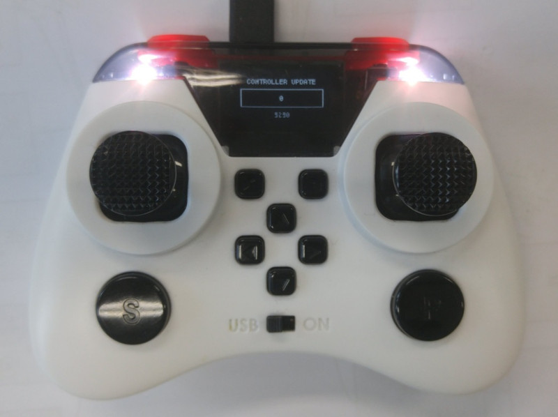
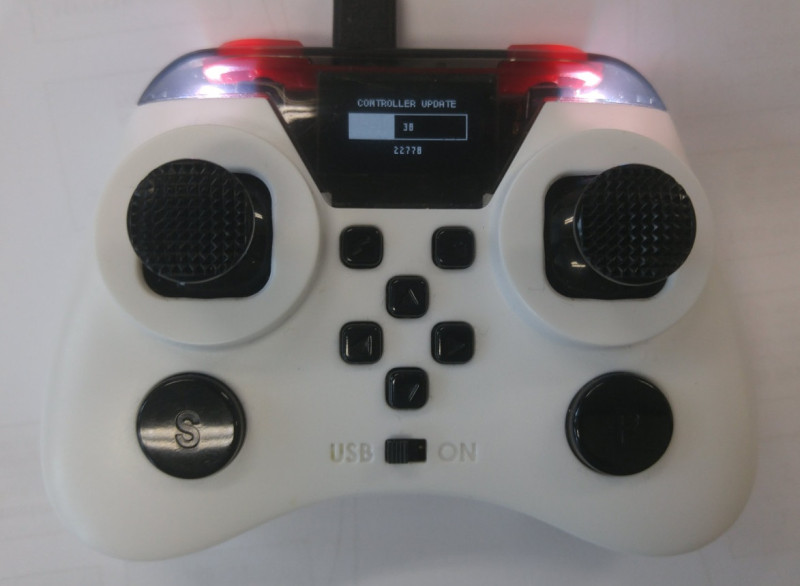

**Petrone V2 firmware Update**

Modified : 2018.3.5

---

<h3>Petrone V2 펌웨어 업데이트 방법을 알려드립니다.</h3>

---

* Kramdown table of contents
{:toc .toc}

 

# 1. 펌웨어 다운로드

[Download](/download/) 페이지에서 최신 Petrone V2 펌웨어를 다운로드 받습니다.

 

# 2. 펌웨어 파일 구성

ABCD

 

# 3. 조종기 펌웨어 업데이트

<b>(1) 조종기에 USB 커넥터를 연결합니다.</b>

<b>(2) 조종기 우측 상단의 빨간색 버튼을 누른 채로, 하단 중앙의 스위치를 <i>ON</i>에서 <i>USB</i>로 밀어줍니다.</b>

    

<b>(3) 조종기의 전원이 켜지면서 부트로더의 펌웨어 업데이트 모드를 시작합니다.</b>

    
    
부트로더 펌웨어 업데이트 모드 진입 화면

 

    
    
부트로더 요약 정보 표시 화면

 

    
    
업데이트 준비 화면

 

<b>(4) 펌웨어 업데이트 프로그램을 실행합니다.</b>

    
    
펌웨어 업데이트 프로그램

 

    
    
펌웨어 파일 폴더

 

<b>(5) 펌웨어를 선택합니다. 처음 실행하면 기본으로 조종기 펌웨어가 선택되어 있습니다.</b>

    
    
업데이트 준비 화면

 

    
    
펌웨어 파일 선택 콤보박스

 

<b>(6) SCAN 버튼을 눌러 시리얼 포트 검색을 실행합니다. 그 후 SCAN 버튼 하단의 콤보 박스를 눌러 원하는 시리얼 포트를 선택합니다. 조종기를 먼저 연결한 후 프로그램을 실행하였다면 이 단계를 건너뛰셔도 됩니다.</b>

    
    
스캔 버튼

 

<b>(7) UPDATE 버튼을 눌러 펌웨어 업데이트를 시작합니다.</b>

    
    
업데이트 버튼

 

    
    
업데이트 진행 화면

 

    
    
조종기 업데이트 진행 상태

 

<b>(8) 업데이트가 완료되면 조종기는 자동으로 재시작합니다. USB 연결이 정상적으로 되려면 전원을 껐다가 다시 켜시기 바랍니다.</b>

    
    
조종기 업데이트 완료 상태

 

 

# 4. 드론 펌웨어 업데이트

 

Petrone V2 드론과 조종기 펌웨어 업데이트를 완료하였습니다.

